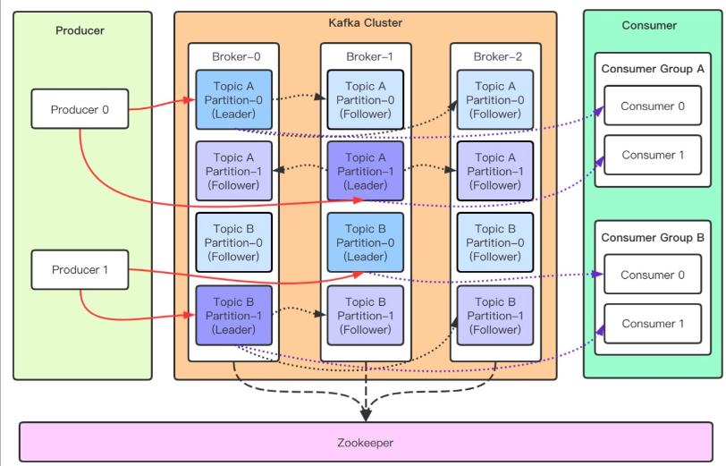

## 一、Kafka是什么？
Apache Kafka 是一个开源分布式事件流平台，被数千家公司用于高性能数据管道、流分析、数据集成和关键任务应用程序。
<!--more-->

## 二、Kafka有哪些应用场景？
- 1.消息系统；
- 2.网站活动追踪；
- 3.运营指标；
- 4.日志收集；
- 5.流处理；
- 6.事件采集。

## 三、Kafka的架构图是怎样的？


## 四、Kafka的优缺点有哪些？

### 1.优点有哪些？
- （1）性能卓越，单机写入TPS约在百万条/秒，最大的优点，就是吞吐量高。
- （2）时效性：ms级。
- （3）可用性：非常高，kafka是分布式的，一个数据多个副本，少数机器宕机，不会丢失数据，不会导致不可用。
- （4）消费者采用Pull方式获取消息, 消息有序, 通过控制能够保证所有消息被消费且仅被消费一次。
- （5）有优秀的第三方Kafka Web管理界面Kafka-Manager。
- （6）在日志领域比较成熟，被多家公司和多个开源项目使用。
- （7）功能支持：功能较为简单，主要支持简单的MQ功能，在大数据领域的实时计算以及日志采集被大规模使用。

### 2.缺点有哪些？
- （1）消息丢失。
- （2）消息重复。
- （3）消息乱序。
- （4）消息堆积。

## 五、如何安装Kafka?
以Linux为例，安装Kafka非常简单，一共三步如下所示:

### 1.下载
```
wget https://downloads.apache.org/kafka/3.3.1/kafka_2.12-3.3.1.tgz

```

### 2.解压
```
tar -xzf kafka_2.12-3.3.1.tgz

```

### 3.启动
```
cd kafka_2.12-3.3.1

bin/zookeeper-server-start.sh config/zookeeper.properties

bin/kafka-server-start.sh config/server.properties
```

## 六、YC-Framework如何使用Kafka?

### 1.导入依赖
```
<dependency>
    <groupId>com.yc.framework</groupId>
    <artifactId>yc-common-kafka</artifactId>
</dependency>

```

### 2.配置文件
```
spring:
  kafka:
    bootstrap-servers: 127.0.0.1:9092
    producer: # 生产者
      retries: 3 # 设置大于0的值，则客户端会将发送失败的记录重新发送
      batch-size: 16384
      buffer-memory: 33554432
      acks: 1
      # 指定消息key和消息体的编解码方式
      key-serializer: org.apache.kafka.common.serialization.StringSerializer
      value-serializer: org.apache.kafka.common.serialization.StringSerializer
    consumer:
      group-id: default-group
      enable-auto-commit: false
      auto-offset-reset: earliest
      key-deserializer: org.apache.kafka.common.serialization.StringDeserializer
      value-deserializer: org.apache.kafka.common.serialization.StringDeserializer
    listener:
      # 当每一条记录被消费者监听器（ListenerConsumer）处理之后提交
      # RECORD
      # 当每一批poll()的数据被消费者监听器（ListenerConsumer）处理之后提交
      # BATCH
      # 当每一批poll()的数据被消费者监听器（ListenerConsumer）处理之后，距离上次提交时间大于TIME时提交
      # TIME
      # 当每一批poll()的数据被消费者监听器（ListenerConsumer）处理之后，被处理record数量大于等于COUNT时提交
      # COUNT
      # TIME |　COUNT　有一个条件满足时提交
      # COUNT_TIME
      # 当每一批poll()的数据被消费者监听器（ListenerConsumer）处理之后, 手动调用Acknowledgment.acknowledge()后提交
      # MANUAL
      # 手动调用Acknowledgment.acknowledge()后立即提交，一般使用这种
      # MANUAL_IMMEDIATE
      ack-mode: manual_immediate


```

### 3.生产者代码
```
@RestController
public class KafkafProductor {
    private final static String TOPIC_NAME = "my-replicated-topic";
    @Autowired
    private KafkaTemplate<String, String> kafkaTemplate;

    @RequestMapping("/send")
    public String send(@RequestParam("msg") String msg) {
        kafkaTemplate.send(TOPIC_NAME, "key", msg);
        return String.format("消息 %s 发送成功！", msg);
    }
}


```

### 4.消费者代码
```
@Component
public class KafkaConsumer {
    /**
     * @param record record
     * @KafkaListener(groupId = "testGroup", topicPartitions = {
     * @TopicPartition(topic = "topic1", partitions = {"0", "1"}),
     * @TopicPartition(topic = "topic2", partitions = "0",
     * partitionOffsets = @PartitionOffset(partition = "1", initialOffset = "100"))
     * },concurrency = "6")
     * //concurrency就是同组下的消费者个数，就是并发消费数，必须小于等于分区总数
     */
    @KafkaListener(topics = "my-replicated-topic", groupId = "testGroup1")
    public void listenJihuGroup(ConsumerRecord<String, String> record, Acknowledgment ack) {
        String value = record.value();
        System.out.println("testGroup1 message: " + value);
        System.out.println("testGroup1 record: " + record);
        //手动提交offset，一般是提交一个banch，幂等性防止重复消息
        // === 每条消费完确认性能不好！
        ack.acknowledge();
    }

    //配置多个消费组
    @KafkaListener(topics = "my-replicated-topic", groupId = "testGroup2")
    public void listenJihuGroup2(ConsumerRecord<String, String> record, Acknowledgment ack) {
        String value = record.value();
        System.out.println("testGroup2 message: " + value);
        System.out.println("testGroup2 record: " + record);
        //手动提交offset
        ack.acknowledge();
    }

}

```

相关示例代码地址:
https://github.com/developers-youcong/yc-framework/tree/main/yc-example/yc-example-kafka

YC-Framework官网：
https://framework.youcongtech.com/

YC-Framework Github源代码：
https://github.com/developers-youcong/yc-framework

YC-Framework Gitee源代码：
https://gitee.com/developers-youcong/yc-framework

以上源代码均已开源，开源不易，如果对你有帮助，不妨给个star，鼓励一下！！！