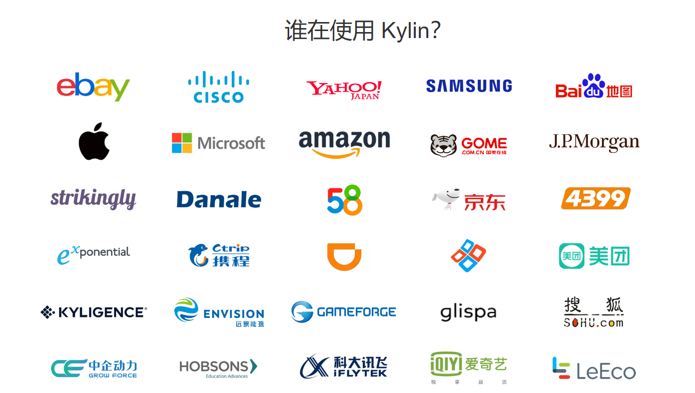
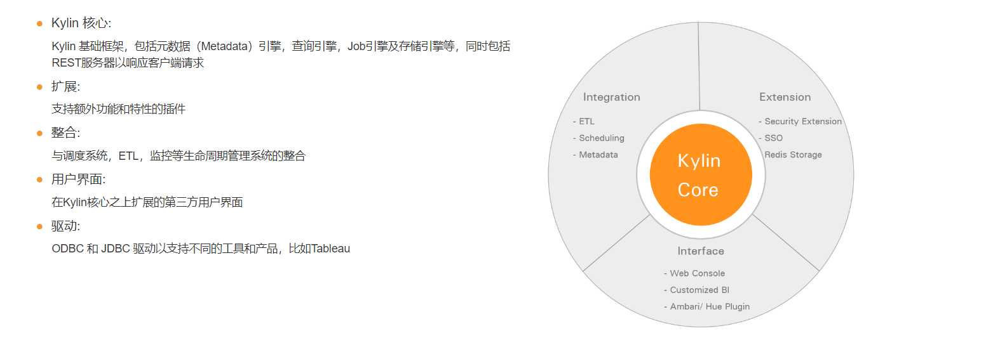
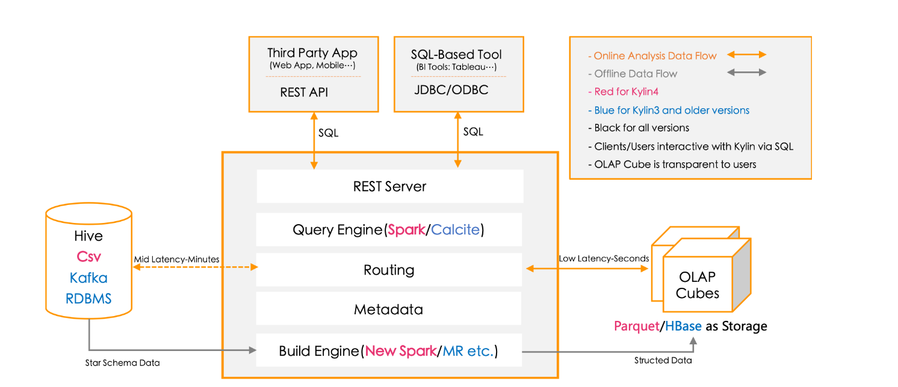

## 一、Kylin是什么？
<!--more-->

Apache Kylin™是一个开源的、分布式的分析型数据仓库，提供 Hadoop 之上的 SQL 查询接口及多维分析（OLAP）能力以支持超大规模数据，最初由eBay Inc.开发并贡献至开源社区。

## 二、Kylin的主要特性有哪些？
- 1.**可扩展超快的基于大数据的分析型数据仓库**(Kylin 是为减少在 Hadoop/Spark 上百亿规模数据查询延迟而设计)。
- 2.**Hadoop ANSI SQL 接口**(作为一个分析型数据仓库(也是 OLAP 引擎)，Kylin 为 Hadoop 提供标准 SQL 支持大部分查询功能)。
- 3.**交互式查询能力**(通过 Kylin，用户可以与 Hadoop 数据进行亚秒级交互，在同样的数据集上提供比 Hive 更好的性能)。
- 4.**多维立方体（MOLAP Cube）**(用户能够在 Kylin 里为百亿以上数据集定义数据模型并构建立方体)。
- 5.**实时 OLAP**(Kylin 可以在数据产生时进行实时处理，用户可以在秒级延迟下进行实时数据的多维分析)。
- 6.**与BI工具无缝整合**(Kylin 提供与 BI 工具的整合能力，如Tableau，PowerBI/Excel，MSTR，QlikSense，Hue 和 SuperSet)。

**其它特性如下:**

- 1.Job管理与监控。
- 2.压缩与编码。
- 3.增量更新。
- 4.利用HBase Coprocessor。
- 5.基于HyperLogLog的Dinstinc Count近似算法。
- 6.友好的web界面以管理，监控和使用立方体。
- 7.项目及表级别的访问控制安全。
- 8.支持LDAP、SSO。

## 三、Kylin的应用场景是什么？
Kylin主要适合高并发对应的固定模式查询场景，例如:

- 1.报表分析。
- 2.留存分析。
- 3.用户标签画像分析。
- 4.用户行为漏斗分析。

## 四、使用Kylin的公司有哪些？

## 五、Kylin的生态圈是怎样的？

## 六、Kylin的整体架构是怎样的？

## 七、Kylin相关的资料有哪些？
Kylin官网:
https://kylin.apache.org/cn/

Kylin官方文档:
https://kylin.apache.org/cn/docs/

Kylin Github 源代码:
https://github.com/apache/kylin

## 八、YC-Framework是否支持Kylin?
支持。主要场景是基于大数据分析。

YC-Framework官网：
https://framework.youcongtech.com/

YC-Framework Github源代码：
https://github.com/developers-youcong/yc-framework

YC-Framework Gitee源代码：
https://gitee.com/developers-youcong/yc-framework

以上源代码均已开源，开源不易，如果对你有帮助，不妨给个star，鼓励一下！！！