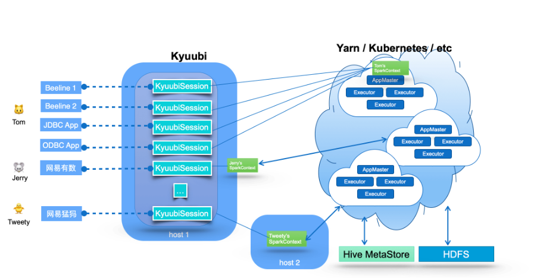

## 一、Kyuubi是什么？
Apache Kyuubi (Incubating)，一个分布式和多租户网关，用于在 Lakehouse 上提供 Serverless SQL。
<!--more-->

Apache Kyuubi通过Thrift JDBC/ODBC接口为最终用户提供了一个纯SQL网关，可以使用预编程和可扩展的Spark SQL引擎操作大规模数据。这种“开箱即用”的模式最大限度地降低了终端用户在客户端使用Spark的障碍和成本。在服务器端，Kyuubi服务器和引擎的多租户架构为管理员提供了一种实现计算资源隔离、数据安全、高可用性、高客户端并发等的方法。

## 二、Kyuubi的主要特性有哪些？
- 1.**多租户**(Kyuubi 通过统一的身份验证授权层为资源获取和数据 / 元数据访问提供端到端的多租户支持。)。
- 2.**高可用**(Kyuubi 通过 ZooKeeper 提供负载均衡，它提供了企业级的高可用性，以及无限的客户端高并发。)。
- 3.**多个工作负载**(Kyuubi 可以通过一个平台、一个数据副本和一个 SQL 接口轻松支持多个不同的工作负载。)。

## 三、Kyuubi的应用场景有哪些？
- 1.海量任务(日均数万的SQL任务)。
- 2.复杂环境(跨资源管理集群 Yarn、K8s、多版本Spark)。
- 3.复杂任务(几百行甚至上千行的SQL任务、数仓各个层级任务)。
- 4.多入口(BI、AI、离线开发、内部业务系统直连)。

## 四、Kyuubi的技术架构是怎样的？

## 五、Kyuubi的相关资料有哪些？
Kyuubi 官方网站:
https://kyuubi.apache.org/zh/

Kyuubi 官方文档:
https://kyuubi.apache.org/docs/latest/index.html

Kyuubi 源代码:
https://github.com/apache/incubator-kyuubi

## 六、YC-Framework是否支持Kyuubi？
支持。YC-Framework采用Kyuubi作为多数据平台统一入口。

YC-Framework官网：
https://framework.youcongtech.com/

YC-Framework Github源代码：
https://github.com/developers-youcong/yc-framework

YC-Framework Gitee源代码：
https://gitee.com/developers-youcong/yc-framework

以上源代码均已开源，开源不易，如果对你有帮助，不妨给个star，鼓励一下！！！