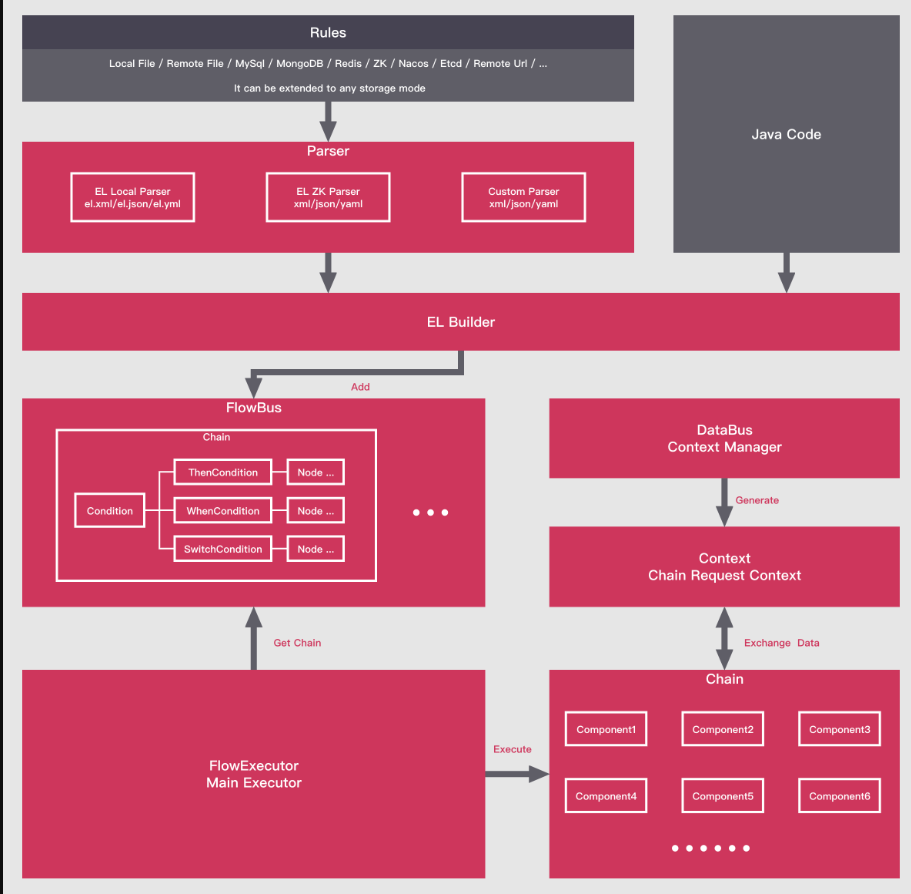

## 一、LiteFlow是什么？
LiteFlow是一个轻量且强大的国产规则引擎框架，可用于复杂的组件化业务的编排领域，独有的DSL规则驱动整个复杂业务，并可实现平滑刷新热部署，支持多种脚本语言规则的嵌入。帮助系统变得更加丝滑且灵活。

<!--more-->

LiteFlow官方网站：
https://liteflow.yomahub.com/

LiteFlow Github源代码：
https://github.com/dromara/liteflow/

LiteFlow Gitee源代码：
https://gitee.com/dromara/liteFlow

## 二、LiteFlow的架构图是怎样的？


## 三、LiteFlow有哪些特性？
- 1.组件定义统一： 所有的逻辑都是组件，为所有的逻辑提供统一化的组件实现方式，小身材，大能量。
- 2.规则轻量： 基于规则文件来编排流程，学习规则入门只需要5分钟，一看既懂。
- 3.规则多样化： 规则支持xml、json、yml三种规则文件写法方式，喜欢哪种用哪个。
- 4。任意编排： 同步异步混编，再复杂的逻辑过程，利用LiteFlow的规则，都是很容易做到的，看规则文件就能知道逻辑是如何运转的。
- 5.规则能从任意地方加载： 框架中提供本地文件配置源和zk配置源的实现，也提供了扩展接口，您可以把规则存储在任何地方。
- 6.优雅热刷新机制： 规则变化，无需重启您的应用，即时改变应用的规则。高并发下不会因为刷新规则导致正在执行的规则有任何错乱。
- 7.支持广泛： 不管你的项目是不是基于Springboot，Spring还是任何其他java框架构建，LiteFlow都能游刃有余。
- 8.JDK支持： 从JDK8到JDK17，统统支持。无需担心JDK版本。
- 9.脚本语言支持： 可以定义脚本语言节点，支持QLExpress和Groovy两种脚本。未来还会支持更多的脚本语言。
- 10.规则嵌套支持： 只要你想的出，你可以利用简单的表达式完成多重嵌套的复杂逻辑编排。
- 11.组件重试支持： 组件可以支持重试，每个组件均可自定义重试配置和指定异常。
- 12.上下文隔离机制： 可靠的上下文隔离机制，你无需担心高并发情况下的数据串流。
- 13.声明式组件支持： 你可以让你的任意类秒变组件。
- 14.详细的步骤信息： 你的链路如何执行的，每个组件耗时多少，报了什么错，一目了然。
- 15.稳定可靠： 历时2年多的迭代，在各大公司的核心系统上稳定运行。
- 16.性能卓越： 框架本身几乎不消耗额外性能，性能取决你的组件执行效率。
- 17.自带简单监控： 框架内自带一个命令行的监控，能够知道每个组件的运行耗时排行。

## 四、LiteFlow的设计原则是怎样的？
LiteFlow是基于工作台模式进行设计的，**何谓工作台模式？**

n个工人按照一定顺序围着一张工作台，按顺序各自生产零件，生产的零件最终能组装成一个机器，每个工人只需要完成自己手中零件的生产，而无需知道其他工人生产的内容。每一个工人生产所需要的资源都从工作台上拿取，如果工作台上有生产所必须的资源，则就进行生产，若是没有，就等到有这个资源。每个工人所做好的零件，也都放在工作台上。

**这个模式有几个好处：**

每个工人无需和其他工人进行沟通。工人只需要关心自己的工作内容和工作台上的资源。这样就做到了每个工人之间的解耦和无差异性。
即便是工人之间调换位置，工人的工作内容和关心的资源没有任何变化。这样就保证了每个工人的稳定性。
如果是指派某个工人去其他的工作台，工人的工作内容和需要的资源依旧没有任何变化，这样就做到了工人的可复用性。
因为每个工人不需要和其他工人沟通，所以可以在生产任务进行时进行实时工位更改：替换，插入，撤掉一些工人，这样生产任务也能实时的被更改。这样就保证了整个生产任务的灵活性。
这个模式映射到LiteFlow框架里，工人就是组件，工人坐的顺序就是流程配置，工作台就是上下文，资源就是参数，最终组装的这个机器就是这个业务。正因为有这些特性，所以LiteFlow能做到统一解耦的组件和灵活的装配。

## 五、LiteFlow适合哪些场景？
LiteFlow适用于拥有复杂逻辑的业务，比如说价格引擎，下单流程等，这些业务往往都拥有很多步骤，这些步骤完全可以按照业务粒度拆分成一个个独立的组件，进行装配复用变更。使用LiteFlow，你会得到一个灵活度高，扩展性很强的系统。因为组件之间相互独立，也可以避免改一处而动全身的这样的风险。

## 六、LiteFlow不适合哪些场景？
LiteFlow自开源来，经常有一些小伙伴来问我，如何做角色任务之间的流转，类似于审批流，A审批完应该是B审批，然后再流转到C角色。

**注意：**
LiteFlow只做基于逻辑的流转，而不做基于角色任务的流转。如果你想做基于角色任务的流转，推荐使用flowable ，activiti这2个框架。

## 七、YC-Framework中如何使用LiteFlow?

引入如下依赖：
```
<dependency>
    <groupId>com.yc.framework</groupId>
    <artifactId>yc-common-liteflow</artifactId>
</dependency>

```

**如何使用可参考LiteFlow官方文档：**
https://liteflow.yomahub.com/pages/5816c5/

我在yc-framework中也曾写过关于如何使用liteflow的示例，示例模块位于yc-example下，名字叫yc-example-liteflow。

**yc-example-liteflow地址如下：**
https://github.com/developers-youcong/yc-framework/tree/main/yc-example/yc-example-liteflow

以上源代码均已开源，开源不易，如果对你有帮助，不妨给个star！！！

YC-Framework官网：
https://framework.youcongtech.com/

YC-Framework Github源代码：
https://github.com/developers-youcong/yc-framework

YC-Framework Gitee源代码：
https://gitee.com/developers-youcong/yc-framework