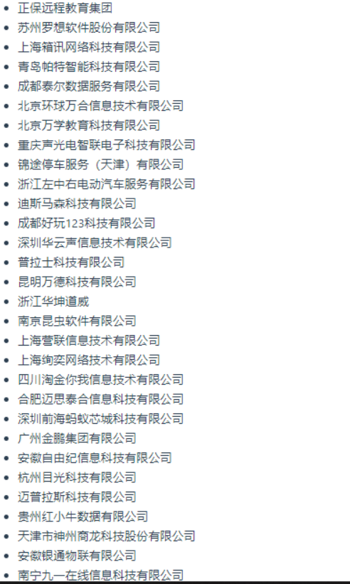

## 一、MyBatis-Plus是什么？
MyBatis-Plus（简称 MP）是一个 MyBatis 的增强工具，在 MyBatis 的基础上只做增强不做改变，为简化开发、提高效率而生。
<!--more-->

## 二、MyBatis-Plus所期望的愿景是什么？
我们的愿景是成为 MyBatis 最好的搭档，就像 魂斗罗 中的 1P、2P，基友搭配，效率翻倍。


## 三、MyBatis-Plus的特性有哪些？
- 1.无侵入：只做增强不做改变，引入它不会对现有工程产生影响，如丝般顺滑。
- 2.损耗小：启动即会自动注入基本 CURD，性能基本无损耗，直接面向对象操作。
- 3.强大的 CRUD 操作：内置通用 Mapper、通用 Service，仅仅通过少量配置即可实现单表大部分 CRUD 操作，更有强大的条件构造器，满足各类使用需求。
- 4.支持 Lambda 形式调用：通过 Lambda 表达式，方便的编写各类查询条件，无需再担心字段写错。
- 5.支持主键自动生成：支持多达 4 种主键策略（内含分布式唯一 ID 生成器 - Sequence），可自由配置，完美解决主键问题。
- 6.支持 ActiveRecord 模式：支持 ActiveRecord 形式调用，实体类只需继承 Model 类即可进行强大的 CRUD 操作。
- 7.支持自定义全局通用操作：支持全局通用方法注入（ Write once, use anywhere ）。
- 8.内置代码生成器：采用代码或者 Maven 插件可快速生成 Mapper 、 Model 、 Service 、 Controller 层代码，支持模板引擎，更有超多自定义配置等您来使用。
- 9.内置分页插件：基于 MyBatis 物理分页，开发者无需关心具体操作，配置好插件之后，写分页等同于普通 List 查询。
- 10.分页插件支持多种数据库：支持 MySQL、MariaDB、Oracle、DB2、H2、HSQL、SQLite、Postgre、SQLServer 等多种数据库。
- 11.内置性能分析插件：可输出 SQL 语句以及其执行时间，建议开发测试时启用该功能，能快速揪出慢查询。
- 12.内置全局拦截插件：提供全表 delete 、 update 操作智能分析阻断，也可自定义拦截规则，预防误操作。

## 四、MyBatis-Plus目前支持哪些数据库？
- 1.MySQL，Oracle，DB2，H2，HSQL，SQLite，PostgreSQL，SQLServer，Phoenix，Gauss ，ClickHouse，Sybase，OceanBase，Firebird，Cubrid，Goldilocks，csiidb。

- 2.达梦数据库，虚谷数据库，人大金仓数据库，南大通用(华库)数据库，南大通用数据库，神通数据库，瀚高数据库。

## 五、MyBatis-Plus的框架结构是怎样的？


## 六、为什么使用MyBatis-Plus？

**这里引用我曾经写过的博文来回答：**
关于为什么要使用MyBatis-Plus这个问题，我结合个人的使用经验，从代码生成器、易学性、应用性、安全性角度分析，归纳如下几个方面？

- 1.MyBatis的代码生成器生成的一大堆XML或者是实体及其Dao太过繁琐，而MyBatis-Plus 的代码生成器，生成的代码从Entity到Dao、Service及其实现类还有Controller包含XML,可以说是一整套生成，生成的代码十分简洁实用;

- 2.MyBatis-Plus原理就是MyBatis，只不过该开源作者对其做了强化,因此丝毫不影响原理怎么使用MyBatis,只不过对于实体而言，需要加一定的注解，注解也是非常易懂的;

- 3.MyBatis-Plus在不少开源项目中都很流行，比如guns、renren-security等等，同时也有不少公司也在用，如图所示:


- 4.至于安全方面，之前我们的公司的第一个项目使用的是MyBatis，后来另外两个项目接连使用MyBatis-Plus作为持久层，目前在线上暂未出现问题，即便出现问题，也不是因为MyBatis-Plus,问题一般通常是业务方面的bug之类的。

## 七、MyBatis-Plus与MyBatis有什么不同？

**相同点:**

它们都是用于持久层开发(DAO层，又称数据访问层),一般都用于常用的SSM框架或者是SpringBoot构建微服务，关于SSM框架实战和SpringBoot集成构建微服务，后面会讲到的。

**不同点:**

- (1) CRUD差异，MyBatis对于CRUD没有通用的一套，一般还得自己写SQL，复制过来，复制过去，而MyBatis-Plus对于CRUD有通用的一套。通用的一套，在这里指的是DAO、Service等。

- (2) 对于实体与表及其字段定义不同，MyBatis对于实体与在字段，通过XML文件方式，而My Batis-Plus通过@TableName让实体与表关联，通过@TableField与表字段关联，如果是XML文件方式的话，实体与字段映射，主要针对自定义SQL。

- (3) 插件成熟和丰富程度，MyBatis历史相对比MyBatis-Plus要久，插件丰富、成熟且强大，不是MyBatis-Plus所能比拟的，但是MyBatis-Plus也一直不断的更新强化自己，不过差距肯定是有的。

- (4) 通用性不同，MyBatis是外国人开发的，国内外皆通用，而MyBatis-Plus是由国内人士自发组织的开源，目前主要通用于国内。


## 八、YC-Framework是如何支持MyBatis-Plus的？
YC-Framework将MyBatis-Plus模块化处理，支持按需使用。按照如下三个步骤就能在对应的模块使用MyBatis-Plus。

### 1.引入依赖
```
<dependency>
    <groupId>mysql</groupId>
    <artifactId>mysql-connector-java</artifactId>
</dependency>

<dependency>
    <groupId>com.yc.framework</groupId>
    <artifactId>yc-common-mp</artifactId>
</dependency>

```

### 2.配置文件
```
# Spring
spring:
  application:
    # 应用名称
    name: yc-example-mp
  datasource:
    driver-class-name: com.mysql.jdbc.Driver
    url: jdbc:mysql://127.0.0.1:3306/yc-framework?useUnicode=true&characterEncoding=UTF-8&serverTimezone=Asia/Shanghai
    username: user_xxx
    password: xxxxx
# mybatis-plus相关配置
mybatis-plus:
  # xml扫描，多个目录用逗号或者分号分隔（告诉 Mapper 所对应的 XML 文件位置）
  mapper-locations: classpath:mapper/*.xml

```

### 3.对应的启动类添加如下注解
```
@MapperScan("xxxx.xxxx.xxxx")

```

**相关示例参考如下:**
https://github.com/developers-youcong/yc-framework/tree/main/yc-auth

https://github.com/developers-youcong/yc-framework/tree/main/yc-modules/yc-admin

以上源代码均已开源，开源不易，如果对你有帮助，不妨给个star！！！

YC-Framework官网：
https://framework.youcongtech.com/

YC-Framework Github源代码：
https://github.com/developers-youcong/yc-framework

YC-Framework Gitee源代码：
https://gitee.com/developers-youcong/yc-framework