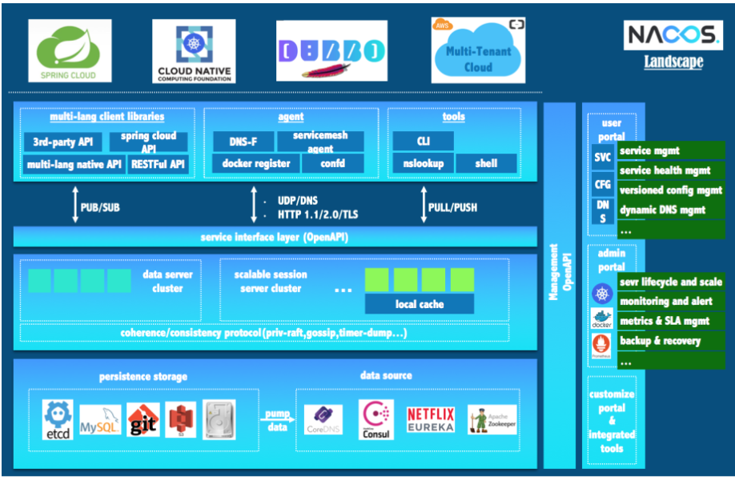
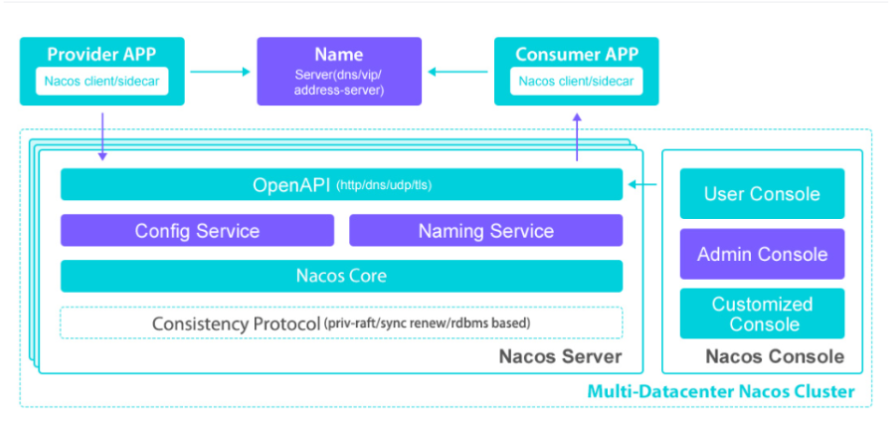
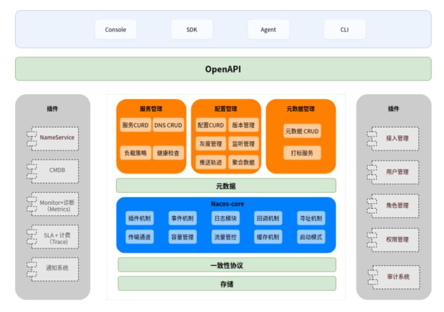

## 一、Nacos是什么？
Nacos是 Dynamic Naming and Configuration Service的首字母简称，一个更易于构建云原生应用的动态服务发现、配置管理和服务管理平台。
Nacos 致力于帮助您发现、配置和管理微服务。Nacos 提供了一组简单易用的特性集，帮助您快速实现动态服务发现、服务配置、服务元数据及流量管理。
Nacos 帮助您更敏捷和容易地构建、交付和管理微服务平台。 Nacos 是构建以“服务”为中心的现代应用架构 (例如微服务范式、云原生范式) 的服务基础设施。
<!--more-->

## 二、Nacos的关键特性有哪些？
● 1.服务发现和服务健康监测
● 2.动态配置服务
● 3.动态 DNS 服务
● 4.服务及其元数据管理

## 三、Nacos的生态图是怎样的？


## 四、Nacos的架构图是怎样的？


## 五、Nacos的逻辑架构及组件是怎样的？


## 六、Nacos相关的资料有哪些？
Nacos官网:
https://nacos.io/zh-cn/index.html

Nacos文档:
https://nacos.io/zh-cn/docs/v2/quickstart/quick-start.html
https://nacos.io/zh-cn/docs/quick-start.html

Nacos Github源代码:
https://github.com/alibaba/nacos

## 七、Nacos如何安装运行？
```
wget https://github.com/alibaba/nacos/releases/download/2.1.2/nacos-server-2.1.2.tar.gz
tar xzvf nacos-server-2.1.2.tar.gz
cd nacos-server-2.1.2/bin
sh startup.sh -m standalone (非集群模式下启动)


```

## 八、我写过有关Nacos相关的文章有哪些？
SpringCloud Alibaba之Nacos:
https://youcongtech.com/2020/08/23/SpringCloud-Alibaba%E4%B9%8BNacos/

Nacos安全配置之思考:
https://youcongtech.com/2022/04/04/Nacos%E5%AE%89%E5%85%A8%E9%85%8D%E7%BD%AE%E4%B9%8B%E6%80%9D%E8%80%83/

Nacos之配置文件实时刷新:
https://youcongtech.com/2020/11/30/nacos%E4%B9%8B%E9%85%8D%E7%BD%AE%E6%96%87%E4%BB%B6%E5%AE%9E%E6%97%B6%E5%88%B7%E6%96%B0/

分布式配置中心之思考:
https://youcongtech.com/2021/05/22/%E5%88%86%E5%B8%83%E5%BC%8F%E9%85%8D%E7%BD%AE%E4%B8%AD%E5%BF%83%E4%B9%8B%E6%80%9D%E8%80%83/

nacos的三种部署方式:
https://www.cnblogs.com/youcong/p/13618377.html


## 九、YC-Framework如何使用Nacos？

### 1.引入依赖
```
<dependency>
    <groupId>com.yc.framework</groupId>
    <artifactId>yc-common-nacos</artifactId>
</dependency>

```
### 2.核心配置文件
```
spring:
  cloud:
    nacos:
      discovery:
        # 服务注册地址
        server-addr: 127.0.0.1:8848
      config:
        # 配置中心地址
        server-addr: 127.0.0.1:8848
        # 配置文件格式
        file-extension: yml
        # 共享配置
        shared-dataids: application-${spring.profiles.active}.${spring.cloud.nacos.config.file-extension}

```

### 3.启动类
```
@SpringBootApplication(exclude = {DataSourceAutoConfiguration.class})
@EnableDiscoveryClient
@EnableCircuitBreaker
public class YcExampleNacosApplication {
    public static void main(String[] args) {
        SpringApplication.run(YcExampleNacosApplication.class, args);
    }
}

```

相关示例代码地址:
https://github.com/developers-youcong/yc-framework/tree/main/yc-example/yc-example-nacos
如果对你有帮助，不妨给个star，鼓励一下！！！

YC-Framework官网：
https://framework.youcongtech.com/

YC-Framework Github源代码：
https://github.com/developers-youcong/yc-framework

YC-Framework Gitee源代码：
https://gitee.com/developers-youcong/yc-framework