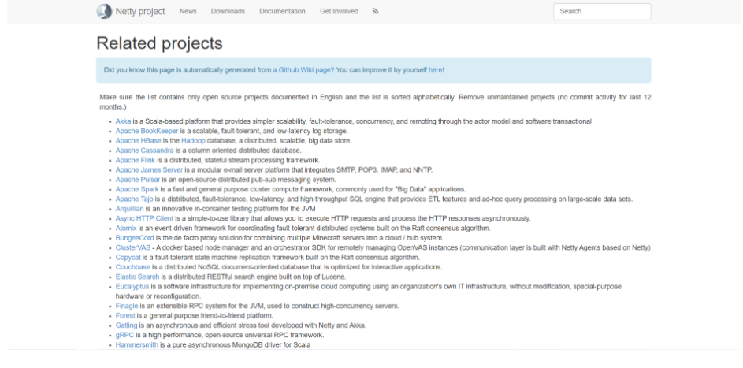

## 一、Netty的定义
Netty是一个异步事件驱动的网络应用程序框架，用于快速开发可维护的高性能协议服务器和客户端。
<!--more-->

## 二、为什么要使用Netty
Netty是业界最流行的NIO框架之一，它的健壮性、功能、性能、可定制性和可扩展性在同类框架中都是首屈一指的，它已经得到成百上千的商用项目验证，例如Hadoop的RPC框架avro使用Netty作为底层通信框架。很多其它业界主流的RPC框架，也使用Netty来构建高性能的异步通信能力。

**Netty的优点可归纳为如下:**
● 1) API使用简单，开发门槛低；
● 2) 功能强大，预置了多种编解码功能，支持多种主流协议；
● 3) 定制能力强，可以通过ChannelHandler对通信框架进行灵活的扩展；
● 4) 性能高，通过与其它业界主流的NIO框架对比，Netty的综合性能最优；
● 5) 成熟、稳定，Netty修复了已经发现的所有JDK NIO BUG，业务开发人员不需要再为NIO的BUG而烦恼；
● 6) 社区活跃，版本迭代周期短，发现的BUG可以被及时修复，同时，更多的新功能会被加入；
● 7) 经历了大规模的商业应用考验，质量已经得到验证。在互联网、大数据、网络游戏、企业应用、电信软件等众多行业得到成功商用，证明了它可以完全满足不同行业的商业应用。

## 三、Netty的应用场景有哪些
● 互联网行业；
● 游戏行业；
● 大数据领域；
● 通信行业。

## 四、Netty的资料有哪些？
官网:
https://netty.io/

官方文档(根据Netty所使用的不同版本进行查阅):
https://netty.io/wiki/index.html

Github源代码:
https://github.com/netty/netty 

Netty有关书籍推荐:
《Netty源码刨析与应用》
《Netty权威指南（第2版）》
《Netty原理解析与开发实战》
《Netty进阶之路:跟着案例学Netty》
《Netty4核心原理与手写RPC框架实战》

## 五、Netty相关的开源项目有哪些？

Netty官网中提到:
https://netty.io/wiki/related-projects.html



**Netty相关的开源项目如下所示:**

● Akka 是一个基于scala的平台，它通过参与者模型和软件事务提供了更简单的可伸缩性、容错、并发性和远程处理model
● Apache BookKeeper 是一种可伸缩、容错和低延迟的日志存储。
● Apache Cassandra 是一个面向列的分布式数据库。
● Apache Flink Apache Flink是一个分布式的、有状态的流处理框架。
● Apache James Server 是一个模块化的电子邮件服务器平台，它集成了SMTP、POP3、IMAP和NNTP。
● Apache Pulsar 是一个开源的分布式发布子消息系统。
● Apache Spark 是一个快速通用的集群计算框架，通常用于“大数据”应用程序。
● Apache Tajo 是一个分布式、容错、低延迟和高吞吐量的SQL引擎，它提供ETL特性和对大型数据集的特殊查询处理。
● Arquillian 是一个创新的JVM容器内测试平台
● Async HTTP Client 是一个简单易用的库，它允许您异步地执行HTTP请求和处理HTTP响应。
● Atomix是一个事件驱动框架，用于协调基于Raft consensus算法的容错分布式系统。
● BungeeCord实际上是一个代理解决方案，用于将多个Minecraft服务器合并到一个云/集线器系统中。
● Copycat 是一个建立在Raft一致性算法基础上的容错状态机复制框架。
● Couchbase 是一个面向文档的分布式NoSQL数据库，它针对交互式应用程序进行了优化。
● Elastic Search是一个基于Lucene的分布式RESTful搜索引擎。
● Eucalyptus 是一个软件基础设施，用于使用组织自己的IT基础设施实现内部云计算，无需修改、特殊用途的硬件或重新配置。
● Finagle 是一个可扩展的JVM RPC系统，用于构造高并发服务器。
● Forest 是一个通用的朋友对朋友的平台。
● Gatling 是由Netty和Akka开发的一种异步且高效的压力工具。
● gRPCgRPC是一个高性能、开源的通用RPC框架。
● Hammersmith 是一个纯异步的Scala MongoDB驱动程序
● Higgs Higgs是一个高性能的、面向消息的网络库。
● Holmes Holmes是一个Java应用程序，它实现了DLNA/UPnP协议，用于向兼容设备播放视频、音乐、图片和播客(RSS)
● HornetQ HornetQ是一个构建多协议、可嵌入、高性能、集群、异步消息传递系统的项目。
● http-client 是一个高性能、面向吞吐量的HTTP客户端库。
● Infinispan 是一个可伸缩的、高度可用的数据网格平台。
● jaC64 是一个支持多人游戏的C64模拟器。
● jasync-sql Java, Netty为基础，异步数据库驱动程序为MySQL和PostgreSQL编写的Kotlin。
● JBossWS 是一个功能丰富的兼容JAX-WS的web服务堆栈。
● Jetserver 是一个快速的多人java游戏服务器，使用JBoss Netty和Mike Rettig的Jetlang编写。它支持TCP和UDP传输和Flash AMF3协议。
● JXTA 是一组开放协议，允许网络上的任何连接设备(从手机和无线pda到pc和服务器)以P2P方式通信和协作。
● LittleProxy 是一个高性能的HTTP代理。
● LittleShoot 是一种基于开放协议和开放标准发布、搜索和下载文件的开源P2P技术。
● Lettuce 是一个可伸缩的Redis客户端，用于构建非阻塞的反应性应用程序
● MessagePack 是一个基于二进制的高效对象序列化库，支持在多种语言之间交换结构化对象。
● Mobicents Media Server 是一个媒体网关服务器，它处理与电话或VoIP连接相关的音频和/或视频流。
● Mobicents SIP Servlets是一个经过开源认证的SIP Servlet实现。
● Mock Server 使用Netty对具有HTTP或HTTPS接口的系统进行模拟的模拟服务器模拟和代理框架
● Moquette MQTT broker 简单的MQTT代理，使用Netty作为协议编解码器。
● Naggati Naggati“it's (DEPRECATED) now”是Netty的协议构建器，用Scala编写。
● Netflow.io Netflow。io是一个Scala/Netty Netflow收集器，用于waste .io
● Netty Tools 是一组在使用Netty时非常有用的工具，其中包括各种HTTP客户机和服务器、带宽计和勤俭RPC处理器。
● Netty-ICAP Codec 编解码器是一种高性能的完全兼容RFC3507的ICAP编解码器实现。该协议主要用于代理环境，以便将工作转移到外部服务器。
● Netty-Livereload 是Netty WebSocket实现上的Livereload协议实现。
● Netty-SocketIO net - socketio是一个套接字。IO服务器写在Netty上面
● Netty-Transport-jSerialComm 是使用jSerialComm库为Netty提供的串行端口传输。
● Netty-ZMTP Netty通道处理程序的集合，旨在实现ZMTP/1.0，即ZeroMQ消息传输协议。
● Riposte Riposte是一个基于netty的微服务框架，用于快速开发可用于生产的HTTP
● ScaleCube ScaleCube反应性微服务是一个按比例构建的消息驱动和异步锁免费库。支持scalecube-cluster闲话功能，旨在解决分布式应用程序的交叉关注点，例如;服务发现、位置透明性、容错和实时故障检测。
● Slacker
由Netty支持的Slacker异步Clojure RPC客户机/服务器库。
● Socket-IO - Service Fabric I/O插座-服务织物I/O超快速插座。基于Netty的IO服务器。
● SwiftNIO SwiftNIO基本上是Netty在iOS平台上的孪生兄弟，由同一个团队编写。
● Nifty Nifty是一个基于netty的Thrift传输实现。
● NIOSMTP 是一个异步SMTP客户机实现。
● OpenTSDB 是一个分布式的、可伸缩的、基于HBase编写的时间序列数据库，用于存储、索引和服务从计算机系统收集的指标。
● Peregrine 是一个map reduce框架，用于跨数据分区运行迭代作业。Peregrine旨在通过支持许多优化和其他map reduce框架中不存在的特性来快速执行map reduce作业。
● Play Framework 是J2EE stack的一个干净的替代web应用程序框架，它关注开发人员的工作效率，并以RESTful架构为目标。
● PS3 Media Server PS3媒体服务器是一个兼容DLNA的通用即插即用媒体服务器的PS3，它可以对任何类型的媒体文件进行代码转换和流媒体。
● Protobuf-RPC-Pro
是谷歌协议缓冲区RPC服务的Java实现。
● PushyPushy是一个用于发送APNs (iOS/OS X)推送通知的Java库。
● Ratpack 是一个用于创建高性能web应用程序的简单、强大的工具包。
● Redisson 在Redis服务器上提供了一个分布式的、可伸缩的Java数据结构(Set、SortedSet、Map、ConcurrentMap、List、Queue、Deque、Lock、AtomicLong、CountDownLatch、Publish / Subscribe、HyperLogLog)。
● RESTExpress 是一个轻量级、快速的微型框架，用于用Java构建独立的REST服务。它自动支持JSON和XML序列化以及ISO 8601日期格式。
● RHQ collectd decoder 解码器解码collectd UDP数据报。
● Spigot 是一个基于CraftBukkit的高性能Minecraft服务器，旨在提供最高的性能和可靠性。它使用Netty作为自定义网络堆栈。
● Spinach 是一个可伸缩的线程安全磁盘客户端，提供同步和异步连接。
● Swift-NIO 是一个跨平台异步事件驱动的网络应用程序框架，用于快速开发可维护的高性能协议服务器和客户端。它就像Netty，但是是为Swift (iOS)编写的。
● Termd 是一个用于在Java中构建终端应用程序的库，提供一个Telnet服务器、一个SSH服务器和一个基于Netty的基于web的终端
● Teiid是一个数据虚拟化系统，它允许应用程序使用来自多个异构数据存储的数据。
● Torrent4J Torrent4J是一个纯Java实现的BitTorrent库。
● TomP2P 是一个纯Java实现的BitTorrent库。
● Unfiltered 是一个扩展的DHT(分布式哈希表)，它将位置键的值存储在一个已排序的表中。
● Universal Media Server一个兼容DLNA的UPNP媒体服务器，适用于PS3和其他渲染器，它可以对任何类型的媒体文件进行代码转换和流媒体。
● Vert.x 是用于在JVM上构建反应性应用程序的工具包。
● WaarpFtp 是基于Netty的FTP服务器
● Wabbit 是clojure中的服务器端应用程序框架。
● Webbit 是一个基于事件的WebSocket和HTTP服务器。
● Websocket-MQTT-Forwarder 是基于事件的WebSocket到MQTT代理代理。
● Xitrum 是一个异步的、集群的Scala web框架和HTTP(S)服务器，位于Netty和Hazelcast之上。
● zooterrain 是一个小型的自包含web服务器应用程序，它将所有ZooKeeper znode及其更改推送到浏览器(使用WebSocket)。


## 六、六、YC-Framework如何使用Netty?

### 1.引入依赖
```
<dependency>
    <groupId>com.yc.framework</groupId>
    <artifactId>yc-common-netty</artifactId>
</dependency>

```

### 2.简单示例代码

#### (1)NettyServer.java
```
@Component
@Data
public class NettyServer {

    private Logger logger = LoggerFactory.getLogger(NettyServer.class);

    //NIO线程组
    private NioEventLoopGroup boos = new NioEventLoopGroup();
    private NioEventLoopGroup worker = new NioEventLoopGroup();
    private Channel channel;

    public ChannelFuture lister(int port) {
        ChannelFuture f = null;
        try {
            ServerBootstrap b = new ServerBootstrap()
                    .group(boos, worker)
                    .channel(NioServerSocketChannel.class)
                    .option(ChannelOption.SO_BACKLOG, 128)
                    .childHandler(new ChannelInitializer<SocketChannel>() {
                        @Override
                        protected void initChannel(SocketChannel ch) throws Exception {
                            //采用分割符解决半包黏包
                            ch.pipeline().addLast(new LineBasedFrameDecoder(1024));
                            //字符串的编解码器
                            ch.pipeline().addLast(new StringDecoder());
                            ch.pipeline().addLast(new StringEncoder());
                            //添加自己的消息处理器
                            ch.pipeline().addLast(new ServerHandler());
                        }
                    });
            f = b.bind(port).sync();
            channel = f.channel();
        } catch (Exception e) {
            e.printStackTrace();
        } finally {
            if (f != null && f.isSuccess()) {
                logger.info("Netty 服务端启动成功.....");
            } else {
                logger.info("Netty 服务端启动失败.....");
            }
        }
        return f;
    }

    //销毁方法
    public void destroy() {
        if (channel == null) {
            return;
        }
        channel.close();
        worker.shutdownGracefully();
        boos.shutdownGracefully();
    }
}


```

#### (2)ServerHandler.java
```
public class ServerHandler extends ChannelInboundHandlerAdapter {
    private Logger logger = LoggerFactory.getLogger(ServerHandler.class);

    @Override
    public void channelRead(ChannelHandlerContext ctx, Object msg) throws Exception {
        if (msg instanceof String) {
            String strMsg = (String) msg;
            logger.info("服务端收到消息: " + msg);
        }
    }

    @Override
    public void channelActive(ChannelHandlerContext ctx) throws Exception {
        logger.info("连接建立.....");
    }

    @Override
    public void channelInactive(ChannelHandlerContext ctx) throws Exception {
        logger.info("连接断开");
    }

    @Override
    public void exceptionCaught(ChannelHandlerContext ctx, Throwable cause) throws Exception {
        logger.error("连接异常: \r\n" + cause);
    }
}


```

#### (3)启动类
```
@SpringBootApplication
public class YcExamleNettyApplication implements CommandLineRunner {
    @Value("${netty.port}")
    private Integer port;
    @Autowired
    private NettyServer nettyServer;

    public static void main(String[] args) {
        SpringApplication.run(YcExamleNettyApplication.class, args);
    }

    @Override
    public void run(String... args) throws Exception {
        ChannelFuture channelFuture = nettyServer.lister(port);
        //增加虚拟机钩子函数
        Runtime.getRuntime().addShutdownHook(new Thread(() -> {
            nettyServer.destroy();
        }));
        channelFuture.channel().closeFuture().channel();
    }

}

```
#### (4)配置文件
```
server:
  tomcat:
    uri-encoding: UTF-8
    #最小线程数
    min-spare-threads: 500
    #最大线程数
    max-threads: 2500
    #最大连接数
    max-connections: 5000
    #最大等待队列长度
    accept-count: 1000
    #请求头最大长度kb
    max-http-header-size: 1048576
    #启动APR(非阻塞IO)
    protocol: org.apache.coyote.http11.Http11AprProtocol
  port: 7019

spring:
  application:
    # 应用名称
    name: yc-example-netty
netty:
  port: 12022

```

相关示例代码地址:
https://github.com/developers-youcong/yc-framework/tree/main/yc-example/yc-example-netty

如果对你有帮助，不妨给个star，鼓励一下！！！

YC-Framework官网：
https://framework.youcongtech.com/

YC-Framework Github源代码：
https://github.com/developers-youcong/yc-framework

YC-Framework Gitee源代码：
https://gitee.com/developers-youcong/yc-framework