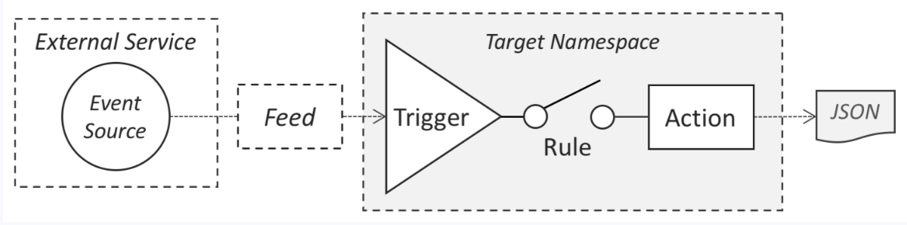
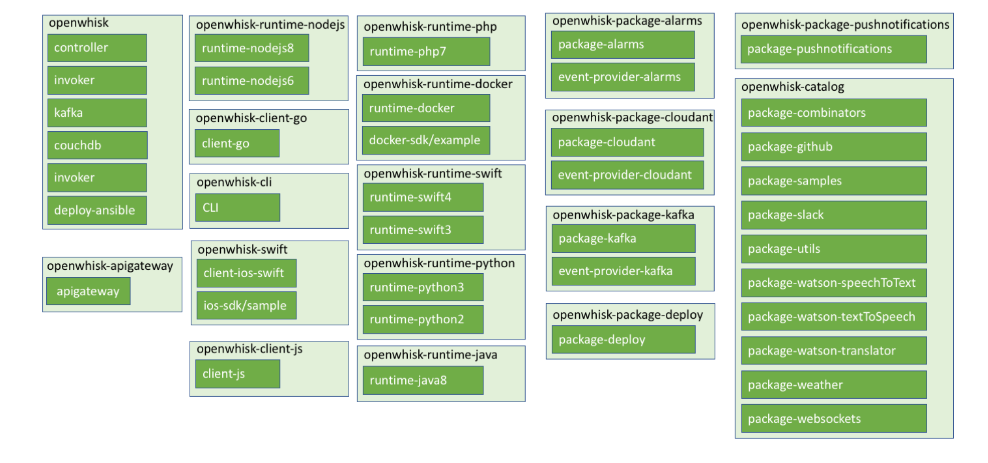
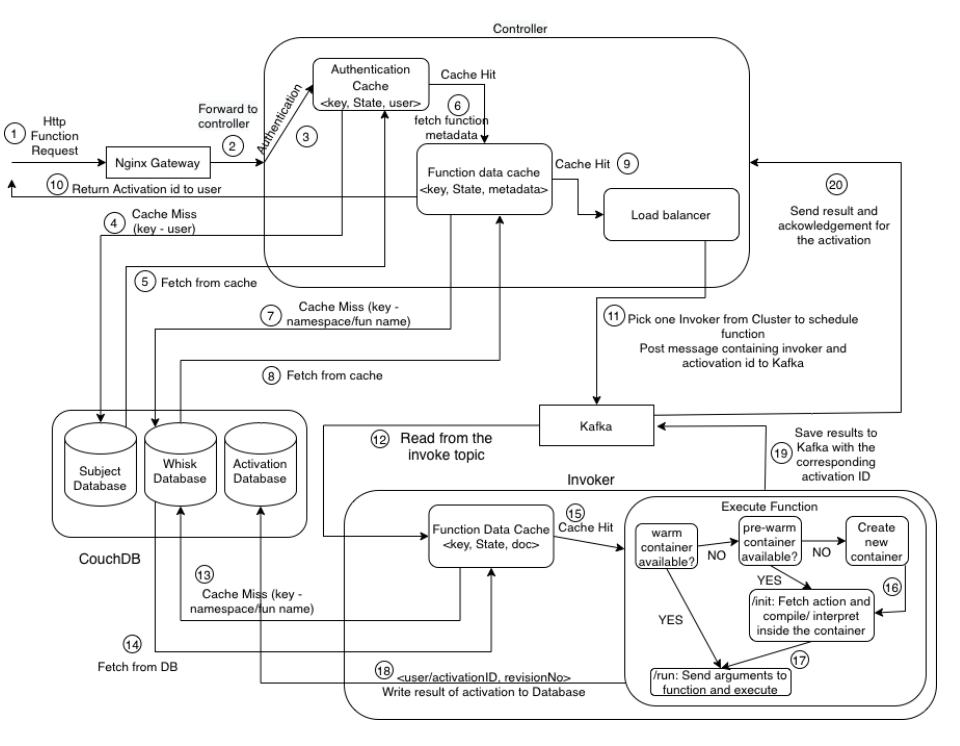

## 一、OpenWhisk是什么？
<!--more-->

Apache OpenWhisk是一个开源的分布式无服务器平台，它可以执行函数(fx)来响应任何规模的事件。OpenWhisk使用Docker容器管理基础设施、服务器和扩展，因此您可以专注于构建令人惊叹和高效的应用程序。

OpenWhisk平台支持一种编程模型，在这种模型中，开发人员可以使用任何受支持的编程语言编写功能逻辑(称为Actions)，这些逻辑可以动态调度并运行，以响应来自外部源(feed)或HTTP请求的相关事件(通过触发器)。该项目包括一个基于REST Api的命令行接口(CLI)以及其他工具，以支持打包、目录服务和许多流行的容器部署选项。

## 二、OpenWhisk编程模型是怎样的？

## 三、OpenWhisk目前支持哪些编程语言？
**主要支持:**.Net、Go、Java、JavaScript、PHP、Python、Ruby、Swift。

## 四、OpenWhisk的应用场景有哪些？
- 1.微服务。
- 2.Web应用。
- 3.物联网。
- 4.API后端。
- 5.移动后端。
- 6.数据处理。

## 五、OpenWhisk的组件图是怎样的？

## 六、当用户调用一个动作时Openwhisk中所发生的步骤是怎样的？

## 七、OpenWhisk的相关资料有哪些？

官网:
https://openwhisk.apache.org/

文档:
https://openwhisk.apache.org/documentation.html

Github源代码:
https://github.com/apache/openwhisk

## 八、YC-Framework是否能结合OpenWhisk？
是的。YC-Framework可以结合OpenWhisk。一般结合OpenWhisk的话，旨在实现构建Serverless Cloud Platform Architecture。

YC-Framework官网：
https://framework.youcongtech.com/

YC-Framework Github源代码：
https://github.com/developers-youcong/yc-framework

YC-Framework Gitee源代码：
https://gitee.com/developers-youcong/yc-framework

以上源代码均已开源，开源不易，如果对你有帮助，不妨给个star，鼓励一下！！