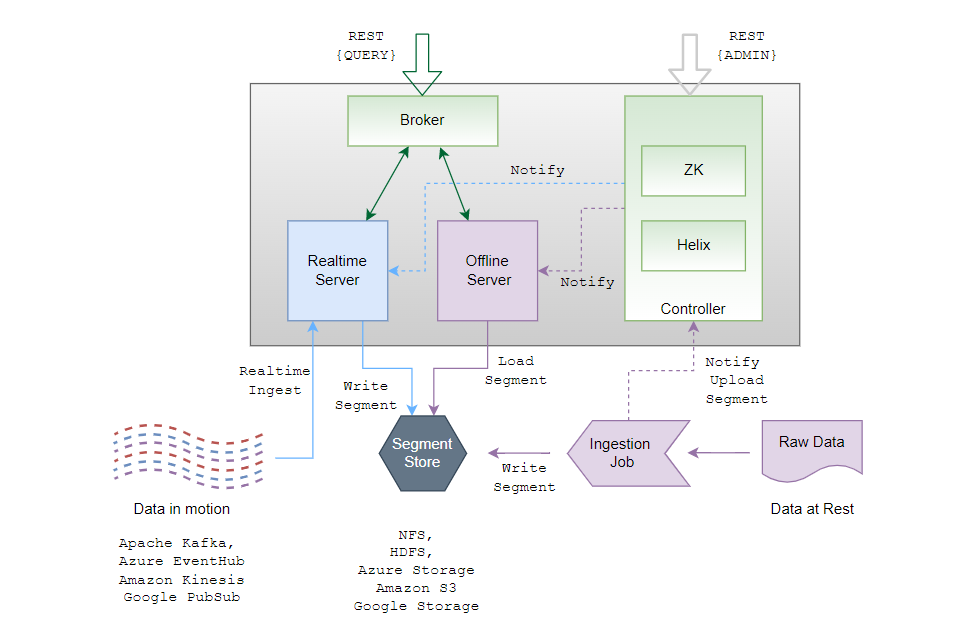

## 一、Pinot是什么？
<!--more-->

Apache Pinot是一个实时分布式OLAP数据存储，专门用于提供超低延迟分析，即使在极高的吞吐量下。它可以直接从流数据源(如Apache Kafka和Amazon Kinesis)中摄取数据，并使事件可以立即查询。它还可以从批处理数据源中摄取数据，如Hadoop HDFS、Amazon S3、Azure ADLS和谷歌云存储。

该系统的核心是一个柱状存储，使用了一些智能索引和预聚合技术以实现低延迟。这使得Pinot最适合面向用户的实时分析。同时，Pinot也是其他分析用例的一个很好的选择，比如内部仪表板、异常检测和临时数据探索。

## 二、Pinot的特性有哪些？
- 1.一个面向列的数据库，具有各种压缩方案，如运行长度，固定位长度。
- 2.可插拔索引技术-排序索引，位图索引，倒排索引，StarTree索引，Bloom过滤器，范围索引，文本搜索索引(Lucence/FST)， Json索引，地理空间索引。
- 3.能够基于查询和段元数据优化查询/执行计划。
- 4.来自Kafka、Kinesis等流的近实时摄取，以及来自Hadoop、S3、Azure、GCS等源的批量摄取。
- 5.类似sql的语言，支持对数据的选择、聚合、过滤、分组、排序和不同的查询。
- 6.支持多值字段。
- 7.水平可扩展和容错。

## 三、Pinot的应用场景有哪些？
- 1.面向用户的分析产品。
- 2.业务指标的实时仪表板。
- 3.异常检测。

## 四、Pinot的指导设计原则有哪些？
- 1.**高可用性:**Pinot旨在为面向客户的应用程序提供低延迟的分析查询。根据设计，Pinot没有单点故障。当节点关闭时，系统继续提供查询服务。
- 2.**水平可伸缩:**能够在工作负载发生变化时通过添加新节点进行扩展。
- 3.**延迟与存储:**Pinot被构建为即使在高吞吐量下也能提供低延迟。为此开发了段分配策略、路由策略、星树索引等功能。
- 4.**不可变数据:**Pinot假设所有存储的数据都是不可变的。为了符合GDPR，我们提供了一个附加解决方案，在保持性能保证的同时清除数据。
- 5.**动态配置更改:**必须在不影响查询可用性或性能的情况下执行添加新表、扩展集群、吸收数据、修改索引配置和重新平衡等操作。

## 五、Pinot的核心组件是由哪些构成？

## 六、Pinot的相关资料有哪些？
官方网站:
https://pinot.apache.org/

官方文档:
https://docs.pinot.apache.org/

源代码:
https://github.com/apache/pinot

## 七、YC-Framework是否支持Pinot？
支持。主要应用于低延迟的实时分析场景。

YC-Framework官网：
https://framework.youcongtech.com/

YC-Framework Github源代码：
https://github.com/developers-youcong/yc-framework

YC-Framework Gitee源代码：
https://gitee.com/developers-youcong/yc-framework