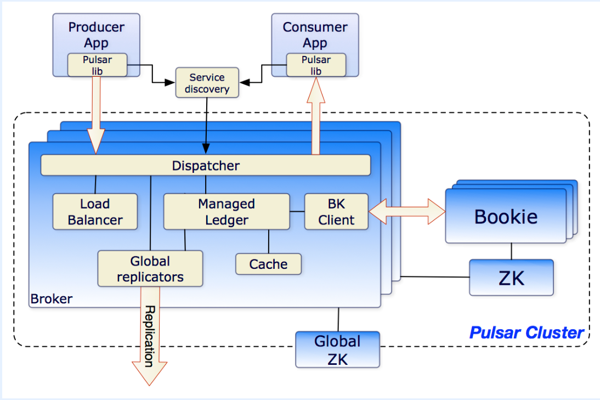

## 一、Pulsar是什么？
<!--more-->

Apache Pulsar是基于发布者-订阅(发布-订阅)模式构建的服务器到服务器消息传递和队列的原生云、多租户、高性能解决方案。Pulsar结合了传统消息系统(如RabbitMQ)和发布-订阅系统(如Apache Kafka)的最佳特性——动态伸缩，不停机。它被成千上万的公司用于高性能数据管道、微服务、即时消息、数据集成等。

## 二、Pulsar的主要特性有哪些？
- 1.云原生架构（计算与存储分离），无缝支持跨集群复制。
- 2.比kafka更高的吞吐量和低延迟。
- 3.无缝支持上百万个topics。
- 4.支持多种消息订阅模式 (exclusive & shared & failover)。
- 5.通过持久化存储BookKeeper保障消息的传递。
- 6.轻量级Serverless计算框架Pulsar Functions提供了流式数据处理能力。
- 7.提供分层存储能力，释放BookKeeper的空间：将老数据or长期不用的数据放到AWS S3等。
- 8.一个简单的客户端API，为Java, Go, Python和c++绑定。

## 三、Pulsar的应用场景有哪些？
- 1.计费平台、支付平台、交易系统。
- 2.Worker Queue / Push Notifications / Task Queue，主要是为了实现系统之间的相互解耦。
- 3.IOT应用。
- 4.批流融合的存储。

换句话说，Kafka能做的，Pulsar也能做，Kafka不能做的，Pulsar能做。

## 四、Pulsar的架构是怎样的？

## 五、Pulsar的相关资料有哪些？
Pulsar 官网:
https://pulsar.apache.org/

Pulsar 官方文档:
https://pulsar.apache.org/docs/

Pulsar Github 源代码:
https://github.com/apache/pulsar

## 六、YC-Framework是否支持Pulsar？
支持。Kafka适用的场景，也可以使用Pulsar。关键还是看业务需求。有一句话叫做：“杀鸡焉用牛刀”。大家自行参考决定。

YC-Framework官网：
https://framework.youcongtech.com/

YC-Framework Github源代码：
https://github.com/developers-youcong/yc-framework

YC-Framework Gitee源代码：
https://gitee.com/developers-youcong/yc-framework

以上源代码均已开源，开源不易，如果对你有帮助，不妨给个star，鼓励一下！！！