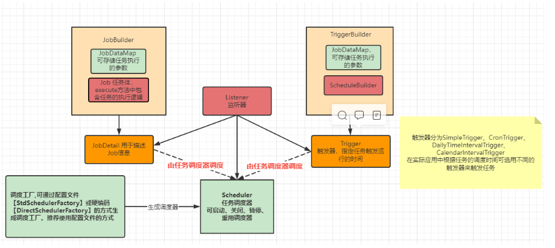

## 一、Quartz是什么？
Quartz 是一个功能丰富的开源作业调度库，几乎可以集成到任何 Java 应用程序中 - 从最小的独立应用程序到最大的电子商务系统。Quartz可用于创建简单或复杂的计划，以执行数十个，数百个甚至数万个作业;其任务被定义为标准 Java 组件的作业，这些组件几乎可以执行您可以对它们进行编程执行的任何操作。Quartz 调度程序包括许多企业级功能，例如支持JTA事务和集群。
<!--more-->

如果你的应用程序具有需要在给定时刻执行的任务，或者如果你的系统具有重复的维护工作，则Quartz可能是你理想的解决方案。

## 二、Quartz的组件包含哪些？


由上图可知，**Quartz框架主要由如下六个部分组成:**

- 1.Scheduler - 与调度程序交互。
- 2.Job - 任务执行单元。
- 3.JobDetail - 定义Job信息。
- 4.Trigger - 定义任务执行的触发时间信息。
- 5.JobBuilder - 用于定于JobDetail实例。
- 6.TriggerBuilder - 用于定于Trigger实例。

## 三、在YC-Framework中如何使用Quartz？

### 1.导入依赖
```
<dependency>
    <groupId>com.yc.framework</groupId>
    <artifactId>yc-common-quartz</artifactId>
</dependency>

```

### 2.核心配置
```
@Configuration
public class QuartzConfig {
    /**
     * 定义任务
     */
    @Bean
    public JobDetail testJob() {
        JobDataMap data = new JobDataMap(); //通过JobDataMap向任务中传递参数
        return JobBuilder.newJob(TestJob.class).withIdentity("TestJob").usingJobData(data).storeDurably()
                .build();
    }

    /**
     * 定义触发器
     */
    @Bean
    public Trigger syncPwdTrigger(@Qualifier("testJob") JobDetail job) {
        ScheduleBuilder<?> csb = getScheduleBuilderWithMillisecond(10000); // 每10秒运行一次

        return TriggerBuilder.newTrigger().forJob(job).withIdentity("TestTrigger").withSchedule(csb).build();
    }

    private ScheduleBuilder<?> getScheduleBuilderWithMillisecond(long milliSecond) {
        SimpleScheduleBuilder ssb = SimpleScheduleBuilder.simpleSchedule().withIntervalInMilliseconds(milliSecond).repeatForever();
        return ssb.repeatForever();
    }

}

```

### 3.编写具体测试任务
```
public class TestJob extends QuartzJobBean {
    @Override
    protected void executeInternal(JobExecutionContext context) throws JobExecutionException {
        System.out.println("it is a quartz job test");
    }
}

```

相关示例代码地址:
https://github.com/developers-youcong/yc-framework/tree/main/yc-example/yc-example-quartz

YC-Framework官网：
https://framework.youcongtech.com/

YC-Framework Github源代码：
https://github.com/developers-youcong/yc-framework

YC-Framework Gitee源代码：
https://gitee.com/developers-youcong/yc-framework

以上源代码均已开源，开源不易，如果对你有帮助，不妨给个star，鼓励一下！！！
