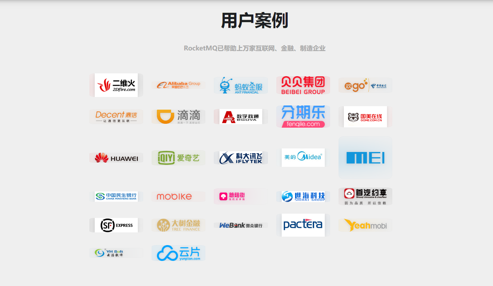
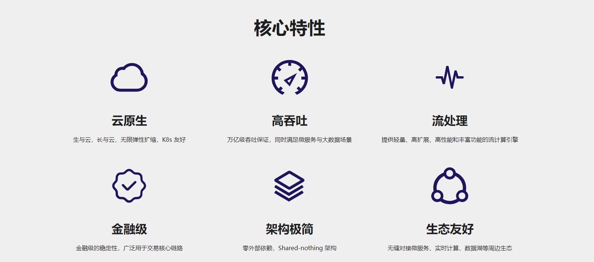
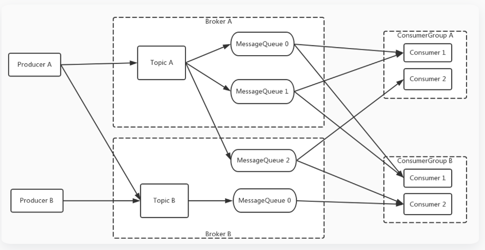
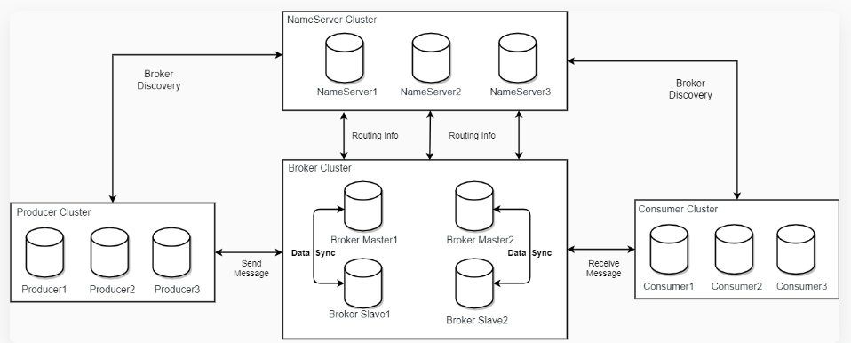

## 一、RocketMQ是什么？
Apache RocketMQ 是一个分布式消息传递和流媒体平台，具有低延迟，高性能和可靠性，万亿级容量和灵活的可扩展性。
<!--more-->

## 二、RocketMQ的应用场景有哪些?
- 1.削峰填谷。
- 2.异步解耦。
- 3.顺序消息。
- 4.分布式事务消息。
- 5.订单通知发货。
- 6.订单超时取消。
- 7.定时消息。
- 8.异常处理告警。
- 9.可靠消息推送。

## 三、为什么选择使用RocketMQ?
- 1.支持严格的消息顺序。
- 2.支持Topic与Queue两种模式。
- 3.亿级消息堆积能力。
- 4.比较友好的分布式特性。
- 5.同时支持Push与Pull方式消费消息。
- 6.历经多次天猫双十一海量消息考验。
- 7.RocketMQ是纯java编写，基于通信框架Netty。

## 四、RocketMQ的用户案例有哪些？


## 五、RocketMQ5.0具备哪些更强大的功能特性？


## 六、RocketMQ的扩展消息模型以及部署模型是怎样的？

### 1.扩展消息模型


### 2.部署模型



## 七、如何安装RocketMQ?

### 1.下载
```
wget https://archive.apache.org/dist/rocketmq/4.9.2/rocketmq-all-4.9.2-bin-release.zip

```

### 2.解压
```
unzip rocketmq-all-4.9.2-bin-release.zip

```
### 3.启动

#### (1)启动name server
```
nohup sh bin/mqnamesrv & 
tail -f ~/logs/rocketmqlogs/namesrv.log

```

#### (2)启动broker
```
nohup sh bin/mqbroker -n localhost:9876 & 
tail -f ~/logs/rocketmqlogs/broker.log

```

## 八、YC-Framework中如何使用RocketMQ?

### 1.导入依赖
```
<dependency>
    <groupId>com.yc.framework</groupId>
    <artifactId>yc-common-rocketmq</artifactId>
</dependency>

```

### 2.配置文件
```
server:
  port: 8181
rocketmq:
  name-server: localhost:9876 # 访问地址
  producer:
    group: TestTopic # 必须指定group
    send-message-timeout: 3000 # 消息发送超时时长，默认3s
    retry-times-when-send-failed: 3 # 同步发送消息失败重试次数，默认2
    retry-times-when-send-async-failed: 3 # 异步发送消息失败重试次数，默认2


```

### 3.生产者代码
```
@Component
public class MessageProducer {

    @Autowired
    private RocketMQTemplate rocketMQTemplate;

    // 发送消息的实例
    public void sendMessage(String topic, String msg) {
        rocketMQTemplate.convertAndSend(topic, msg);
    }

    // 发送事务消息的实例
    public void sendMessageInTransaction(String topic, String msg) throws InterruptedException {
        String[] tags = {"TagA", "TagB", "TagC", "TagD", "TagE"};
        for (int i = 0; i < 10; i++) {
            Message<String> message = MessageBuilder.withPayload(msg).build();
            String destination = topic + ":" + tags[i % tags.length];

            TransactionSendResult sendResult =
                    rocketMQTemplate.sendMessageInTransaction(destination, message, destination);

            System.out.printf("%s%n", sendResult);
            Thread.sleep(10);
        }
    }
}

```

### 4.消费者代码
```
@Component
@RocketMQMessageListener(consumerGroup = "testBootGroup", topic = "TestTopic")
public class MessageConsumer implements RocketMQListener {
    @Override
    public void onMessage(Object message) {
        System.out.println("Received message : " + message);
    }
}

```

### 5.测试类代码
```
@RestController
public class TestController {
    private final String topic = "TestTopic";
    @Autowired
    private MessageProducer producer;

    @GetMapping("/sendMessage")
    public String sendMessage(String message) {
        producer.sendMessage(topic, message);
        return "消息发送完成";
    }

    @GetMapping("/sendTransactionMessage")
    public String sendTransactionMessage(String message) throws InterruptedException {
        producer.sendMessageInTransaction(topic, message);
        return "消息发送完成";
    }

}

```

相关示例代码地址:
https://github.com/developers-youcong/yc-framework/tree/main/yc-example/yc-example-rocketmq

YC-Framework官网：
https://framework.youcongtech.com/

YC-Framework Github源代码：
https://github.com/developers-youcong/yc-framework

YC-Framework Gitee源代码：
https://gitee.com/developers-youcong/yc-framework

以上源代码均已开源，开源不易，如果对你有帮助，不妨给个star，鼓励一下！！！