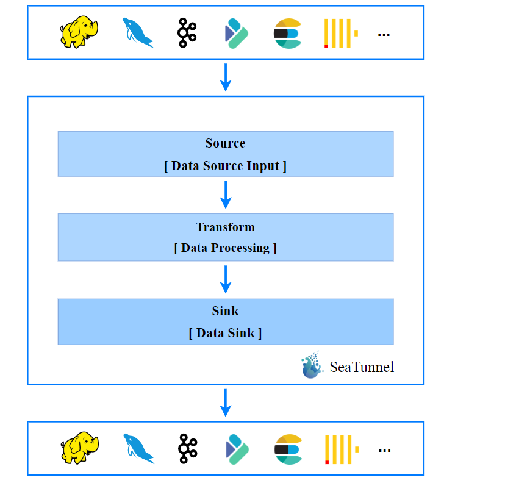
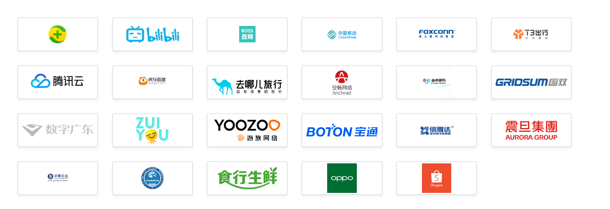

## 一、SeaTunnel是什么？
SeaTunnel下一代高性能、分布式、海量数据集成框架。SeaTunnel是一个非常易于使用的超高性能分布式数据集成平台，支持海量数据的实时同步。每天可以稳定高效地同步数百亿数据，已被近百家公司用于生产。
<!--more-->

## 二、SeaTunnel的核心特性有哪些？
- 1.组件丰富(内置丰富插件,支持各种数据产品方便快捷的传输和集成数据)。
- 2.高扩展性(基于模块化和插件化设计,支持热插拔, 带来更好的扩展性)。
- 3.简单易用(特有的架构设计下,使得开发配置更简单,几乎零代码,无使用成本)。
- 4.成熟稳定(经历多家企业,大规模生产环境使用和海量数据的洗礼,稳定健壮)。

## 三、SeaTunnel的工作流程是怎样的？

## 四、SeaTunnel的使用场景有哪些？
- 1.海量数据同步。
- 2.海量数据集成。
- 3.拥有海量数据的ETL。
- 4.海量数据聚合。
- 5.多源数据处理。

## 五、为什么要选择SeaTunnel？换言之它能解决哪些问题？
SeaTunnel将尽力解决在海量数据同步过程中可能遇到的问题(如下所示):

- 1.数据丢失和重复。
- 2.任务积累与延迟。
- 3.低吞吐量。
- 4.在生产环境中应用周期长。
- 5.缺乏应用程序运行状态监控。

## 六、有哪些公司在使用SeaTunnel？

## 七、关于SeaTunnel的学习资料有哪些？
官方网站:
https://seatunnel.apache.org/

所有版本官方文档:
https://seatunnel.apache.org/versions/

下载:
https://seatunnel.apache.org/zh-CN/download

用户案例:
https://seatunnel.apache.org/zh-CN/user_cases

Github源代码:
https://github.com/apache/incubator-seatunnel

## 八、YC-Framework在哪些场景中用到SeaTunnel?
YC-Framework用到Flink,主要场景是数据分析，其中数据分析也涉及到多个数据源的聚合以及数据同步(就用到SeaTunnel)。

YC-Framework官网：
https://framework.youcongtech.com/

YC-Framework Github源代码：
https://github.com/developers-youcong/yc-framework

YC-Framework Gitee源代码：
https://gitee.com/developers-youcong/yc-framework

以上源代码均已开源，开源不易，如果对你有帮助，不妨给个star，鼓励一下！！！