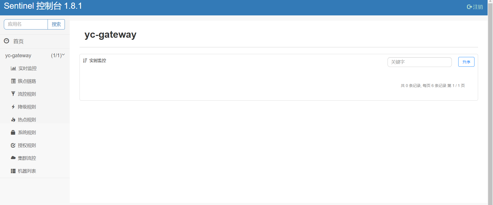

## 一、什么是Sentinel?
随着微服务的流行，服务和服务之间的稳定性变得越来越重要。Sentinel 以流量为切入点，从流量控制、流量路由、熔断降级、系统自适应过载保护、热点流量防护等多个维度保护服务的稳定性。
<!--more-->

## 二、Sentinel具有哪些特征？
- 1.丰富的应用场景：Sentinel 承接了阿里巴巴近 10 年的双十一大促流量的核心场景，例如秒杀（即突发流量控制在系统容量可以承受的范围）、消息削峰填谷、集群流量控制、实时熔断下游不可用应用等。
- 2.完备的实时监控：Sentinel 同时提供实时的监控功能。您可以在控制台中看到接入应用的单台机器秒级数据，甚至 500 台以下规模的集群的汇总运行情况。
- 3.广泛的开源生态：Sentinel 提供开箱即用的与其它开源框架/库的整合模块，例如与 Spring Cloud、Apache Dubbo、gRPC、Quarkus 的整合。您只需要引入相应的依赖并进行简单的配置即可快速地接入 Sentinel。同时 Sentinel 提供 Java/Go/C++ 等多语言的原生实现。
- 4.完善的 SPI 扩展机制：Sentinel 提供简单易用、完善的 SPI 扩展接口。您可以通过实现扩展接口来快速地定制逻辑。例如定制规则管理、适配动态数据源等。

## 三、Sentinel的总体框架图是怎样的？


## 四、关于Sentinel的资料有哪些？
Sentinel官网:
https://sentinelguard.io/zh-cn/index.html

Github源代码:
https://github.com/alibaba/Sentinel

Sentinel Wiki:
https://github.com/alibaba/Sentinel/wiki/%E4%BB%8B%E7%BB%8D

Sentinel官方文档:
https://sentinelguard.io/zh-cn/docs/introduction.html

## 五、YC-Framework使用Sentinel主要是做什么的？
主要用于限流。限流是服务降级的一种。限流就是限制系统的输入和输出流量已达到保护系统的目的。一般来说系统的吞吐量是可以被测算的，为了保证系统的稳定运行，一旦达到的需要限制的阈值，就需要限制流量并采取一些措施以完成限制流量的目的。比如：延迟处理，拒绝处理，或者部分拒绝处理等等。

限流的方案有不少，我将其分为两类：

- 第一类，基于中间件的单一方式。
- 第二类，基于中间件的混合方式。

### 1.基于中间件的单一方式
- 1.Tomcat中使用maxThreads来实现限流。
- 2.基于Nginx配置实现(limit_conn_zone、limit_req_zone、ngx_http_upstream_module等)。

### 2.基于中间件的混合方式
- 1.SpringCloud Gateway+Sentinel实现限流(又称网关端限流，YC-Framework使用该方式)。
- 2.Nginx+Lua+Redis实现限流。
- 3.Java和Redis相结合实现限流(又称服务端限流控制)。

## 六、YC-Framework是如何结合网关使用Sentinel的？
启动网关服务(yc-gateway)、认证服务(yc-auth)、doc/run目录下sentinel-dashboard.jar等。对应的运行效果图如下:


Nacos配置文件内容(sentinel-gateway.json，这里配置的是流控规则):
```
[
  {
    // 资源名
    "resource": "/yc-auth",
    // 针对来源，若为 default 则不区分调用来源
    "limitApp": "default",
    // 限流阈值类型(1:QPS;0:并发线程数）
    "grade": 1,
    // 阈值
    "count": 1,
    // 是否是集群模式
    "clusterMode": false,
    // 流控效果(0:快速失败;1:Warm Up(预热模式);2:排队等待)
    "controlBehavior": 0,
    // 流控模式(0:直接；1:关联;2:链路)
    "strategy": 0,
    // 预热时间（秒，预热模式需要此参数）
    "warmUpPeriodSec": 10,
    // 超时时间（排队等待模式需要此参数）
    "maxQueueingTimeMs": 500
  }
]


```
除流控规则外还有降级规则、热点规则、系统规则、授权规则等，大家可按需使用。

相关参考代码地址:
https://github.com/developers-youcong/yc-framework/tree/main/yc-gateway

YC-Framework官网：
https://framework.youcongtech.com/

YC-Framework Github源代码：
https://github.com/developers-youcong/yc-framework

YC-Framework Gitee源代码：
https://gitee.com/developers-youcong/yc-framework

以上源代码均已开源，开源不易，如果对你有帮助，不妨给个star，鼓励一下！！！