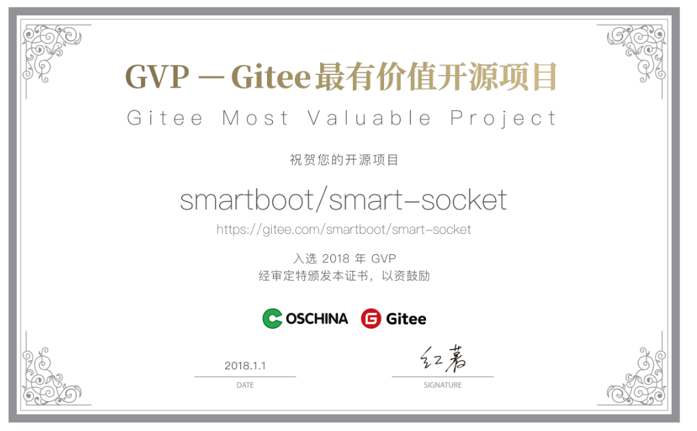
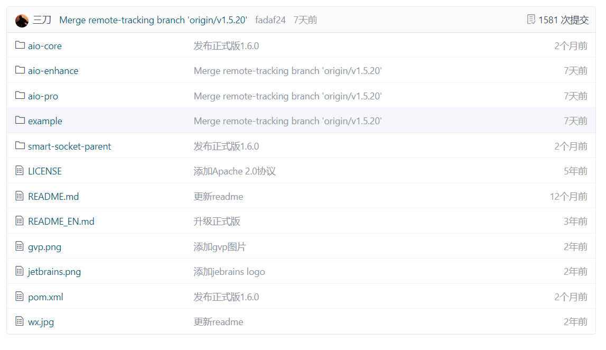
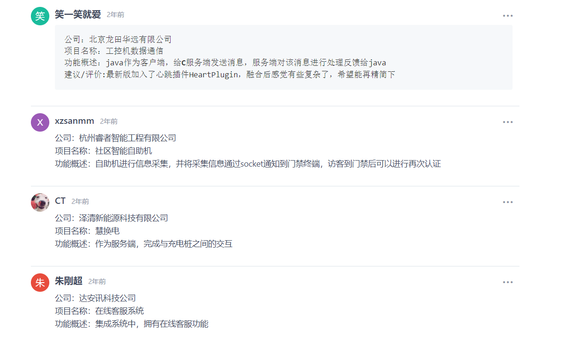

## 一、Smart-Socket是什么？
Smart-Socket是一款国产开源的 Java AIO 通信框架，支持 TCP、UDP、SSL/TLS 。

作为一款极简、易用、高性能的通信框架，现已广泛运用于物联网、证券、电力、电商等诸多领域。
<!--more-->

## 二、Smart-Socket的优势有哪些？
- 1.高性能、高并发、低延迟、低能耗。
- 2.代码量极少，可读性强。核心代码不到 1500 行，工程结构、包层次清晰。
- 3.学习门槛低，二次开发只需实现 2 个接口（Protocol、MessageProcessor）,具备通信开发经验的几乎无学习成本。
- 4.良好的线程模型、内存模型设计，保障服务高效稳定的运行。
- 5.支持自定义插件，并已提供了丰富地插件，包括：SSL/TLS通信插件、心跳插件、断链重连插件、服务指标统计插件、黑名单插件、内存池监测插件。

## 三、Smart-Socket的工程结构是怎样的？
```
. → 项目仓库主目录
├── smart-socket-parent → 项目主模块
│ │
│ └── pom.xml
│
├── aio-core → 项目基础子模块，仅包含 TCP 的 Server、Client 通信服务，以及内存池。
│
├── aio-pro → 项目高级子模块，提供便于开发所需的高级封装，同时附带 UDP 通信能力。
│
├── aio-example → 存放 smart-socket 的使用示例，学习过程中可供参考。
│
└── pom.xml

```

## 四、关于Smart-Socket相关的信息有哪些？
Smart-Socket官方网站:
https://smartboot.gitee.io/book/smart-socket/

Smart-Socket源代码:
https://github.com/smartboot/smart-socket

https://gitee.com/smartboot/smart-socket

Gitee GVP项目:


开源活跃情况:


一些企业应用案例:



## 五、YC-Framework如何支持Smart-Socket?

### 1.引入Maven依赖
```
<dependency>
    <groupId>com.yc.framework</groupId>
    <artifactId>yc-common-smart-socket</artifactId>
</dependency>

```

### 2.样例代码

#### (1)客户端
```
public class YcSmartSocketClient {

    public static void main(String[] args) throws IOException {
        MessageProcessor<String> processor = new MessageProcessor<String>() {
            @Override
            public void process(AioSession session, String msg) {
                System.out.println("receive from server: " + msg);
            }
        };
        AioQuickClient client = new AioQuickClient("localhost", 8888, new YcSmartSocketProtocol(), processor);
        AioSession session = client.start();
        WriteBuffer writeBuffer = session.writeBuffer();
        byte[] data = "hello smart-socket".getBytes();
        writeBuffer.writeInt(data.length);
        writeBuffer.write(data);
        writeBuffer.flush();
    }
}

```

#### (2)服务端
```
public class YcSmartSocketServer {
    public static void main(String[] args) throws IOException {
        MessageProcessor<String> processor = new MessageProcessor<String>() {
            @Override
            public void process(AioSession session, String msg) {
                System.out.println("receive from client: " + msg);
                WriteBuffer outputStream = session.writeBuffer();
                try {
                    byte[] bytes = msg.getBytes();
                    outputStream.writeInt(bytes.length);
                    outputStream.write(bytes);
                } catch (IOException e) {
                    e.printStackTrace();
                }
            }
        };

        AioQuickServer server = new AioQuickServer(8888, new YcSmartSocketProtocol(), processor);
        server.start();
    }
}


```

相关示例参考如下:
https://github.com/developers-youcong/yc-framework/tree/main/yc-example/yc-example-smart-socket

以上源代码均已开源，开源不易，如果对你有帮助，不妨给个star！！！

YC-Framework官网：
https://framework.youcongtech.com/

YC-Framework Github源代码：
https://github.com/developers-youcong/yc-framework

YC-Framework Gitee源代码：
https://gitee.com/developers-youcong/yc-framework