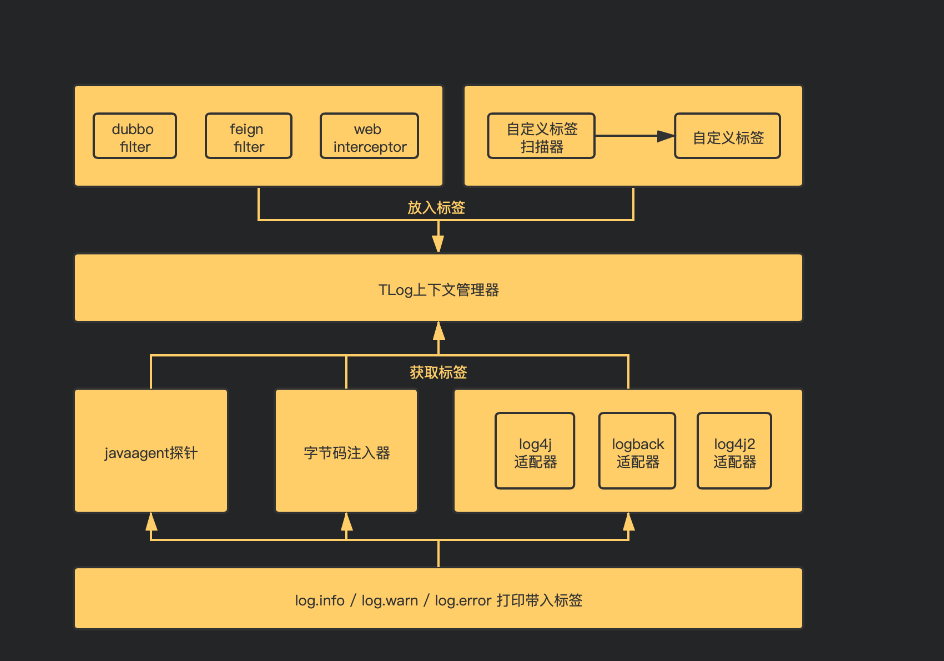
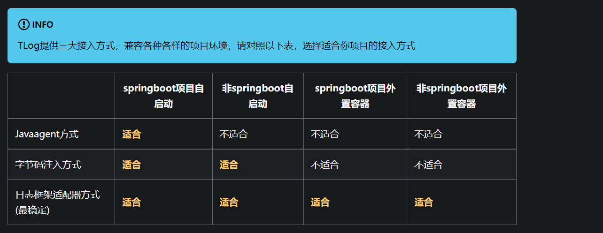

## 一、TLog是什么？
TLog是一个轻量级的分布式日志标记追踪神器。
<!--more-->

TLog官方网站：
https://tlog.yomahub.com/

TLog Github源代码：
https://github.com/dromara/TLog

TLog Gitee源代码：
https://gitee.com/dromara/TLog

## 二、TLog的架构图是怎样的？



## 三、TLog能解决什么痛点？
随着微服务盛行，很多公司都把系统按照业务边界拆成了很多微服务，在排错查日志的时候。因为业务链路贯穿着很多微服务节点，导致定位某个请求的日志以及上下游业务的日志会变得有些困难。

这时候很多童鞋会开始考虑上SkyWalking，Pinpoint等分布式追踪系统来解决，基于OpenTracing规范，而且通常都是无侵入性的，并且有相对友好的管理界面来进行链路Span的查询。

但是搭建分布式追踪系统，熟悉以及推广到全公司的系统需要一定的时间周期，而且当中涉及到链路span节点的存储成本问题，全量采集还是部分采集？如果全量采集，就以SkyWalking的存储来举例，ES集群搭建至少需要5个节点。这就需要增加服务器成本。况且如果微服务节点多的话，一天下来产生几十G上百G的数据其实非常正常。如果想保存时间长点的话，也需要增加服务器磁盘的成本。

当然分布式追踪系统是一个最终的解决方案，如果您的公司已经上了分布式追踪系统，那TLog并不适用。

**注意：**
TLog提供了一种最简单的方式来解决日志追踪问题，它不收集日志，也不需要另外的存储空间，它只是自动的对你的日志进行打标签，自动生成TraceId贯穿你微服务的一整条链路。并且提供上下游节点信息。适合中小型企业以及想快速解决日志追踪问题的公司项目使用。


## 四、TLog目前支持哪些特性？
- 1.通过对日志打标签完成轻量级微服务日志追踪。
- 2.提供三种接入方式：javaagent完全无侵入接入，字节码一行代码接入，基于配置文件的接入。
- 3.对业务代码无侵入式设计，使用简单，10分钟即可接入。
- 4.支持常见的log4j，log4j2，logback三大日志框架，并提供自动检测，完成适配。
- 5.支持dubbo，dubbox，springcloud三大RPC框架。
- 6.支持Spring Cloud Gateway和Soul网关。
- 7.适配HttpClient和Okhttp的http调用标签传递。
- 8.支持三种任务框架，JDK的TimerTask，Quartz，XXL-JOB。
- 9.支持日志标签的自定义模板的配置，提供多个系统级埋点标签的选择。
- 10.支持异步线程的追踪，包括线程池，多级异步线程等场景。
- 11.几乎无性能损耗，快速稳定，经过压测，损耗在0.01%。

## 五、如何选择你的接入方式？


## 六、YC-Framework是如何支持TLog的？
YC-Framework中的yc-common-log模块用到TLog，主要用于分布式微服务场景下的接口日志存储（最终存储在MongoDB里）。

主要核心代码如下:
```
@Aspect
@Component
@Slf4j
public class LogAspect {
    @Autowired
    private OperateLogApi operateLogApi;

    // 配置织入点
    @Pointcut("@annotation(com.yc.common.log.annotation.Log)")
    public void logPointCut() {
        log.info("织入");
    }

    /**
     * 处理完请求后执行
     *
     * @param joinPoint 切点
     */
    @AfterReturning(pointcut = "logPointCut()", returning = "jsonResult")
    public void doAfterReturning(JoinPoint joinPoint, Object jsonResult) {
        handleLog(joinPoint, null, jsonResult);
    }

    /**
     * 拦截异常操作
     *
     * @param joinPoint 切点
     * @param e         异常
     */
    @AfterThrowing(value = "logPointCut()", throwing = "e")
    public void doAfterThrowing(JoinPoint joinPoint, Exception e) {
        handleLog(joinPoint, e, null);
    }

    protected void handleLog(final JoinPoint joinPoint, final Exception e, Object jsonResult) {
        try {
            // 获得注解
            Log controllerLog = getAnnotationLog(joinPoint);
            if (controllerLog == null) {
                return;
            }
            // *========日志=========*//
            log.info("currIp:" + TLogContext.getCurrIp());
            log.info("preIp:" + TLogContext.getPreIp());
            log.info("traceId:" + TLogContext.getTraceId());
            log.info("spanId:" + TLogContext.getSpanId());

            OperateLog operLog = new OperateLog();
            operLog.setOperId(IdUtil.simpleUUID());
            operLog.setStatus(BusinessStatus.SUCCESS.ordinal());
            // 请求的地址
            String ip = IpUtil.getIpAddr(ServletUtil.getRequest());
            operLog.setOperIp(ip);
            // 返回参数
            operLog.setJsonResult(JSON.toJSONString(jsonResult));
            //请求接口URL
            operLog.setOperUrl(ServletUtil.getRequest().getRequestURI());
            //当前用户ID
            operLog.setOperName(String.valueOf(StpUtil.getLoginId()));
            if (e != null) {
                operLog.setStatus(BusinessStatus.FAIL.ordinal());
                operLog.setErrorMsg(StringUtil.substring(e.getMessage(), 0, 2000));
            }
            // 设置方法名称
            String className = joinPoint.getTarget().getClass().getName();
            String methodName = joinPoint.getSignature().getName();
            operLog.setMethod(className + "." + methodName + "()");
            // 设置请求方式
            operLog.setRequestMethod(ServletUtil.getRequest().getMethod());
            // 处理设置注解上的参数
            getControllerMethodDescription(joinPoint, controllerLog, operLog);
            // 保存数据库或MongoDB
            log.info("operLog:" + operLog);
            ThreadUtil.execAsync(() -> {
                //调用日志存储API
                operateLogApi.add(operLog);
            });
        } catch (Exception exp) {
            // 记录本地异常日志
            log.error("==前置通知异常==");
            log.error("异常信息:{}", exp.getMessage());
            exp.printStackTrace();
        }
    }

    /**
     * 获取注解中对方法的描述信息 用于Controller层注解
     *
     * @param log     日志
     * @param operLog 操作日志
     * @throws Exception
     */
    public void getControllerMethodDescription(JoinPoint joinPoint, Log log, OperateLog operLog) throws Exception {
        // 是否需要保存request，参数和值
        if (log.isSaveReqData()) {
            operLog.setFunctionName(log.value());
            // 获取参数的信息
            setRequestValue(joinPoint, operLog);
        }
    }

    /**
     * 获取请求的参数，放到log中
     *
     * @param operLog 操作日志
     * @throws Exception 异常
     */
    private void setRequestValue(JoinPoint joinPoint, OperateLog operLog) throws Exception {
        String requestMethod = operLog.getRequestMethod();
        if (HttpMethod.PUT.name().equals(requestMethod) || HttpMethod.POST.name().equals(requestMethod)) {
            String params = argsArrayToString(joinPoint.getArgs());
            operLog.setOperParam(StringUtil.substring(params, 0, 2000));
        } else {
            Map<?, ?> paramsMap = (Map<?, ?>) ServletUtil.getRequest().getAttribute(HandlerMapping.URI_TEMPLATE_VARIABLES_ATTRIBUTE);
            operLog.setOperParam(StringUtil.substring(paramsMap.toString(), 0, 2000));
        }
    }

    /**
     * 是否存在注解，如果存在就获取
     */
    private Log getAnnotationLog(JoinPoint joinPoint) throws Exception {
        Signature signature = joinPoint.getSignature();
        MethodSignature methodSignature = (MethodSignature) signature;
        Method method = methodSignature.getMethod();

        if (method != null) {
            return method.getAnnotation(Log.class);
        }
        return null;
    }

    /**
     * 参数拼装
     */
    private String argsArrayToString(Object[] paramsArray) {
        String params = "";
        if (paramsArray != null && paramsArray.length > 0) {
            for (int i = 0; i < paramsArray.length; i++) {
                if (!isFilterObject(paramsArray[i])) {
                    try {
                        Object jsonObj = JSON.toJSON(paramsArray[i]);
                        params += jsonObj.toString() + " ";
                    } catch (Exception e) {
                    }
                }
            }
        }
        return params.trim();
    }

    /**
     * 判断是否需要过滤的对象。
     *
     * @param o 对象信息。
     * @return 如果是需要过滤的对象，则返回true；否则返回false。
     */
    public boolean isFilterObject(final Object o) {
        return o instanceof MultipartFile || o instanceof HttpServletRequest || o instanceof HttpServletResponse;
    }

    public static String getIpAddress(HttpServletRequest request) {
        String ip = request.getHeader("x-forwarded-for");
        if (ip == null || ip.length() == 0 || "unknown".equalsIgnoreCase(ip)) {
            ip = request.getHeader("Proxy-Client-IP");
        }
        if (ip == null || ip.length() == 0 || "unknown".equalsIgnoreCase(ip)) {
            ip = request.getHeader("WL-Proxy-Client-IP");
        }
        if (ip == null || ip.length() == 0 || "unknown".equalsIgnoreCase(ip)) {
            ip = request.getHeader("HTTP_CLIENT_IP");
        }
        if (ip == null || ip.length() == 0 || "unknown".equalsIgnoreCase(ip)) {
            ip = request.getHeader("HTTP_X_FORWARDED_FOR");
        }
        if (ip == null || ip.length() == 0 || "unknown".equalsIgnoreCase(ip)) {
            ip = request.getRemoteAddr();
        }
        return ip;
    }

}

```

**该模块完整代码可参考：**
https://github.com/developers-youcong/yc-framework/tree/main/yc-common/yc-common-log


以上源代码均已开源，开源不易，如果对你有帮助，不妨给个star！！！

YC-Framework官网：
https://framework.youcongtech.com/

YC-Framework Github源代码：
https://github.com/developers-youcong/yc-framework

YC-Framework Gitee源代码：
https://gitee.com/developers-youcong/yc-framework
