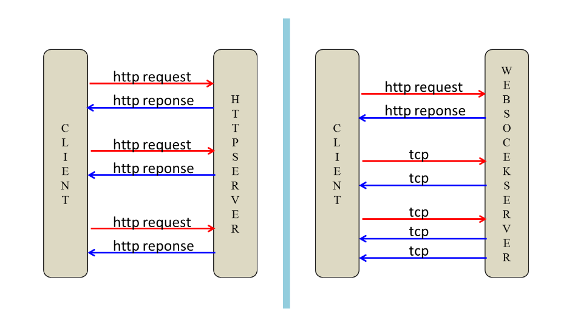
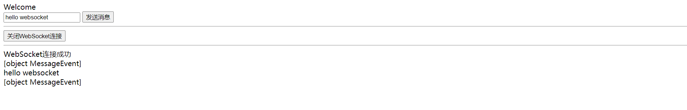
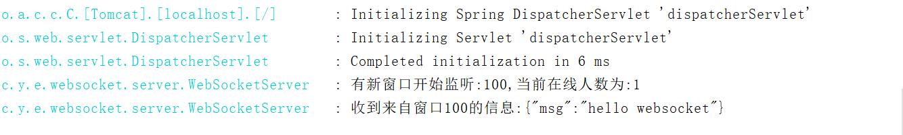

## 一、WebSocket是什么？
<!--more-->
WebSocket 是一种网络传输协议，可在单个TCP连接上进行全双工通信，位于 OSI 模型的应用层。WebSocket协议在 2011 年由 IETF 标准化为RFC 6455，后由RFC 7936 补充规范。

WebSocket使得客户端和服务器之间的数据交换变得更加简单，允许服务端主动向客户端推送数据。在WebSocket API中，浏览器和服务器只需要完成一次握手，两者之间就可以创建持久性的连接，并进行双向数据传输。

## 二、WebSocket诞生的背景是什么？
早期，很多网站为了实现推送技术，所用的技术都是轮询。轮询是指由浏览器每隔一段时间（如每秒）向服务器发出HTTP请求，然后服务器返回最新的数据给客户端。这种传统的模式带来很明显的缺点，即浏览器需要不断的向服务器发出请求，然而HTTP请求与回复可能会包含较长的头部，其中真正有效的数据可能只是很小的一部分，所以这样会消耗很多带宽资源。

比较新的轮询技术是Comet。这种技术虽然可以实现双向通信，但仍然需要反复发出请求。而且在Comet中普遍采用的HTTP长连接也会消耗服务器资源。

在这种情况下，HTML5定义了WebSocket协议，能更好的节省服务器资源和带宽，并且能够更实时地进行通讯。

## 三、WebSocket的优点有哪些？
- 1）较少的控制开销：在连接创建后，服务器和客户端之间交换数据时，用于协议控制的数据包头部相对较小；
- 2）更强的实时性：由于协议是全双工的，所以服务器可以随时主动给客户端下发数据。相对于 HTTP 请求需要等待客户端发起请求服务端才能响应，延迟明显更少；
- 3）保持连接状态：与 HTTP 不同的是，WebSocket 需要先创建连接，这就使得其成为一种有状态的协议，之后通信时可以省略部分状态信息；
- 4）更好的二进制支持：WebSocket 定义了二进制帧，相对 HTTP，可以更轻松地处理二进制内容；
- 5）可以支持扩展：WebSocket 定义了扩展，用户可以扩展协议、实现部分自定义的子协议。

也存在缺点，缺点是有些浏览器不支持WebSocket。

## 四、WebSocket有哪些应用场景？
- 1.弹幕
- 2.协同编辑
- 3.基于位置的应用
- 4.体育实况更新
- 5.股票基金报价实时更新
- 6.多玩家游戏
- 7.音视频聊天
- 8.视频会议
- 9.在线教育
- 10.社交订阅

## 五、WebSocket的通信图是怎样的？


## 六、基于YC-Framework如何使用WebSocket？
YC-Framework使用的WebSocket是基于Spring生态，大家即可基于YC-Framework开发，也可以将其抽取出来使用。


### 1.引入Maven依赖
```
<dependency>
    <groupId>com.yc.framework</groupId>
    <artifactId>yc-common-websocket</artifactId>
</dependency>

```

### 2.核心配置类
```
@Configuration
public class WebSocketConfig {
    @Bean
    public ServerEndpointExporter serverEndpointExporter() {
        return new ServerEndpointExporter();
    }
}


```

### 3.WebSocket服务端核心代码
```
@Component
@Slf4j
@Service
@ServerEndpoint("/api/websocket/{sid}")
public class WebSocketServer {
    //静态变量，用来记录当前在线连接数。应该把它设计成线程安全的。
    private static int onlineCount = 0;
    //concurrent包的线程安全Set，用来存放每个客户端对应的MyWebSocket对象。
    private static CopyOnWriteArraySet<WebSocketServer> webSocketSet = new CopyOnWriteArraySet<WebSocketServer>();

    //与某个客户端的连接会话，需要通过它来给客户端发送数据
    private Session session;

    //接收sid
    private String sid = "";

    /**
     * 连接建立成功调用的方法
     */
    @OnOpen
    public void onOpen(Session session, @PathParam("sid") String sid) {
        this.session = session;
        webSocketSet.add(this);     //加入set中
        this.sid = sid;
        addOnlineCount();           //在线数加1
        try {
            sendMessage("conn_success");
            log.info("有新窗口开始监听:" + sid + ",当前在线人数为:" + getOnlineCount());
        } catch (IOException e) {
            log.error("websocket IO Exception");
        }
    }

    /**
     * 连接关闭调用的方法
     */
    @OnClose
    public void onClose() {
        webSocketSet.remove(this);  //从set中删除
        subOnlineCount();           //在线数减1
        //断开连接情况下，更新主板占用情况为释放
        log.info("释放的sid为：" + sid);
        //这里写你 释放的时候，要处理的业务
        log.info("有一连接关闭！当前在线人数为" + getOnlineCount());

    }

    /**
     * 收到客户端消息后调用的方法
     *
     * @ Param message 客户端发送过来的消息
     */
    @OnMessage
    public void onMessage(String message, Session session) {
        log.info("收到来自窗口" + sid + "的信息:" + message);
        //群发消息
        for (WebSocketServer item : webSocketSet) {
            try {
                item.sendMessage(message);
            } catch (IOException e) {
                e.printStackTrace();
            }
        }
    }

    /**
     * @ Param session
     * @ Param error
     */
    @OnError
    public void onError(Session session, Throwable error) {
        log.error("发生错误");
        error.printStackTrace();
    }

    /**
     * 实现服务器主动推送
     */
    public void sendMessage(String message) throws IOException {
        this.session.getBasicRemote().sendText(message);
    }

    /**
     * 群发自定义消息
     */
    public static void sendInfo(String message, @PathParam("sid") String sid) throws IOException {
        log.info("推送消息到窗口" + sid + "，推送内容:" + message);

        for (WebSocketServer item : webSocketSet) {
            try {
                //这里可以设定只推送给这个sid的，为null则全部推送
                if (sid == null) {
//                    item.sendMessage(message);
                } else if (item.sid.equals(sid)) {
                    item.sendMessage(message);
                }
            } catch (IOException e) {
                continue;
            }
        }
    }

    public static synchronized int getOnlineCount() {
        return onlineCount;
    }

    public static synchronized void addOnlineCount() {
        WebSocketServer.onlineCount++;
    }

    public static synchronized void subOnlineCount() {
        WebSocketServer.onlineCount--;
    }

    public static CopyOnWriteArraySet<WebSocketServer> getWebSocketSet() {
        return webSocketSet;
    }
}

```

运行效果图如下所示:





相关示例代码地址:
https://github.com/developers-youcong/yc-framework/tree/main/yc-example

YC-Framework官网：
https://framework.youcongtech.com/

YC-Framework Github源代码：
https://github.com/developers-youcong/yc-framework

YC-Framework Gitee源代码：
https://gitee.com/developers-youcong/yc-framework

以上源代码均已开源，开源不易，如果对你有帮助，不妨给个star，鼓励一下！！！