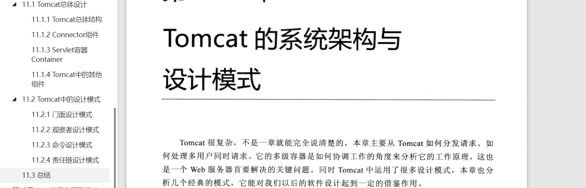

## 一、YC-Framework现阶段能支持哪些Web容器呢？
YC-Framework的微服务核心主要基于SpringBoot与SpringCloud以及SpringCloud Alibaba生态等，SpringBoot本身就支持Tomcat、Jetty、Undertow等Web容器（其中Tomcat是默认的），所以YC-Framework本身也是支持的。
<!--more-->

## 二、在YC-Framewor中如何使用Tomcat、Jetty、Undertow等Web容器？

### 1.使用Tomcat

#### (1)引入依赖
```
<dependency>
    <groupId>org.springframework.boot</groupId>
    <artifactId>spring-boot-starter-web</artifactId>
</dependency>

```

#### (2)核心配置
```
# Tomcat
server:
  tomcat:
    uri-encoding: UTF-8
    #最小线程数
    min-spare-threads: 500
    #最大线程数
    max-threads: 2500
    #最大连接数
    max-connections: 5000
    #最大等待队列长度
    accept-count: 1000
    #请求头最大长度kb
    max-http-header-size: 1048576
    #启动APR(非阻塞IO)
    protocol: org.apache.coyote.http11.Http11AprProtocol
  port: 7103

```


### 2.使用Jetty

#### (1)引入依赖
```

<dependency>
    <groupId>org.springframework.boot</groupId>
    <artifactId>spring-boot-starter-web</artifactId>
    <exclusions>
        <exclusion>
         <groupId>org.springframework.boot</groupId>
            <artifactId>spring-boot-starter-tomcat</artifactId>
        </exclusion>
    </exclusions>
</dependency>
<dependency>
    <groupId>org.springframework.boot</groupId>
    <artifactId>spring-boot-starter-jetty</artifactId>
</dependency>

```

#### (2)核心配置
```
server:
  port: 7104
  servlet:
    context-path: /test
  jetty:
    threads:
      acceptors: -1                   
      selectors: -1                  
    max-http-form-post-size: 200000  

```


### 3.使用Undertow

#### (1)引入依赖
```
<dependency>
    <groupId>org.springframework.boot</groupId>
    <artifactId>spring-boot-starter-web</artifactId>
    <exclusions>
        <exclusion>
            <groupId>org.springframework.boot</groupId>
            <artifactId>spring-boot-starter-tomcat</artifactId>
        </exclusion>
    </exclusions>
</dependency>
<dependency>
    <groupId>org.springframework.boot</groupId>
    <artifactId>spring-boot-starter-undertow</artifactId>
</dependency>

```

#### (2)核心配置
```
server:
  undertow:
    undertow:
      io-threads: 16
      # 阻塞任务线程池, 当执行类似servlet请求阻塞IO操作, undertow会从这个线程池中取得线程
      # 它的值设置取决于系统线程执行任务的阻塞系数，默认值是IO线程数*8
      worker-threads: 256
      # 以下的配置会影响buffer,这些buffer会用于服务器连接的IO操作,有点类似netty的池化内存管理
      # 每块buffer的空间大小,越小的空间被利用越充分，不要设置太大，以免影响其他应用，合适即可
      buffer-size: 1024
      # 每个区分配的buffer数量 , 所以pool的大小是buffer-size * buffers-per-region
      buffers-per-region: 1024
      # 是否分配的直接内存(NIO直接分配的堆外内存)
      direct-buffers: true
  port: 7105

```

启动类是通用的，不需要加一些特别的配置，相关源代码均已上传至Github，小伙伴们可参考！！！

相关示例代码地址:
https://github.com/developers-youcong/yc-framework/tree/main/yc-example/yc-example-container

如果对你有帮助，不妨给个star，鼓励一下！！！

YC-Framework官网：
https://framework.youcongtech.com/

YC-Framework Github源代码：
https://github.com/developers-youcong/yc-framework

YC-Framework Gitee源代码：
https://gitee.com/developers-youcong/yc-framework


## 三、关于Tomcat、Jetty、Undertow相关的学习资料有哪些？

### 1.Tomcat
Tomcat官网:
https://tomcat.apache.org/

Tomcat源代码:
https://github.com/apache/tomcat

### 2.Jetty
Jetty官网:
https://www.eclipse.org/jetty

Jetty源代码:
https://github.com/eclipse/jetty.project

### 3.Undertow
Undertow官网:
https://undertow.io/

Undertow源代码:
https://github.com/undertow-io/undertow


其中对于Java开发的小伙伴们用的最多的还是Tomcat，无论是早年的JSP，还是之后的SSH、SSM以及SpringBoot相关等。所以建议专门对其中一个Web容器做深入研究学习。在此我推荐几本书：

许令波写的《深入分析JavaWeb技术内幕》，其中推荐阅读Tomcat的系统架构与设计模式这一章:


Budi Kurniawan与Paul Deck写的《深入刨析Tomcat》。

这两本书均有电子版，均可在如下Github地址找到，希望能够对大家有帮助:
https://github.com/developers-youcong/Personal-Learning-Library/tree/master/JavaDev

## 四、关于Tomcat、Jetty、Undertow等Web容器该如何选择呢？
我个人首推Tomcat，因为它符合我对技术选型所考虑的几个因素，之前我在[从单体架构到分布式微服务架构的思考](https://youcongtech.com/2021/04/17/%E4%BB%8E%E5%8D%95%E4%BD%93%E6%9E%B6%E6%9E%84%E5%88%B0%E5%88%86%E5%B8%83%E5%BC%8F%E5%BE%AE%E6%9C%8D%E5%8A%A1%E6%9E%B6%E6%9E%84%E7%9A%84%E6%80%9D%E8%80%83/)提到过技术选型需要注重的因素：

- 1.业务相关性。
- 2.流行度。
- 3.学习曲线。
- 4.文档。
- 5.社区支持。
- 6.单元测试。
- 7.可扩展性。
- 8.许可证。

网上有很多博文针对Tomcat、Jetty、Undertow做相关的性能对比测试，比较它们在不同的应用场景下的面对高并发或一些特别的使用场景，性能对比是怎样的。

对于我而言就技术基础层面，我求稳为主，在稳的基础上，适当引入一些新的技术促使研发效率的提高，从而提高整体研发团队的生产力。所以，大家不必纠结于该如何选择，标准只有一个能不能解决你当下的问题，除此之外，当你不知道该如何选的时候，可以考虑大众化(哪一个Web容器用的最多，就选择它，因为基本上你不需要踩很多坑，都有人为你踩过了)。