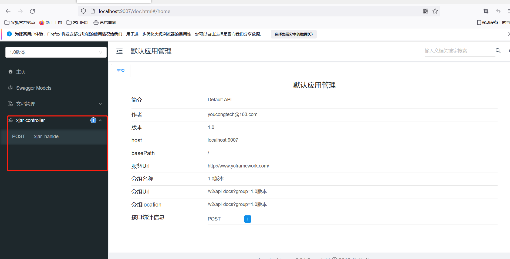
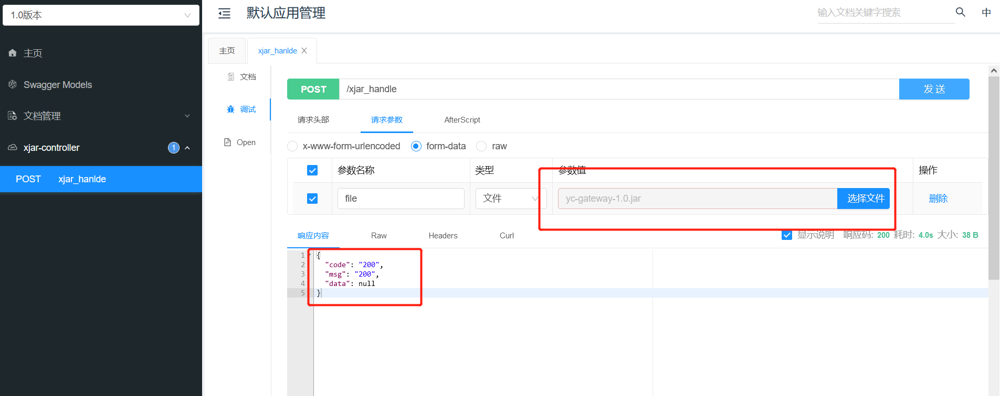
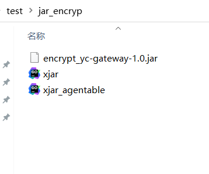
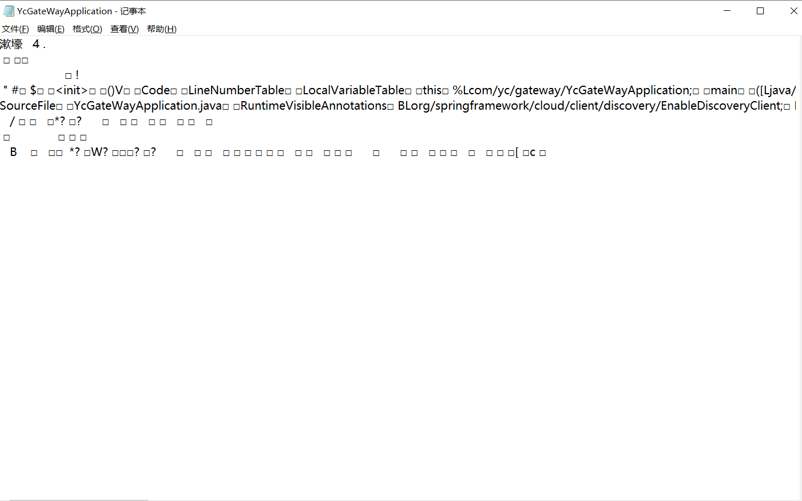

## 一、为什么要针对jar包进行加密呢？
解压jar文件可获取该项目的配置文件和源代码，配置文件中通常存有数据库连接、服务应用配置等信息。通常黑客攻入服务器后(获取某个普通用户的账号)，为什么能轻易的绑架数据库，在于通过普通用户解压jar或war文件，从而得到数据库账号实现备份和删库(备份就是为了敲诈勒索)。加密jar文件就是为了防止黑客(很多时候不仅仅是黑客)解压后获取一些隐秘的信息，从而造成数据库数据泄漏或其它危害影响。
<!--more-->

## 二、YC-Framework针对jar包加密的场景提供一种怎样的方案？
在YC-Framework中，yc-xjar基于xjar技术实现对jar包进行加密。xjar是一种基于对JAR包内资源的加密以及拓展ClassLoader来构建的一套程序加密启动, 动态解密运行的方案, 避免源码泄露以及反编译。

### 1.xjar的主要特性有哪些？

- (1)无代码侵入，只需要把编译好的JAR包通过工具加密即可。
- (2)完全内存解密， 降低源码以及字节码泄露或反编译的风险。
- (3)支持所有JDK内置加解密算法。
- (4)可选择需要加解密的字节码或其他资源文件。
- (5)支持Maven插件， 加密更加便捷。
- (6)动态生成Go启动器, 保护密码不泄露。

### 2.所需环境是什么？
- (1)JDK1.7及其以上。
- (2)MAVEN3.x版本。


### 3.yc-xjar怎样对jar包进行加密？

#### (1)启动yc-xjar无报错

#### (2)访问yc-xjar swagger地址
访问如下:
http://localhost:9007/doc.html



#### (3)上传需要加密的jar包


#### (4)查看加密jar包


**解压对应的jar包，分别查看配置文件以及相关类：**




#### (5)启动加密jar

##### a.编译脚本
```
go build xjar.go
```

##### b.运行
```
xjar.exe java -jar encrypt_yc-gateway-1.0.jar

```

##### c.注意

- 在 Java 启动命令前加上编译好的Go启动器可执行文件名(xjar)即可启动运行加密后的JAR包.
- 若使用 nohup 方式启动则 nohup 要放在Go启动器可执行文件名(xjar)之前.
- 若Go启动器可执行文件名(xjar)不在当前命令行所在目录则要通过绝对路径或相对路径指定.
- 仅支持通过 -jar 方式启动, 不支持-cp或-classpath的方式.
- -jar 后面必须紧跟着启动的加密jar文件路径
- 例子: 如果当前命令行就在 xjar 所在目录, java 环境变量也设置好了 ./xjar java -Xms256m -Xmx1024m -jar /path/to/encrypted.jar


### 4.yc-xjar的核心代码主要是什么？

#### (1)Maven依赖
```
<dependency>
    <groupId>com.github.core-lib</groupId>
    <artifactId>xjar</artifactId>
    <version>${xjar.version}</version>
    <!--<scope>test</scope>-->
</dependency>

<!-- 设置 jitpack.io 仓库 -->
<repositories>
    <repository>
        <id>jitpack.io</id>
        <url>https://jitpack.io</url>
    </repository>
</repositories>

```

#### (2)Controller
```
@RestController
public class XjarController {

    private String fileStorePath="D://test/jar_backup//";

    private String outEncrypPath="D://test//jar_encryp//";

    @PostMapping("/xjar_handle")
    public RespBody xjar_hanlde(@RequestParam("file") MultipartFile[] files) {
        try {
            if (files.length > 0) {
                for (int i = 0; i < files.length; i++) {
                    saveFile(fileStorePath, files[i]);
                }
            }
        } catch (Exception e) {
            e.printStackTrace();
        }
        return RespBody.success();
    }

    private void saveFile(String filePath, MultipartFile file) {
        try {
            //原文件名
            String originalFileName = file.getOriginalFilename();
            //获取文件扩展名
            String extName = file.getOriginalFilename().substring(file.getOriginalFilename().lastIndexOf("."));
            //重新定义文件名
            String fileName = originalFileName + extName;
            // 显示文件容量
            String fileSize = String.valueOf(new BigDecimal(file.getSize()).divide(new BigDecimal("1024"), 0, BigDecimal.ROUND_HALF_UP));
            File temp = new File(filePath);
            if (!temp.exists()) {
                temp.mkdirs();
            }
            if (fileSize.length() > 0) {
                File localFile = new File(filePath + fileName);
                //把上传的文件保存至本地
                file.transferTo(localFile);
                //本地加密
                XCryptos.encryption()
                        .from(localFile)
                        .use("io.xjar")
                        .include("/io/xjar/**/*.class")
                        .include("/mapper/**/*Mapper.xml")
                        .include("/*.yml")
                        .exclude("/static/**/*")
                        .exclude("/conf/*")
                        .to(outEncrypPath+"encrypt_"+originalFileName+".jar");
            }
        } catch (Exception e) {
            e.printStackTrace();
        }

    }
}


```

以上源代码均已开源，开源不易，如果对你有帮助，不妨给个star！！！

YC-Framework官网：
https://framework.youcongtech.com/

YC-Framework Github源代码：
https://github.com/developers-youcong/yc-framework

YC-Framework Gitee源代码：
https://gitee.com/developers-youcong/yc-framework