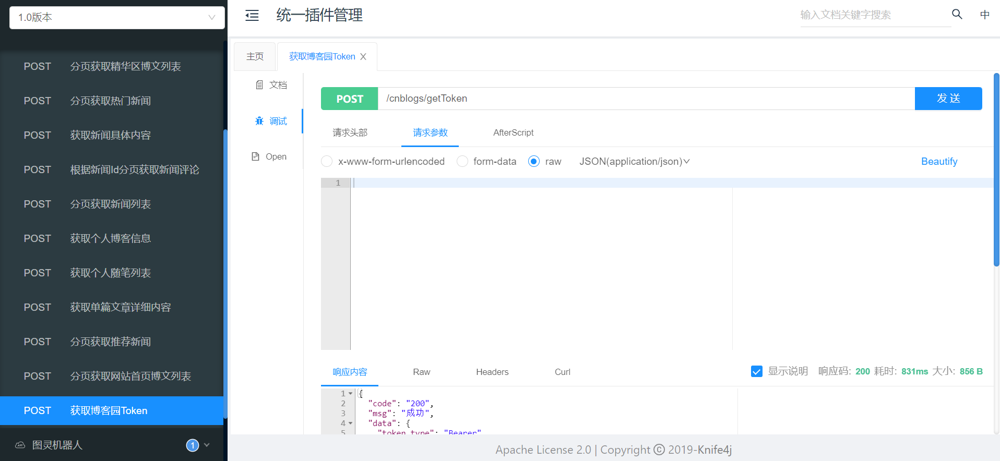
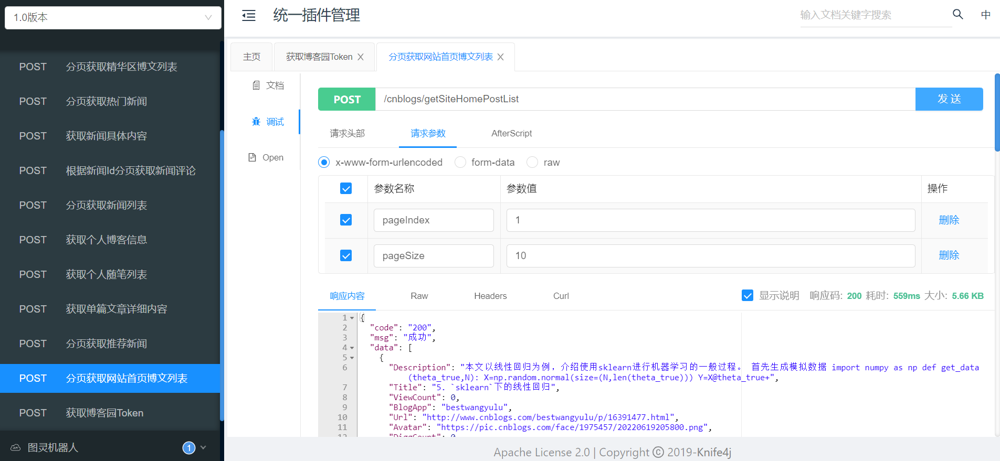
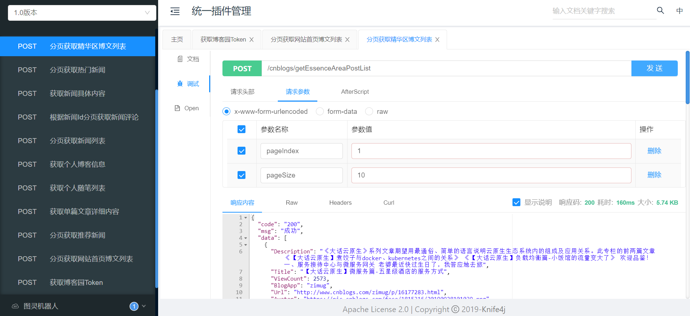
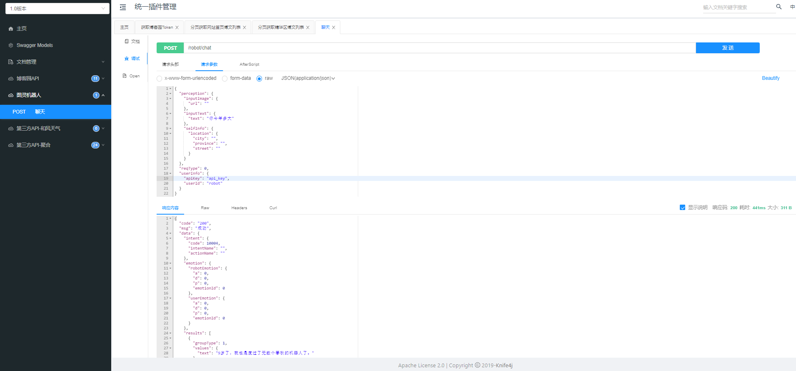
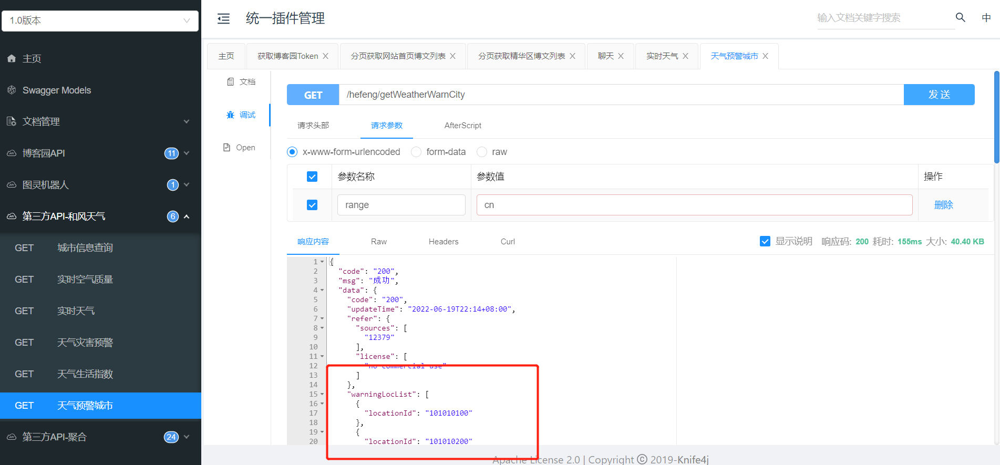

YC-Framework插件服务的理念源自WordPress。在YC-Framework中的插件服务目前主要用于对接第三方API，例如博客园API、图灵机器人、和风天气、聚合API等。
<!--more-->

YC-Framework中的插件服务名叫yc-plugins，位于yc-modules目录下。

该服务与yc-crawler、yc-job等密切相关。例如yc-crawler定时爬取博客园首页、精华等博文时，需与yc-plugins协同合作(yc-plugins内置api)。yc-job相当于定时抓取。

## 一、博客园数据API调用
博客园API需要配置自己的密钥，具体如何申请获取，可参考我的这篇文章：[博客园开放API如何使用](https://youcongtech.com/2020/06/04/%E5%8D%9A%E5%AE%A2%E5%9B%AD%E5%BC%80%E6%94%BEAPI%E5%A6%82%E4%BD%95%E4%BD%BF%E7%94%A8/)

### 1.请求Token

### 2.获取博客首页文章

### 3.获取博客园精华文章

## 二、图灵机器人API调用
与机器人对话，适用于机器人24小时在线客服场景。

## 三、和风天气API调用
获取天气预警城市。

API服务放在插件服务中，本质上就是为了服务解耦以及可扩展。需要API的服务只需调用对应的API即可，无需在业务微服务中写一些硬编码之类的。

源代码均已开源，开源不易，如果对你有帮助，不妨给个star！！！

YC-Framework官网：
https://framework.youcongtech.com/

YC-Framework Github源代码：
https://github.com/developers-youcong/yc-framework

YC-Framework Gitee源代码：
https://gitee.com/developers-youcong/yc-framework