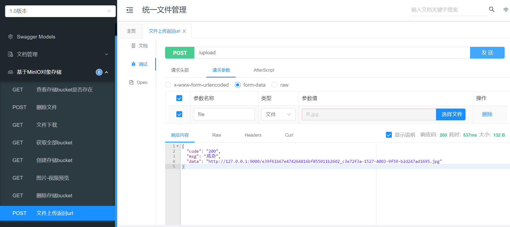
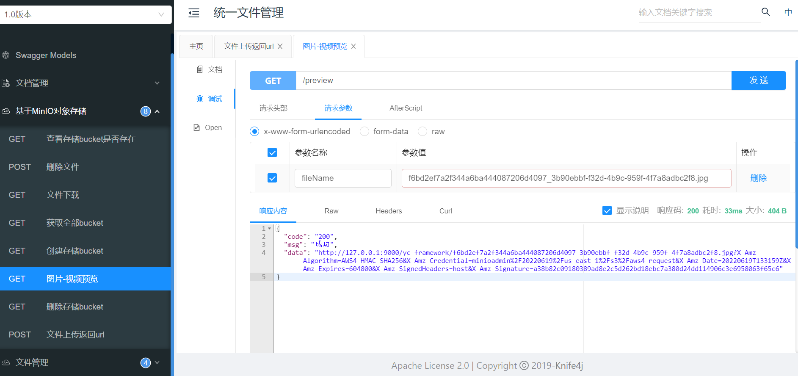
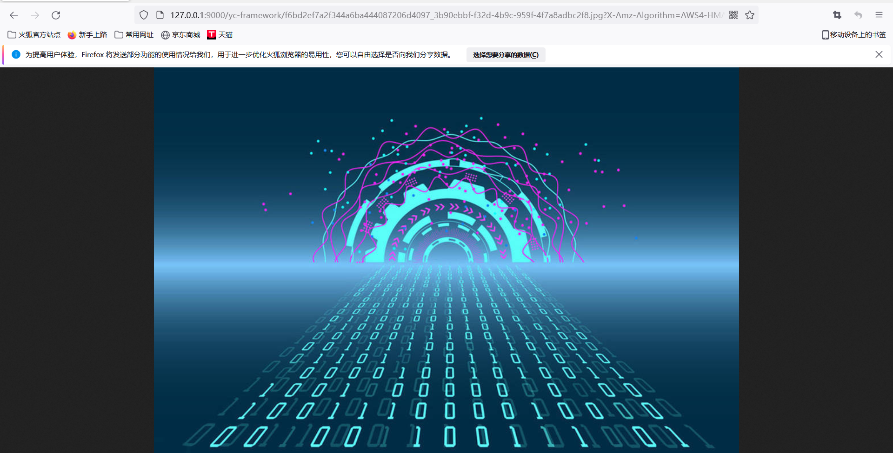

文件存储与访问对于任何一个IT系统，都是必不可少的。

YC-Framework针对这样的情况，也提供一套解决方案，解决方案包含Nginx代理服务器方式、MinIO等。

<!--more-->

Nginx代理服务器的方式，基于本地文件存储，文件存储的地方为对应服务器的磁盘空间上，然后通过Nginx代理进行访问。

关于Nginx相关实战系列文章，可以参考我写的这篇文章[深入理解Nginx](https://youcongtech.com/2022/05/25/%E6%B7%B1%E5%85%A5%E7%90%86%E8%A7%A3Nginx/)，该文章记录了Nginx常用的实战操作策略。

下面开始着重介绍，YC-Framework基于MinIO的分布式文件存储方案实践。


## 一、什么是MinIO?
MinIO是在GNU Affero通用公共许可证v3.0下发布的高性能对象存储。它与 Amazon S3云存储服务API兼容。使用MinIO为机器学习、分析和应用程序数据工作负载构建高性能基础架构。

## 二、MinIO的相关资料有哪些（强烈建议以官网为主，博客参考为辅）？
官方网站：
https://min.io/

官方文档：
https://docs.min.io/?ref=con

SDK使用文档：
https://docs.min.io/docs/java-client-quickstart-guide.html

## 三、在Linux上如何安装？
很简单一共四步：
```
# Download
wget https://dl.min.io/server/minio/release/linux-amd64/minio

# Authorization
chmod +x minio

# Run
MINIO_ROOT_USER=admin MINIO_ROOT_PASSWORD=minio_admin ./minio server /mnt/data --console-address "0.0.0.0:21218"

# Backup Run
MINIO_ROOT_USER=admin MINIO_ROOT_PASSWORD=minio_admin nohup ./minio server /mnt/data --console-address "0.0.0.0:21218" &

```

Windows安装更简单，这里不再赘述，大家可以参考官方文档！！！

## 四、在Java项目中如何使用MinIO？

### 1.引入Maven依赖
```
<properties>
    <minio.version>8.4.1</minio.version>
    <okhttp.version>4.8.1</okhttp.version>
</properties>
  
<dependency>
    <groupId>io.minio</groupId>
    <artifactId>minio</artifactId>
    <version>${minio.version}</version>
</dependency>

<dependency>
    <groupId>com.squareup.okhttp3</groupId>
    <artifactId>okhttp</artifactId>
    <version>${okhttp.version}</version>
</dependency>

```

### 2.配置类
```
@Configuration
public class MinIOConfig {

    @Bean
    public MinioClient minioClient() {
        MinioClient minioClient = MinioClient.builder().endpoint("http://127.0.0.1:9000")
                .credentials("minioadmin", "minioadmin") //minIO默认用户名和密码，上生产一定要更改
                .build();

        return minioClient;
    }
}


```

### 3.工具类
```

@Component
public class MinioUtil {


    private static final String MINIO_BUCKET = "yc-framework";

    @Autowired
    private MinioClient minioClient;

    /**
     * 查看存储bucket是否存在
     *
     * @return boolean
     */
    public Boolean bucketExists(String bucketName) {
        Boolean found;
        try {
            found = minioClient.bucketExists(BucketExistsArgs.builder().bucket(bucketName).build());
        } catch (Exception e) {
            e.printStackTrace();
            return false;
        }
        return found;
    }

    /**
     * 创建存储bucket
     *
     * @return Boolean
     */
    public Boolean makeBucket(String bucketName) {
        try {
            minioClient.makeBucket(MakeBucketArgs.builder()
                    .bucket(bucketName)
                    .build());
        } catch (Exception e) {
            e.printStackTrace();
            return false;
        }
        return true;
    }

    /**
     * 删除存储bucket
     *
     * @return Boolean
     */
    public Boolean removeBucket(String bucketName) {
        try {
            minioClient.removeBucket(RemoveBucketArgs.builder()
                    .bucket(bucketName)
                    .build());
        } catch (Exception e) {
            e.printStackTrace();
            return false;
        }
        return true;
    }

    /**
     * 获取全部bucket
     */
    public List<Bucket> getAllBuckets() {
        try {
            List<Bucket> buckets = minioClient.listBuckets();
            return buckets;
        } catch (Exception e) {
            e.printStackTrace();
        }
        return null;
    }


    /**
     * 文件上传
     *
     * @param file 文件
     * @return Boolean
     */
    public String upload(MultipartFile file) {
        String originalFilename = file.getOriginalFilename();
        if (StrUtil.isBlank(originalFilename)) {
            throw new RuntimeException();
        }
        String fileName = UuidUtils.generateUuid() + originalFilename.substring(originalFilename.lastIndexOf("."));
        String objectName = IdUtil.simpleUUID() + "_" + fileName;
        System.out.println("objectName:" + objectName);
        try {
            PutObjectArgs objectArgs = PutObjectArgs.builder().bucket(MINIO_BUCKET).object(objectName)
                    .stream(file.getInputStream(), file.getSize(), -1).contentType(file.getContentType()).build();
            //文件名称相同会覆盖
            minioClient.putObject(objectArgs);
        } catch (Exception e) {
            e.printStackTrace();
            return null;
        }
        return objectName;
    }

    /**
     * 预览图片
     *
     * @param fileName
     * @return
     */
    public String preview(String fileName) {
        // 查看文件地址
        GetPresignedObjectUrlArgs build = GetPresignedObjectUrlArgs.builder().bucket(MINIO_BUCKET).object(fileName).method(Method.GET).build();
        try {
            String url = minioClient.getPresignedObjectUrl(build);
            return url;
        } catch (Exception e) {
            e.printStackTrace();
        }
        return null;
    }

    /**
     * 文件下载
     *
     * @param fileName 文件名称
     * @param res      response
     * @return Boolean
     */
    public void download(String fileName, HttpServletResponse res) {
        GetObjectArgs objectArgs = GetObjectArgs.builder().bucket(MINIO_BUCKET)
                .object(fileName).build();
        try (GetObjectResponse response = minioClient.getObject(objectArgs)) {
            byte[] buf = new byte[1024];
            int len;
            try (FastByteArrayOutputStream os = new FastByteArrayOutputStream()) {
                while ((len = response.read(buf)) != -1) {
                    os.write(buf, 0, len);
                }
                os.flush();
                byte[] bytes = os.toByteArray();
                res.setCharacterEncoding("utf-8");
                // 设置强制下载不打开
                // res.setContentType("application/force-download");
                res.addHeader("Content-Disposition", "attachment;fileName=" + fileName);
                try (ServletOutputStream stream = res.getOutputStream()) {
                    stream.write(bytes);
                    stream.flush();
                }
            }
        } catch (Exception e) {
            e.printStackTrace();
        }
    }

    /**
     * 查看文件对象
     *
     * @return 存储bucket内文件对象信息
     */
    public List<Item> listObjects() {
        Iterable<Result<Item>> results = minioClient.listObjects(
                ListObjectsArgs.builder().bucket(MINIO_BUCKET).build());
        List<Item> items = new ArrayList<>();
        try {
            for (Result<Item> result : results) {
                items.add(result.get());
            }
        } catch (Exception e) {
            e.printStackTrace();
            return null;
        }
        return items;
    }

    /**
     * 删除
     *
     * @param fileName
     * @return
     * @throws Exception
     */
    public boolean remove(String fileName) {
        try {
            minioClient.removeObject(RemoveObjectArgs.builder().bucket(MINIO_BUCKET).object(fileName).build());
        } catch (Exception e) {
            return false;
        }
        return true;
    }

}


```

### 4.核心Controller代码
```
@RestController
@Api(tags = {"基于MinIO对象存储"}, description = "基于MinIO对象存储")
public class MinIOController {
    @Autowired
    private MinioUtil minioUtil;

    @GetMapping("/bucketExists")
    @ApiOperation(value = "查看存储bucket是否存在")
    public RespBody bucketExists(String bucketName) {
        return RespBody.success(minioUtil.bucketExists(bucketName));
    }


    @GetMapping("/makeBucket")
    @ApiOperation(value = "创建存储bucket")
    public RespBody makeBucket(String bucketName) {
        minioUtil.makeBucket(bucketName);
        return RespBody.success();
    }


    @GetMapping("/removeBucket")
    @ApiOperation(value = "删除存储bucket")
    public RespBody removeBucket(String bucketName) {
        minioUtil.removeBucket(bucketName);
        return RespBody.success();
    }


    @GetMapping("/getAllBuckets")
    @ApiOperation(value = "获取全部bucket")
    public RespBody<List<Bucket>> getAllBuckets() {
        List<Bucket> allBuckets = minioUtil.getAllBuckets();
        return RespBody.success(allBuckets);
    }


    @PostMapping("/upload")
    @ApiOperation(value = "文件上传返回url")
    public RespBody<String> upload(@RequestParam(value = "file") MultipartFile file) {
        String objectName = minioUtil.upload(file);
        if (null != objectName) {
            String endPoint = "http://127.0.0.1:9000";
            return RespBody.success(endPoint + "/" + objectName);
        }
        return RespBody.fail();
    }


    @GetMapping("/preview")
    @ApiOperation(value = "图片/视频预览")
    public RespBody preview(@RequestParam("fileName") String fileName) {
        return RespBody.success(minioUtil.preview(fileName));
    }


    @GetMapping("/download")
    @ApiOperation(value = "文件下载")
    public RespBody download(@RequestParam("fileName") String fileName, HttpServletResponse res) {
        minioUtil.download(fileName, res);
        return RespBody.success();
    }


    @PostMapping("/delete")
    @ApiOperation(value = "删除文件", notes = "根据url地址删除文件")
    public RespBody remove(String url) {
        String objName = url.substring(url.lastIndexOf("test" + "/") + "test".length() + 1);
        minioUtil.remove(objName);
        return RespBody.success();
    }

}


```

### 5.启动yc-file微服务进行测试

#### (1)上传


#### (2)预览




源代码均已开源，开源不易，如果对你有帮助，不妨给个star！！！

YC-Framework官网：
https://framework.youcongtech.com/

YC-Framework Github源代码：
https://github.com/developers-youcong/yc-framework

YC-Framework Gitee源代码：
https://gitee.com/developers-youcong/yc-framework