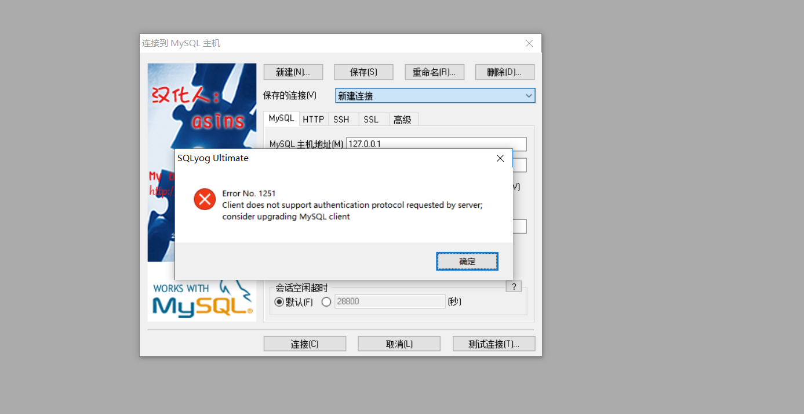

错误如图所示:


错误详情信息:
```
1251 client does not support authentication protocol requested by server;consider upgrading Mysql client

ERROR 1396 (HY000): Operation ALTER USER failed for 'root'@'localhost'


```
<!--more-->
问题原因:
主要是由于mysql8以前的加密规则与mysql8以后的存在差异。


解决办法:
```
ALTER USER 'root'@'localhost' IDENTIFIED BY 'password' PASSWORD EXPIRE NEVER;  ##修改加密规则

ALTER USER 'root'@'localhost' IDENTIFIED WITH mysql_native_password BY 'password'; ##更新一下用户的密码 password 为自己想要重新设置的密码

FLUSH PRIVILEGES; ##刷新权限

```

本文参考资料如下:
[Navicat 连接 Mysql 出现1251错误](https://blog.csdn.net/SUNbrightness/article/details/80600953)