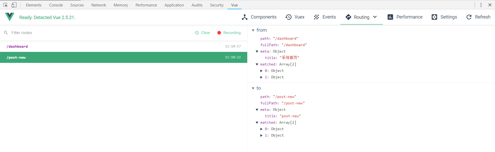
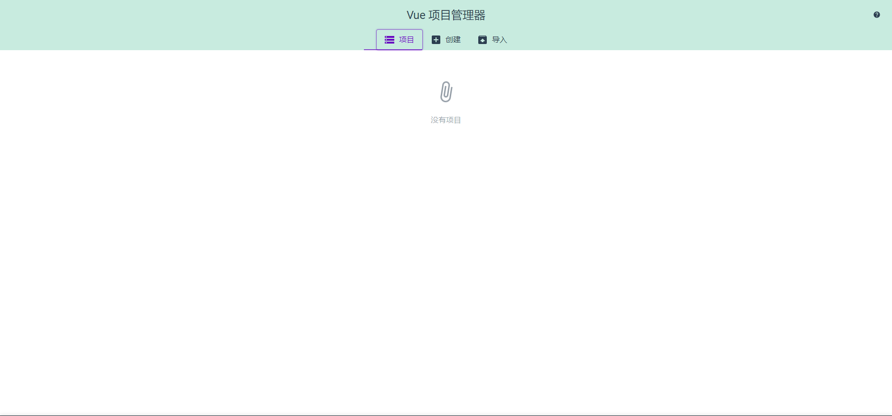
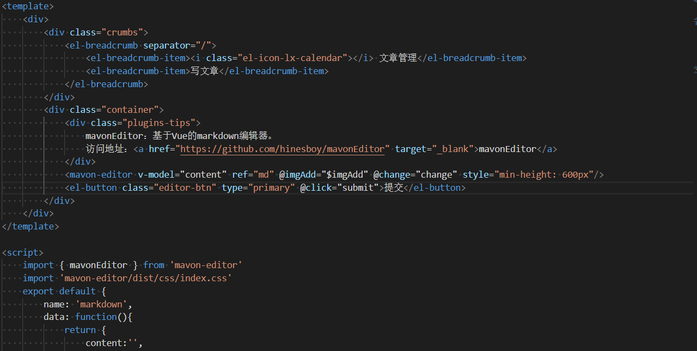

今天主要的核心话题是Vue.js和前端工程化。我将结合我这两年多的工作学习经历来谈谈这个，主要侧重点是前端工程化，Vue.js侧重点相对前端工程化，比重不是特别大。
<!--more-->
## Vue.js

Vue.js和React.js、Angular.js并驾齐驱号称前端三大框架(前端最常用的这三大框架，大中小公司均采用)。
Vue.js是一个叫尤雨溪及其他的团队开发的，不过早年是他自己独立做出来的。这一点我觉得他很牛逼。
我觉得每个做开发的朋友们，都要有一个自己的开源项目，自己的开源项目可以是自己工作三到四年发现有很多地方是重复的，可以写一个框架减少不必要的重复工作量，现在已经有很多人正在做，比如renren-security、jeesite等开源项目，通过它们很容易就可以写出一个功能齐全的后台管理系统。也可以是自己开发中常用的某些组件，那些组件每次开发都要用，可以将其收集起来，针对其中某个api进行改造，比如Hutools这个开源项目在这个方面就做的挺不错。又或者是在校的学生们，自己可以不断实践，写写图书管理系统或者是根据学校某些需求定制一个系统出来，然后将其开源，我觉得这样一来，对于以后毕业出来找工作也是很有帮助的。总而言之，开源项目可以是很多，它可以是一个电商系统、CMS、CRM或ERP之类的，也可以是读书笔记、书籍收集、文章收集等。


关于Vue.js这部分，主要参考[Vue.js](https://cn.vuejs.org/)的官方网站和一些开源项目

下面正式开讲

### 工具

#### Devtools
Devtools其目的主要是用于浏览器调试Vue相关的项目(因为Vue.js中的标签并不仅仅是html相关的，还有如el这类的标签及其相关的dom关系等，这些都是常规的浏览器调试所不能做到的)

[vue-devtools开源项目地址](http://chromecj.com/utilities/2018-12/1653.html)
[图文详解vue.js devtools使用方法](http://chromecj.com/utilities/2018-12/1653.html)
使用Devtools调试对应的Vue.js应用程序，效果如图:


#### Vue CLI
1.Vue CLI具有如下优点
(1)功能丰富
对 Babel、TypeScript、ESLint、PostCSS、PWA、单元测试和 End-to-end 测试提供开箱即用的支持。

(2)易于扩展
它的插件系统可以让社区根据常见需求构建和共享可复用的解决方案。

(3)无需 Eject
Vue CLI 完全是可配置的，无需 eject。这样你的项目就可以长期保持更新了。

(4)CLI 之上的图形化界面
通过配套的图形化界面创建、开发和管理你的项目。

(5)即刻创建原型
用单个 Vue 文件即刻实践新的灵感。

(6)面向未来
为现代浏览器轻松产出原生的 ES2015 代码，或将你的 Vue 组件构建为原生的 Web Components 组件。

2.Vue CLI的三种构建方式
第一种方式(常规)
```
npm install -g @vue/cli
vue create hello-world
npm run server

```

第二种方式(旧版本2.x)
```
npm install -g @vue/cli-init
vue init webpack my-project

```

第三种方式(GUI)
在git bash中输入如下命令，即可创建vue脚手架项目:
```
vue ui

```
效果图如下:


#### Vue Loader
Vue Loader的作用是解析和转换 .vue 文件，提取出其中的逻辑代码 script、样式代码 style、以及 HTML 模版 template，再分别把它们交给对应的 Loader 去处理。

[Vue Loader官方指南](https://vue-loader.vuejs.org/zh/guide/)
Vue Loader的例子很多，如图所示:

从图中我们就可以看出它们的职责和作用，正好验证前面说的script（逻辑代码)、style(样式代码)、template(html模板)。
换句话说，Vue Loader你可以理解为一个tomcat服务器，它不仅仅能解析jsp和servlet，还能处理css、html、js等前端三剑客。

### 核心插件

#### Vue Router
[Vue Router文档](https://router.vuejs.org/zh/)
Vue Router 是 Vue.js 官方的路由管理器。它和 Vue.js 的核心深度集成，让构建单页面应用变得易如反掌。
包含的功能如下:
(1)嵌套的路由/视图表
(2)模块化的、基于组件的路由配置
(3)路由参数、查询、通配符
(4)基于 Vue.js 过渡系统的视图过渡效果
(5)细粒度的导航控制
(6)带有自动激活的 CSS class 的链接
(7)HTML5 历史模式或 hash 模式，在 IE9 中自动降级
(8)自定义的滚动条行为


#### Vuex
Vuex 是一个专为 Vue.js 应用程序开发的状态管理模式。它采用集中式存储管理应用的所有组件的状态，并以相应的规则保证状态以一种可预测的方式发生变化。Vuex 也集成到 Vue 的官方调试工具 devtools extension，提供了诸如零配置的 time-travel 调试、状态快照导入导出等高级调试功能。

[Vuex官方文档](https://vuex.vuejs.org/zh/)

#### Vue服务端渲染
Vue.js 是构建客户端应用程序的框架。默认情况下，可以在浏览器中输出 Vue 组件，进行生成 DOM 和操作 DOM。然而，也可以将同一个组件渲染为服务器端的 HTML 字符串，将它们直接发送到浏览器，最后将这些静态标记"激活"为客户端上完全可交互的应用程序。服务器渲染的 Vue.js 应用程序也可以被认为是"同构"或"通用"，因为应用程序的大部分代码都可以在服务器和客户端上运行。

[Vue.js服务端渲染指南](https://ssr.vuejs.org/zh/#%E4%BB%80%E4%B9%88%E6%98%AF%E6%9C%8D%E5%8A%A1%E5%99%A8%E7%AB%AF%E6%B8%B2%E6%9F%93-ssr-%EF%BC%9F)

这个服务端渲染通常可以用node.js中的express框架，当然了，也可以用koa或者egg.js等。


### 资源列表
[Vue.js官方仓库](https://github.com/vuejs)
[Vue.js优选](https://curated.vuejs.org/)
[Vue.js资源](https://github.com/vuejs/awesome-vue)


关于Vue.js学习方式，个人建议对HTML+CSS+JavaScript要掌握的比较好才行，不仅仅对前端而言，后端也亦如此。
为什么这么说呢？
通常来说做Java后台开发的，基本上前端也会。
另外从一位前端工程师的角度来看，前端的技术与后端相比，更新迭代更快，但是不变的还是前端三剑客那点东西。把握了这些基本上学任何前端框架都是一件很容易的事情。
正如Vue.js起步中所说的那样:
**官方指南假设你已了解关于 HTML、CSS 和 JavaScript 的中级知识。如果你刚开始学习前端开发，将框架作为你的第一步可能不是最好的主意——掌握好基础知识再来吧！之前有其它框架的使用经验会有帮助，但这不是必需的。**
另外我一直认为，公司研发岗位，如开发人员、测试人员、运维人员、运营人员、产品人员等，至少要知道彼此在做什么以及彼此工作之间联系，我觉得这样会比较好，不然很容易会陷入一个死循环，你可以理解为"闭关锁国"。

本次的Vue.js内部分享不算太多，只不过是全局概况一下，更多的内容，可以去官方网站上学习。

我觉得作为一名研发人员，一定要养成通过官网学习的习惯，像博客之类的可以作为一个辅助或者深入的学习方式。通过官方网站学习，我觉得总体可以让你形成一个全局的认识，这种认识，可以让你触类旁通或举一反三。

举个例子说一下，最近因为某个电商项目二次开发，而该二次开发用的是ThinkPHP框架，虽然我没有接触过PHP方面的，但是我通过官网相关知识，一下就了解了它的大致，ThinkPHP是基于MVC的，而正好可以联系到Java中的SSM,其也是基于MVC。

## 前端工程化
这一部分内容我将结合我的开发经历和《前端工程化体系设计与实践》这本书。

#### 前后端分离

##### 原始的前后端分离方式

前端把页面模板写好，后台将页面模板改为jsp或者freemaker、volocity等动态模板语言。

曾经做的一个智能酒店项目就是使用这种方式。这样做最不好的地方是，如果公司是前后端职责分明的话，前端每改动某个页面时，都需要将修改的后发给后台人员，后台人员将其改为jsp。这样一来效率及其低下，当然了，小公司是不会这么做的，小公司都是后台兼任前端的，自然就可以省去这些不必要的时间成本。

原始的前后端分离方式优缺点(以模板语言采用jsp为例):

优点:
(1)严格按照MVC模式，职责分明，效率还是挺高的，举个例子说明，视图(jsp)只负责展示数据而不做过多的逻辑判断处理，过多的逻辑判断应该交给控制器内部的业务逻辑方法进行处理。
(2)由于通常采用的是模板语言(jsp、freemaker、volocity等)，视图里可以做一定的逻辑判断和处理，因此不必嵌入大量的js，大量的js如果某一个有问题，将会导致整个有问题，比如写一个ajax方法，但是参数没有传进去，这时页面上将不会显示数据，只会空白，只能用浏览器调试才能发现是哪里有问题，如果是jsp的话，直接就会报500错误(或者内部做一些处理，让其跳转到错误指定界面);
(3)减少HTTP请求(只需请求一次即可,如果页面是html的话，需要大量的js函数请求后端路由，在一定程度上会增大服务器的压力，导致页面延迟);
(4)不用考虑浏览器兼容性(有些js的方式由于浏览器的兼容性而不能正常调用或者需要进行改动);

缺点:
(1)复用性较差(由于返回的不是json数据而是视图，导致复用性不是特别好);
(2)过于依赖Java运行环境(需要servlet容器);
(3)前后端未分离，耦合性高，可读性差(jsp中嵌入java代码及其大量的jstl标签，导致可读性不好，耦合性也高，当然了，如果做一个良好的设计并遵循的话，耦合性是可以降低的，可读性也是可以提高的);


总的来说，用jsp作为视图展示，可复用性不是特别好，于是曾经的第二个项目LMS(智能门锁系统)，视图就变成了HTML，由Ajax作为前后端交互的支点。

用Ajax的优缺点如下:

优点:
(1)开发过程前后端脱离，通过接口进行JSON数据传输(职责分明更加明确);
(2)跨平台能力更强，依托于浏览器的支持(基本上人们常用的浏览器(谷歌、火狐、IE、360等)都支持)
(3)可复用性更好;

缺点:
(1)开发难度大，考虑浏览器兼容性;
(2)页面请求过多(参考网站十大优化原则，其中一点优化原则是减少HTTP请求，过多的HTTP请求对于性能是十分消耗的);
(3)接口代码需要新增很多(这一点我相信许多开发人员都有这样的感触);
(4)大量的逻辑判断都需要使用js(前面我说过,js是不允许一丁点错误的，一旦错误，体验很不好，至少jsp报错500，可以让其跳转到一个友好的提示，而html就不行了，直接就没有数据或者是如果牵扯到布局，直接会影响到用户体验);

总的来说，开发中一般两者兼用。


不过后来，Vue.js、Angular.js、React.js火起来了，前后端分离实践更佳的方式到来。

因为即便完全采用jsp作为视图展示/采用HTML作为视图展示或者两者兼用，还是存在不少的问题的。这一点后面会讲到的。


#### 前端工程化

前端工程化的目的在于**提高生产效率**

##### 前端工程化的衡量准则

三大衡量准则:

(1)从开发的角度衡量工程化，主要体现为"快";
天下武功，唯“快”不破。做项目也是如此，特别是做产品原型，一定要快，快速做出来，然后使用mock套一些假数据，等待产品经理确认是其想要的，然后就可以开发的。从中也体现着“敏捷”。


(2)从测试的角度衡量工程化，主要体现为"快"和"准";

"快"的主要体现在前端工程师和后端工程师并行完成之后的集成测试阶段。
"准"的主要体现在集成测试阶段对问题的准确定位。

**什么是集成测试?**
集成测试，也叫组装测试或联合测试。在单元测试的基础上，将所有模块按照设计要求（如根据结构图）组装成为子系统或系统，进行集成测试。

你可以将其理解为一辆车，车在没有组装成是一堆大大小小的零件，这些零件经过生产工人生产，组装工人组装，质量工人测试。零零散散的零件单个测试也许是没有问题的，但是组装成一辆车的时候，这个时候就可能会出现问题。

(3)从部署角度衡量工程化，主要体现为"稳";
通常会使用持续集成工具(如Jenkins、 Travis CI等)，通常会将每一次开发人员的代码提交进行编译、测试、发布，如果编译或测试有问题，直接就会将本次构建取消，回滚到稳定版本。这样一来，可以确保"稳"。


##### 前端工程化的进化历程


##### 前端工程化的3个阶段

(1)本地工具链-工程化不等同于工具化;
工程化的核心并非工具。前端工程化是以规范工作流程为手段，以工具为实现媒介，其最终目的是为了提高研发效率以及保证Web产品的线上质量。
如果要给前端工程化一个明确定义的话，比较恰当的定义如下:

前端工程化是一系列工具和规范的组合，规范为蓝本，工具为实现。其中规范如下:
a.项目文件的组织结构，比如使用目录名称区分源文件和目标文件;
b.源代码的开发范式，比如使用既定的模块化方案;
c.工具的使用规范，比如工程化自身的配置规范;
d.各阶段环境的依赖，比如部署功能的实现需要目标服务器提供SSH全新;

另外工具链的统一，另一个好处是巩固了流程的规范性，开发者使用统一的工具链、遵循统一的规范进行业务代码的编写，利于多人协作和程序维护。

试想一下:
假设你身处一个团队，团队中没有任何的开发规范，遇到一些需求，往往这些需求是可以通过引入某一个框架来实现的，但由于没有任何的限制，本来一个框架可以实现多个需求，但像前面提到的没有任何规范限制，就变成了多个框架实现多个需求。这样一来项目将会越来越乱，不利于团队协作。我曾经就做过这样的项目，深有感触。

(2)管理平台-进一步淡化差异、加深规范;

管理平台形态的工程化需达到如下几点:
a.淡化环境差异性，保证构建产出一致性;
b.权限集中管理，提高安全性;
c.项目版本集中管理，便于危机处理，比如版本回滚等;

管理平台形态将各个功能模块的执行环境集中化，从各模块实现角度来讲与本地工具链基本一致。


(3)持续集成-前端工程化的目标是融入整体
即使进化达到管理平台形态，前端工程化方案所能解决问题的本质仍然只是将前端工程师与后端工程师的工作解耦。虽然提高了两端的工作效率，但是各自的工作流却是孤立的。前端有了构建和部署，后端也有了相应的阶段，两方的工作流是分离的，最终的融合工作仍然难以避免繁琐的人工操作。

举个例子，比如后端修改了某个接口，前端某个dom与这个接口关系紧密，接口变化了，dom渲染也要随之变化，但是由于工作流是分开的，前端工程师并不知道这一点。我们经常强调一点，要加强沟通，但是当项目紧急期到来时，每个人手里任务一大堆，这时沟通就可能会少了很多，这时像上面说的，接口发生变化时，前端工程师并不知情，直到因为某些操作发生问题时，才知道原来是接口变了。另外从某个角度来看，接口的设计原则应该是与前端相隔离的，但是实际中并非如此。


## 总结
今天主要分享的两个知识点，一个是vue.js，另一个是关于前端工程化。
vue.js相关的demo，我已经放到我的GitHub上，感兴趣的朋友可以将其git clone下来，
地址为:https://github.com/developers-youcong/blog-manage-system

前端工程化，用一句话来概括就是让工具更好的服务于流程。从研发的角度看，使用技术实现业务(让技术更好的服务于业务)。今天说的这个工程化核心就是工具与流程相结合起来，让整个工作流紧密结合且效率提高。鉴于本次内部分享说的挺多的，目前这只是一部分。欢迎大家评论留言，最好还是提问题，问题让思考更深刻。

