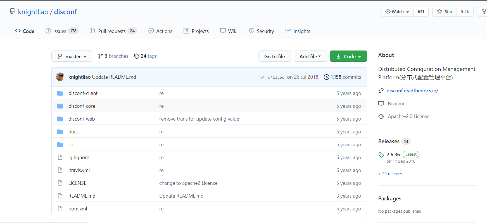
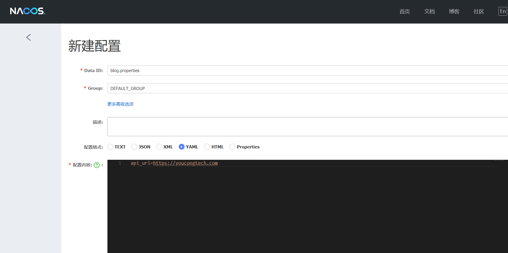

## 一、为什么需要分布式配置中心？它能解决什么问题？
从解决问题层面进行切入，它能解决配置混乱难管理的问题。
<!--more-->

过去传统式开发，一个SSM框架开发的单体应用通常会有如下配置:
- spring-mybatis.xml；
- spring-mvc.xml；
- mybatis.xml；
- web.xml；
- jdbc.properties；
- log4j.properties；
- spring-redis.xml；
- spring-mongodb.xml；
- mapper目录下有若干xml。

当这个单体应用因为某种原因(新来的架构师按照微服务的方式进行重构以及拆分(逐步开展)、项目经理为了新的需求-新建项目(一般老项目不能轻易动，保险起见)等)，这个时候就涉及到一个问题，新的项目目录结构与原来的可能一致，但配置文件基本上相同，这时将老项目的配置文件复制到新的项目，除非新的项目采取新的技术，否则仍然按照之前老项目的规范来，这个场景相信不少的朋友都遇到过。假如是两三个项目还好，如果这时要拆分为七八个甚至二十个，那么这样的工作将非常繁琐，同时维护上会很困难(稍不留神漏掉一个，最后一上线发现数据不对，原来连的还是开发环境的数据库，这时只得重新部署)。由此看来，分布式配置中心的主要作用**在于对配置文件的统一管理，减少重复性工作，提高整体研发团队的效率(开发、测试、运维等)**。
除此外统一管理体现的好处有**安全性**(可采用某种加密的方式进行关键配置数据加密，同时过去配置在代码里，如果代码被人反编译破解就可能导致密码之类的东西被泄漏等)、**时效性**(从两个方面来说，第一个方面是修改后重启才能生效，第二个是当时修改即刻生效)。
归纳地概括，因为多个项目场景中面临配置文件过于分散、修改追根溯源困难、环境容易搞混、代码与配置文件耦合等问题，我们需要分布式配置中心，而分布式配置中心恰好就能解决这样的问题。


## 二、分布式配置中心在实际中会面临哪些问题？
以Nacos为例，目前我使用Nacos作为分布式服务注册中心，而Nacos恰好集成了分布式配置管理。Nacos中的配置管理，就是管理配置文件的，而这些配置文件内容存储在MySQL。如果MySQL遭遇一些意外如磁盘空间满了、黑客攻击、连接过多、低效率的SQL导致内存消耗极大等，那么Nacos也会处于挂掉或死机状态(停止服务)等，这样也会直接导致一些微服务处理故障，虽然不在一个服务器上或者是连接的业务数据库不一样，但共同点都是读取Nacos统一管理下的配置。*针对这样的问题一般从三个方面入手:*

- 第一个方面，运维从监控策略(提前预警，做好应对)、服务器安全策略(防止攻击)、服务可用性策略(包含集群)等；
- 第二个方面，开发从写代码入手，遵守规范(代码规范)，逻辑严谨(程序逻辑考虑较为全面)，合理调用API(明白每个API的优缺点，进行合理组装，避免性能瓶颈)等；
- 第三个方面，测试从性能测试入手，模拟多人使用或非法攻击的场景等。

上面列举的仅仅是配置中心在实际落中面临的重大问题之一，除此之外还有就是如何规范管理配置(因为并不是所有的配置都需要放到配置中心进行统一管理，如果所有的微服务配置均放到分布式配置中心来管理，那么也会面临一个大问题就是如何管理好这些配置，一旦管理不好，就可能变成了体力劳动，违背了分布式配置中心的初衷)。

在提到规范管理之前，回到一个问题上，这个问题是究竟什么样的配置文件应该放在分布式配置中心？
我的回答是**通用性配置**，以我博客为例，application-dev.yml配置内容(我将jwt和鉴权、ribbon、hystrix等通用性配置放入了Nacos的配置管理):
```
# JWT配置
jwt:
  # 密匙KEY
  secret: JWTSecret
  # HeaderKEY
  tokenHeader: Authorization
  # Token前缀字符
  tokenPrefix: challenger-
  # 过期时间 单位秒 1天后过期=86400 7天后过期=604800
  expiration: 86400
  # 配置不需要认证的接口
  antMatchers: /login/**,/user/register,/api-doc/**,/login/**,/favicon.ico,/doc.html,/webjars/**,/swagger-resources,/v2/api-docs/**,/druid/**,/cnblogs/**,/user/**
  # 有效时间
  validTime: 7
ribbon:
  okhttp:
    enabled: true #
  NFLoadBalancerRuleClassName: com.netflix.loadbalancer.RandomRule # 默认为；轮询，这里改为随机
  ConnectTimeout: 5000 # 连接超时时间(ms)
  ReadTimeout: 5000 # 通信超时时间(ms)
hystrix:
  enabled: true
  command:
    default:
      execution:
        isolation:
          thread:
            timeoutInMilliseconds: 6000 #

```

那么在规范性方面该如何落地？这与公司的实际情况有关，每家公司的业务、研发团队的综合素质等均存在差异性，而在规范性上就需要找到适合该公司研发团队的。但适合很难，都是从坑坑洼洼中摸索出来的。

*以我个人经验来看(结合近来的坑)，从以下入手:*
- **通用性配置管理**，公共通用性配置文件和业务通用性配置文件，放入分布式配置中心进行管理；
- **分类配置管理**，不同环境(dev、test、prod)放入不同的分布式配置中心进行管理；
- **差异性配置管理**，差异性配置文件放入具体的微服务项目，衡量差异性的标准是该配置只在此处用到，其它微服务均不涉及。


## 三、分布式配置中心的技术选型
关于这一方面，我特别查阅了相关资料，有博友将分布式配置中心的技术选型归纳为如下:
- Disconf；
- Spring Cloud Config；
- Apollo；
- Nacos。

目前用的比较多的，一个是SpringCloud Config，相当于是SpringCloud原生自带，不过该分布式配置中心的存储主要为SVN和Git，也有部分人采用本地存储的方式(存储在某个服务器上)，另一个是Apollo，然后就是Nacos，至于Disconf早就不维护了，相当于落伍，GitHub如图:


对于早就不维护的，一般技术选型不考虑，关于技术选型需要考虑哪些东西，感兴趣的朋友可以阅读我的这篇文章:
[从单体架构到分布式微服务架构的思考](https://youcongtech.com/2021/04/17/%E4%BB%8E%E5%8D%95%E4%BD%93%E6%9E%B6%E6%9E%84%E5%88%B0%E5%88%86%E5%B8%83%E5%BC%8F%E5%BE%AE%E6%9C%8D%E5%8A%A1%E6%9E%B6%E6%9E%84%E7%9A%84%E6%80%9D%E8%80%83/)


## 四、SpringCloud Alibaba之分布式配置中心整合(以Nacos作为分布式配置中心)

### 1.添加Maven依赖
```
        <dependency>
            <groupId>com.alibaba.cloud</groupId>
            <artifactId>spring-cloud-starter-alibaba-nacos-discovery</artifactId>
        </dependency>

        <!-- SpringCloud Ailibaba Nacos Config -->
        <dependency>
            <groupId>com.alibaba.cloud</groupId>
            <artifactId>spring-cloud-starter-alibaba-nacos-config</artifactId>
        </dependency>

```

### 2.bootstrap.yml配置
```
 cloud:
    nacos:
      discovery:
        # 服务注册地址
        server-addr: 127.0.0.1:8848
      config:
        # 配置中心地址
        server-addr: 127.0.0.1:8848
        # 配置文件格式
        file-extension: yml
        # 共享配置
        shared-dataids: application-${spring.profiles.active}.${spring.cloud.nacos.config.file-extension}

```

### 3.例子

#### (1)通过nacos新建一个配置文件



#### (2)bootstrap.yml配置
```
 cloud:
    nacos:
      discovery:
        # 服务注册地址
        server-addr: 127.0.0.1:8848
      config:
        # 配置中心地址
        server-addr: 127.0.0.1:8848
        # 配置文件格式
        file-extension: yml
        # 共享配置
        shared-dataids: blog.properties,application-${spring.profiles.active}.${spring.cloud.nacos.config.file-extension}

```

#### (3)代码读取

##### a.Environment读取
```
@Autowired
private Environment env

env.getProperty("api_url")

```
##### b.注解读取
```
@Value("${api_url}")
private String apiUrl;

```
#### (4)如果想实时更新的话需要配置两个地方(两者缺一不可，nacos版本为1.3.1)

##### a.配置文件
```
  cloud:
    nacos:
      discovery:
        # 服务注册地址
        server-addr: 127.0.0.1:8848
      config:
        # 配置中心地址
        server-addr: 127.0.0.1:8848
        # 配置文件格式
        file-extension: yml
        # 共享配置
        shared-dataids: application-${spring.profiles.active}.${spring.cloud.nacos.config.file-extension},blog.properties
        refresh-enabled: true
        refreshable-dataids: blog.properties

```

##### b.注解
```
@RefreshScope

```