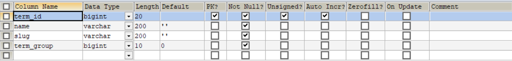
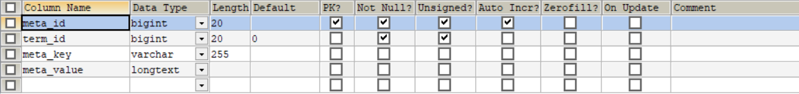
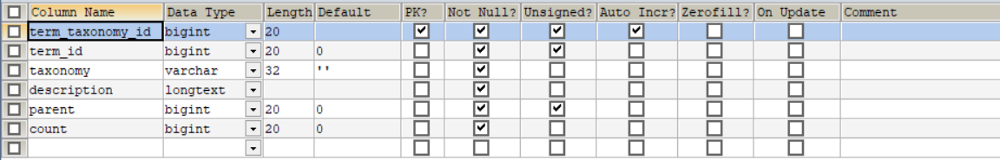
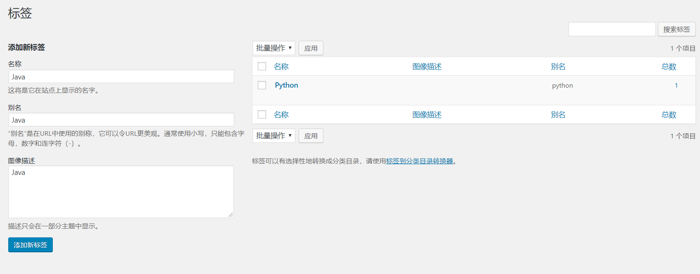
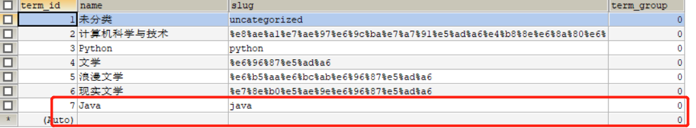
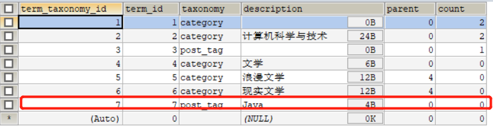

## 数据表分析

### wp_terms(分类标签表)

<!--more-->
表字段如下:
term_id(分类或标签ID)
name(分类或标签名)
slug(别名)
term_group(分类标签组，我想应该是用于排序分组)

### wp_termmeta(分类标签元数据表)

表字段如下:
meta_id(元数据自增ID)
term_id(分类标签ID)
meta_key(元数据键)
meta_value(元数据值)

### wp_term_taxonomy(分类标签表)

表字段如下:
term_taxonomy_id(分类标签ID,主要用于wp_term_relationships,因为wp_term_relationships，主要是文章和对应的标签分类进行关联)
term_id(标签或分类ID)
taxonomy(标签与分类的衡量标准)
description(描述)
parent(父ID，用于父子分类或父子集)
cout(该分类文章总数)

## 具体实例分析

以添加分类或标签为例:

### 添加标签

添加成功后，分别在wp_terms及其wp_term_taxonomy表增加对应的数据，如下所示:

由此我们可以看，决定是分类还是标签，关键在于wp_term_taxonomy表中的taxonomy(通常有两个，一个是category，即分类，另外一个是post_tag，即文章标签)

