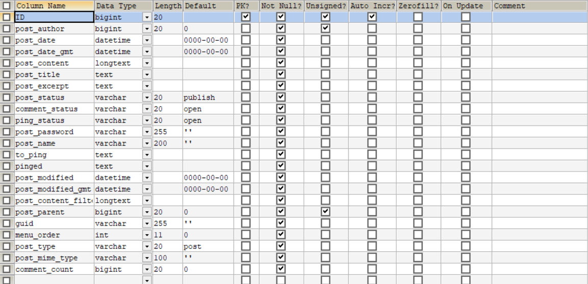
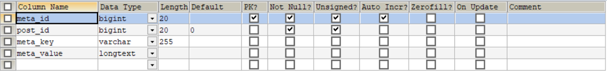
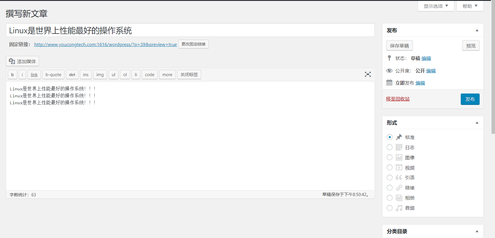
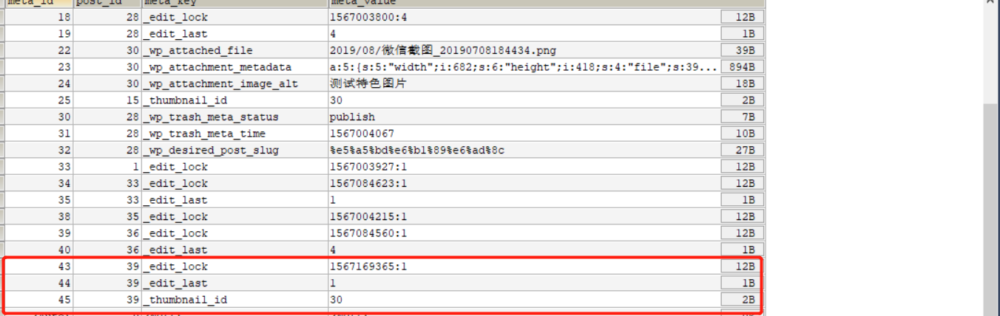
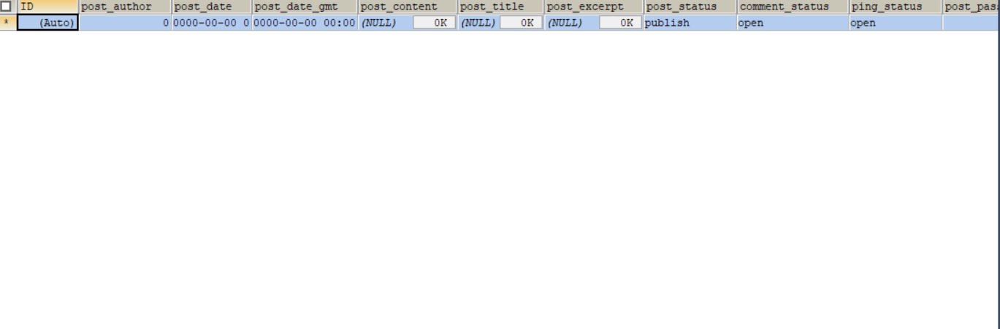

## 数据表分析

### wp_posts(文章表)

<!--more-->
表字段如下:
ID(文章ID)
post_author(文章作者名，我想可以是为用户名，也可以是用户ID)
post_date(文章发布日期)
post_date_gmt(文章发布日期，格林威治时间)
post_content(文章内容)
post_title(文章标题)
post_exerpt(摘录)
post_status(文章状态，publish/auto-draft/inherit)
comment_status(是否开启评论，默认值为open，打开)
ping_status
post_password(文章密码，如果加密的话，需要输入对应的密码才能打开)
post_name(文章缩略名)
to_ping(ping的链接)
pinged(已经PING过的链接)
post_modified(文章修改时间)
post_modified_gmt(文章修改时间，格林威治时间)
post_content_filter
post_parent(父文章，主要用于page)
guid
menu_order(排序ID)
post_type(文章类型,post或page)
post_mime_type(MIME类型)
comment_count(文章评论总数)

### wp_postmeta(文章元数据)

表字段分析:
meta_id(文章元数据自增ID)
post_id(文章ID)
meta_key(元数据键)
meta_value(元数据值)

## 具体事例分析

### 以写一篇文章为例
如图:

页面效果，如下:

在对应的数据表中我们看到如下数据:
这里显示的是wp_postmeta表:

再看wp_posts表，如下(却还是仅仅只有一条数据，关于这一点我有些疑惑不解):
