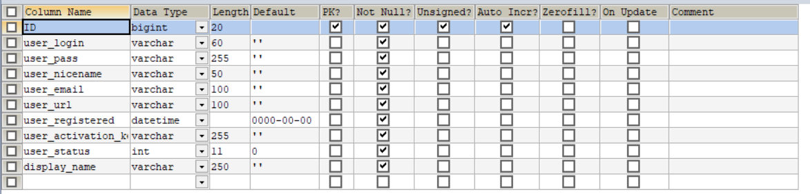
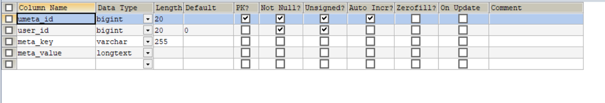
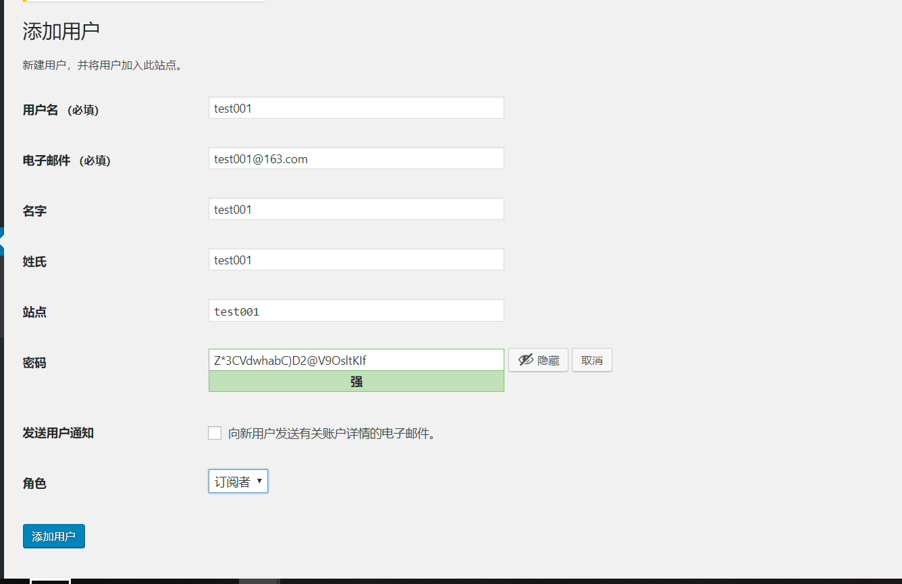
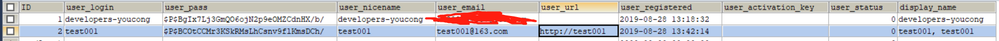
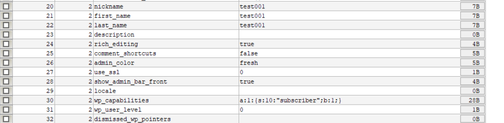
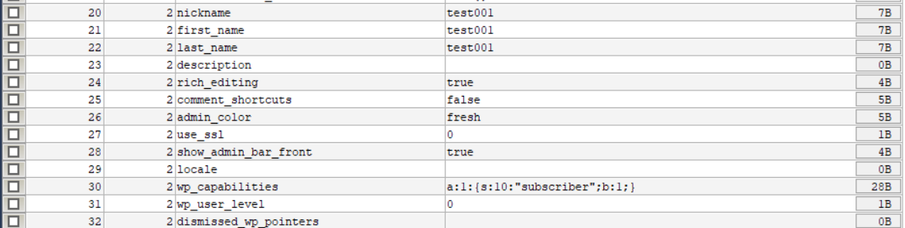

# 数据表分析

## wp_users

## wp_usermeta

用户系统就是靠着这两张表来实现的。
<!--more-->
# 具体事例分析

## 添加用户

添加成功后，我们会分别在wp_users及wp_usermeta表中分别看到test001的数据。

### wp_users

### wp_usermeta

wp_users表字段分析:
ID(用户ID)
user_login(用户登录账户名)
user_pass(用户密码)
user_nicename(用户昵称)
user_email(用户邮箱)
user_url(用户博客URL)
user_registered(注册时间)
user_activation_key(激活)
user_status(状态)
display_name(显示名称)

wp_usermeta表字段分析:
umeta_id(用户元数据表自增ID)
user_id(用户ID)
meta_key(元数据键)
meta_value(元数据值)

通常添加用户都会包含这些必须的数据，如图:

umeta_id和user_id就不作分析了，很好理解。

主要说说meta_key里面的值到底是个什么意思(有的不清楚是什么意思，就不作解释了，等后续明白了再补充)?
nickname(用户昵称)
first_name(用户姓)
last_name(用户名)
description(个人说明)
rich_editing(编写文件不使用可视化编辑器，默认是true,表示使用可视化编辑器)
comment_shortcuts(管理评论时启用键盘快捷键)
admin_color(管理界面配色)
use_ssl(是否使用ssl)
show_admin_bar_front(是否显示管理面板)
locale(站点使用什么语言，如中文或英文)
wp_capabilities(权限)
wp_user_level(用户等级)
dismissed_wp_pointers

随着用户操作增加的meta_key内容如下:
session_tokens(会话token，登录就会产生，退出就会清除,我想用户下线功能就是这样实现的)
wp_user-settings(用户设置)
wp_user-settings-time(用户设置操作的时间)

