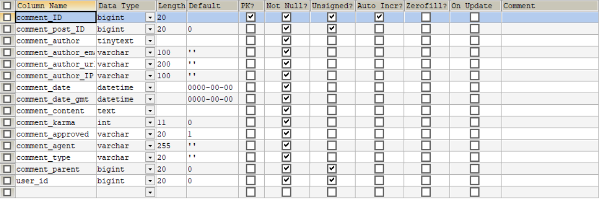
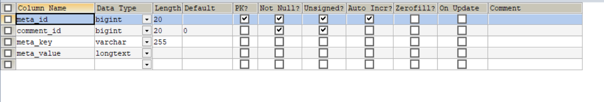
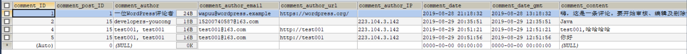
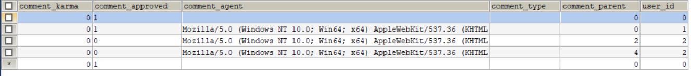
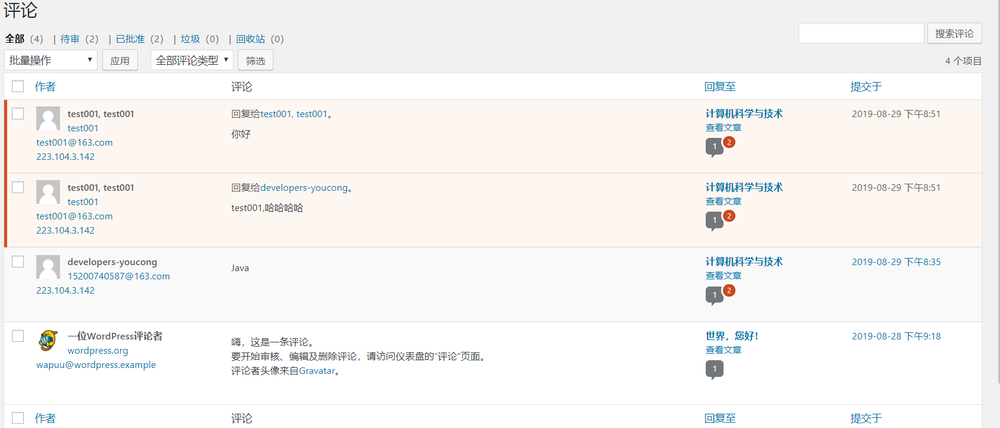

## 数据表分析

### wp_comments(评论表)
<!--more-->

该表字段，如下:
comment_ID(评论ID)
comment_post_ID(评论文章ID)
comment_author(评论者用户名)
comment_author_email(评论者邮箱)
comment_author_url(评论者博客URL)
comment_author_IP(评论者访问IP)
comment_date(评论日期)
comment_date_gmt(评论格尼林治时间)
comment_content(评论内容)
comment_karma
comment_approved(评论状态，0相当于待审批，1相当于审批通过，spam相当于垃圾评论，trash相当于回收站，永久删除相当于从数据表中将其移除)
comment_agent(使用什么浏览器)
comment_type(评论类型)
comment_parent(评论父ID，判断该评论下是否有子集，0默认是没有子集)
user_id(用户ID)

### wp_commentmeta(评论元数据表)

表字段，如下:
meta_id(评论元数据自增ID)
comment_id(评论ID)
meta_key(元数据键)
meta_value(元数据值)

这个评论元数据表，目前我还没有用起来。

## 具体实例分析

以评论为例:

### 评论文章

这里有这么几个功能?
(1)评论某个作者发表的文章，需经过审批后，才能显示;
(2)对应的文章评论应该是父子级展示，没有子集，一路平等，有子集，默认显示树形;

### 评论列表

从上面可得出如下功能:
(1)评论列表展示(管理员身份，默认展示所有评论);
(2)评论有对应的统计，如全部、待审、已批准、垃圾、回收站等;
(3)支持批量操作，如将对应的评论进行通过审批;
(4)对应的文章还必须显示，目前有多少评论，已批准，待审批等;
(5)搜索功能(这个搜索貌似仅仅只包含作者名及其评论内容等);
(6)统计评论总条数(根据统计条件进行变化);