此文转自我个人微信公众号，时间虽然过去已经四个多月了，但是我个人认为还是能够给大家带来启发意义，所以借这个时间分享给大家，微信公众号分享比较有限，而且时效性也比较差，而博客时效性比较好，而且还能集思广益，欢迎朋友在评论区留言，俗话说，众人拾柴火焰高。
<!--more-->
原文如下:

春节的假期在家待了10天。明天就要回北京了。

微信公众号文章也停更了两周。感谢每天新关注的朋友们，同时也感谢一直关注和支持的朋友们。2019年争取输出更多的技术干货或者其它非技术干货(不过我对于我的微信公众号定义主要还是以技术导向为主，非技术可能会少一些)。

 

算法对我来说，用一句诗歌来说，“蜀道难，难于上青天”。

原本之前想着用一年时间来攻克，现在看来可能性不大。

身处在一线城市于我而言，不仅仅需要通过闲暇时间学习算法，同时我也还要学习最新的技术，同时也还要时常补补计算机相关的基础(当年不努力，太过对自己放松所造成的后果)。

 

春节假期中，不仅仅放松玩了玩，比如跑得快、王者、看电影及其和几个好哥们聚会，同时也刷了下知乎，在知乎中东看看西看看，看了好几篇于我目前而言比较感兴趣的文章，如何学好算法。

 

于我目前而言算法并没有给我带来实际的利益，至少没有其它软件工程技术那样给我带来直观的利益(比如使用shiro我可以轻松的完成接口权限控制、使用Nginx做负载均衡、使用Redis缓存数据等这样的例子数不胜数）。

 

由此可以推断出算法对我而言实际利益并不大，但我为什么要坚持要学呢？

 

以拉勾、boss直聘等招聘网站来说，一些上市大公司和大部分中小公司所要求的主要是丰富的项目经验和对开发常用技术掌握的非常熟练、某些特定领域的经验，比如银行、医疗、办公等，对于算法方面的能力并不十分看重(当然了，如果是在校参加过acm比赛获奖、刷过算法题的或者是github上有过开源项目的也是一项优势)。

比如下图所示:

图一:
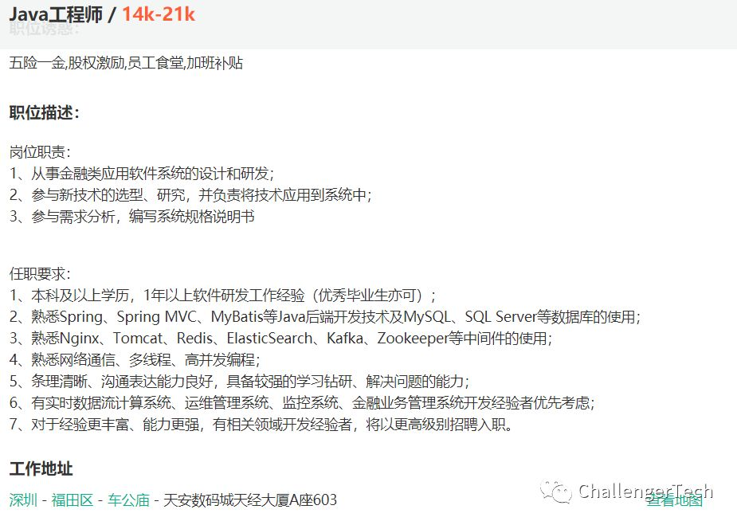

图二:
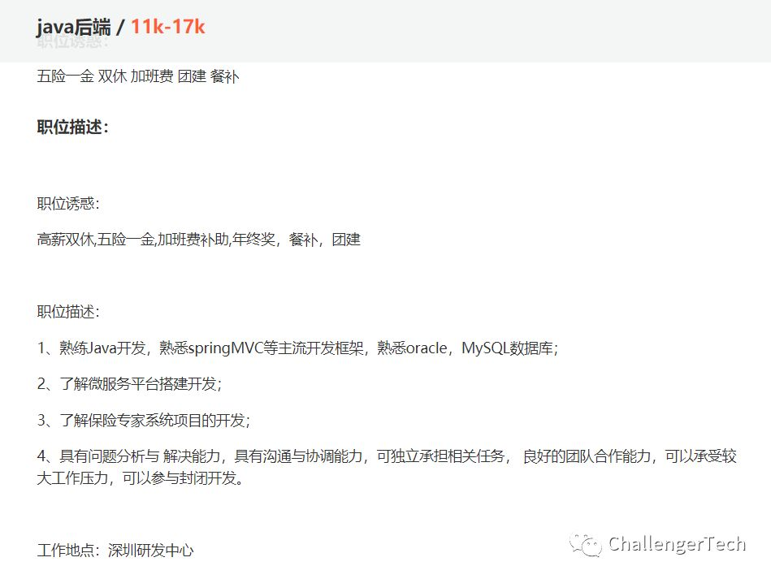

图三:
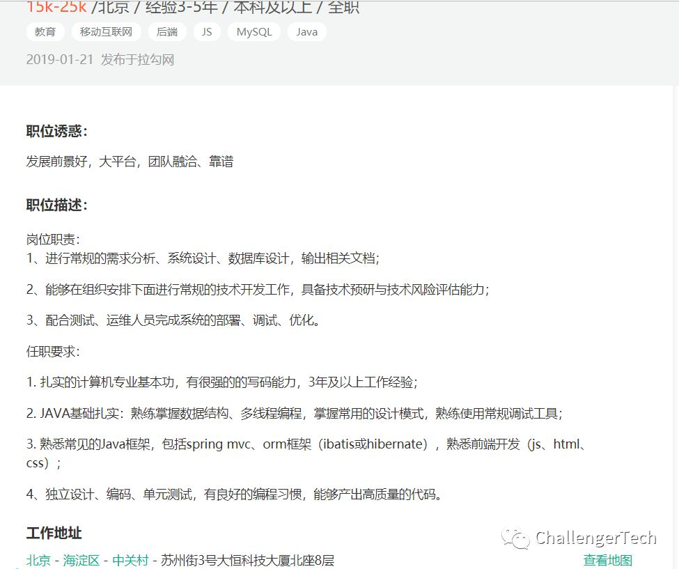

如果要说给出的理由的话，我觉得能够说服我自己的最大的理由是我不想成为一名码农(我对码农的定义的是将脑力劳动变成的体力劳动，经过这一年多的开发，我发现在工作中，有一半是体力，有一半是脑力，其实那一半体力是可以靠脑力解决的)。

 

另外研究算法的也是为了更好的读懂Java源代码和Spring源码相关的,作为一名Java后端开发，不深入了解源代码的实现思路是很难混的好的(主要指靠技术吃饭)。我觉得一个算法能力强的人读Java源代码和Spring源码及其其它相关的软件源码要比算法能力弱的人效率高的多。尽管两者之间不一定是正比。

 

关于算法学习(我作为初学者就不多说太多了，参考前辈们的经验)

 

当然了，虽说不说太多，但是还是要说的。

 

我对我目前的要求，只有一条。

一道算法题目，将思路想清楚想明白了将其攻克，再继续下一道题目和尽可能不借鉴其它已知的解决方案(参考不少知友的回答加上以自己1月份的做题经验来说，没有经过深度思考尝试多次解题直接去参考现成答案，收获太小，效率不高，感觉太浪费时间了)。

 

知友们给出的观点(如何学好算法)，如下图所示:

图一:
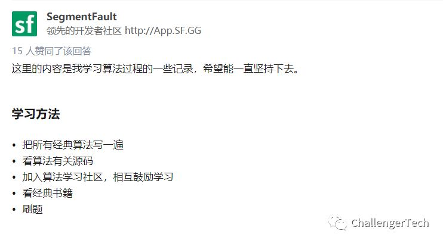

图二:
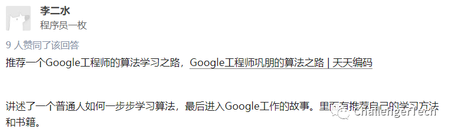

图三:
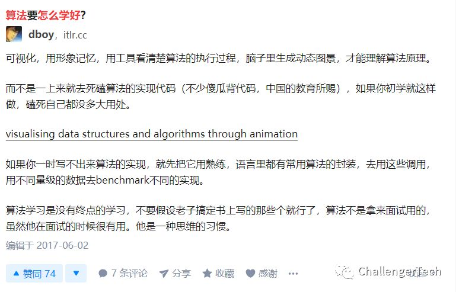
看了这篇知友的回答，我点击该链接:

https://visualgo.net/en

这个链接的效果图，如下所示:
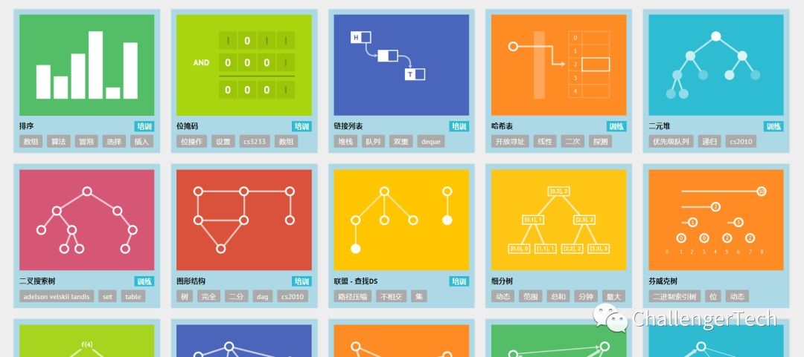

点击其中的一个，以排序为例(它会以动画的形式展现，有助于更形象的感受，可以作为算法学习的辅助工具):
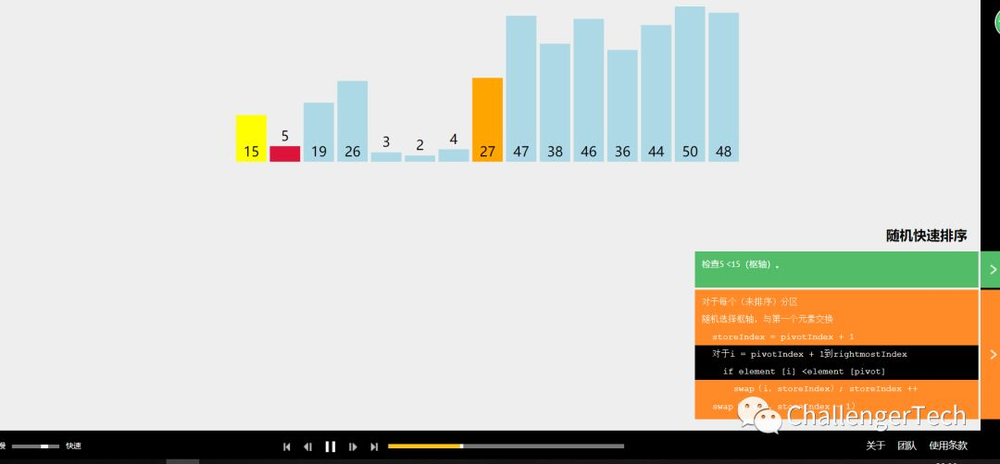

图四(为什么要学算法)：
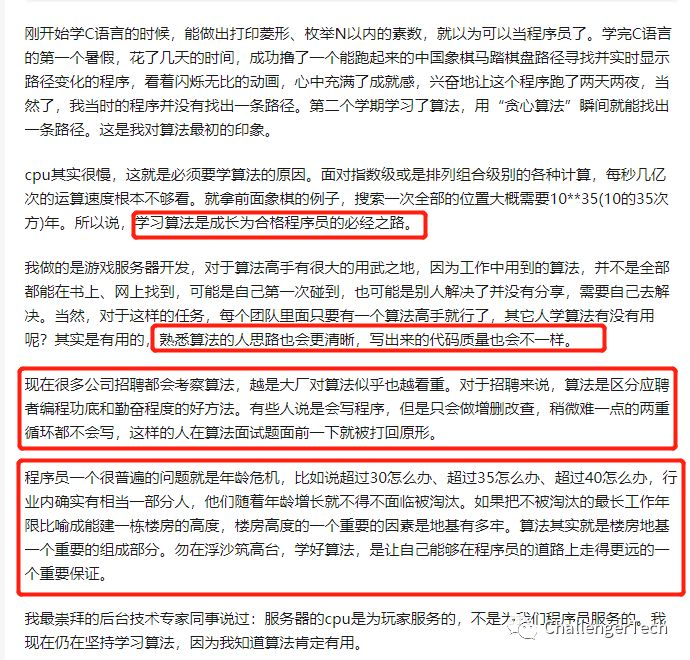

图五(有没有学不会算法的人):
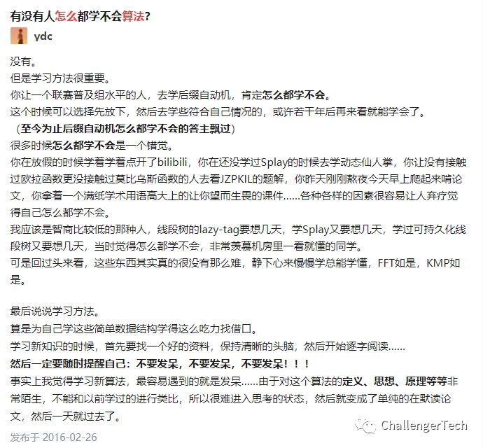
这让我想起曾经看过的一篇文章，说的是一位十几岁就出来打工，快三十岁或者三十岁以上年龄咬紧牙关学软件开发，最终还是学成对的。由此看，人必须要有决心，想当初新中国建立也才十来年，自力更生造出了原子弹、氢弹等核武器，使我们不再受制于他国的核威胁。

 

关于刷算法题网站有很多，比如目前我常用的就是力扣，

力扣题库(也就是现在比较出名的leetcode，记得前段时间我们经理招人时，特别强调这么几点，有leetcode刷题经验的、有个人github的、有个人博客的优先):

https://leetcode-cn.com/problemset/all/

 

还有一个国内挺出名的牛客网:

https://www.nowcoder.com/

图六:
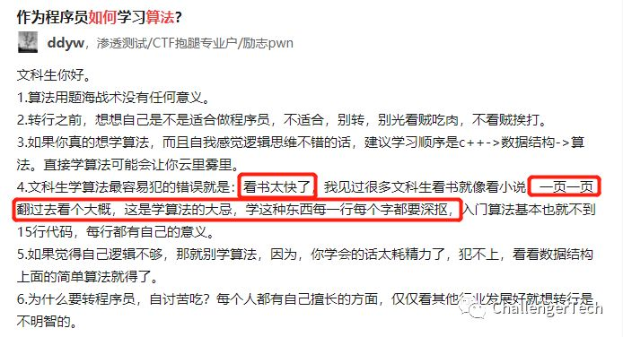

想到我当初看书，一周一本书，然而并没有什么用处。

有句话叫做，欲速则不达。

慢就是快，快就是慢。

举例说明:

以我为例，经理要求某个功能时，我在完成该功能之前，事先画个草图，仔细分析，功能拆分(通常要求的功能是一个大的功能，大的功能一般包含好几个小功能)，再度确认(将列举画好的草图跟经理确认一遍，这样的好处是，确定需求无误，减少盲目开干浪费时间)。事实上证明是非常有必要的，前期我没有这样做，盲目埋头干导致的需求没有理解透，做出的功能也不对，以至于重做(重做是一件非常痛苦的事情)，很多程序员都有过这样的经历，新增功能是一件很容易的事情，但是要重构原有的功能代码是一件很不容易的事情(特别是时间过了很长，如果编码规范不是特别好的话，会导致许多问题，比如代码可读性、代码耦合性等，我觉得这两个是维护代码最痛苦的事情)。

由此推论出如下:

给定需求->分析思考需求(确定需求的合理性，功能多少，时间周期，能不能做)->跟领导确定需求->需求确定，撸起键盘开敲->完成后的效果，找产品经理或者领导确认。

这一个流程下来时间虽然花不少，但是想想如果没有听清需求正确分析需求直接开敲那样的后果，你会发现这样做其实是很节约时间的，所以正好验证，慢就是快。

 

 

今天就说到这吧，回到北京后，一切都将回到正轨。

继续我的工程师成长之路。

 

另祝2019年，大家都能实现自己的目标，也许实现目标的过程中是一件比较痛苦的事情，但是想想度过这段痛苦的过程后，你将会获得无比强大的力量。

 

我的微信公众号，如图:
