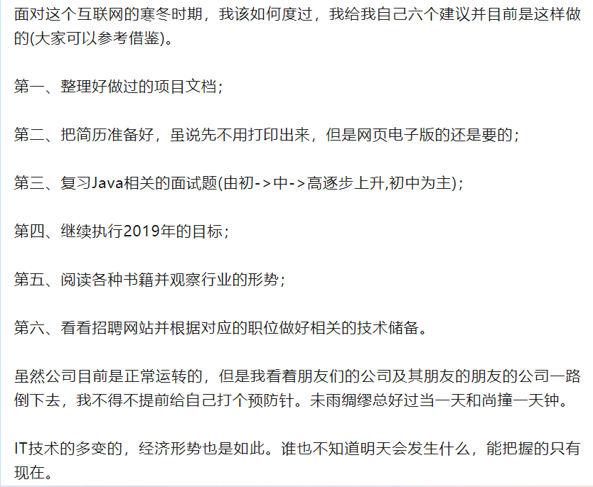

以IT行业为例，从2019年算起，几乎是每年都会出现公司倒闭以及公司裁员等现象。但今年形势却很不乐观，基于一些粉丝朋友们的反馈和我自己观察感受到的，主要表现为如下分为两个方面:

- 第一、招聘方面。
- 第二、在职方面。

<!--more-->

**第一、招聘方面主要表现如下:**

- 1.招聘岗位大大缩减(公司各个部门的招聘岗位);
- 2.招聘岗位的人员数量大大缩减(公司各个部门的招聘岗位的人数)；
- 3.不少招聘网站上的招聘人士回复意愿低(自主研发产品的公司招聘意愿低于外包)；
- 4.招聘岗位的人员要求多(这个"要求多"指要求你具备多方面能力，身兼数职，例如后端开发需要会前端、运维等)，但薪资给出的却与此不太相符合；
- 5.招聘岗位的卡年龄、卡学历、卡年限比以往更严重。

**第二、在职方面主要表现如下:**

- 1.有的公司开始全员降薪(如按照80%、70%甚至50%这样的比例发放薪资，这算是比较乐观的，至少有钱发)；
- 2.有的公司为减少裁员支出开始变相搞裁员，从抓考勤、绩效方面入手(例如迟到一分钟扣50~100这样的(甚至迟到1次取消当月餐补)、绩效考核比往期更严格更细致入微更不合理)；
- 3.有的公司已经无力支撑，薪资拖欠达三个月以上(主要表现有很多，例如项目制公司没有回款发不出工资、公司帐上本身就没钱了、公司面临官司且帐上已被冻结等)；
- 4.有的公司采用新的经营模式，由各个业务部门自身盈利状况决定薪资发放的比例。
- 5.原来的双休变为单休，早九晚五或早九晚六变为早九晚八或早九晚十这样的(单休变为常态，正常上班制变为"弹性"上班制等)。
- 6.已经被裁的人以及他手头上的工作，由未被裁的人接手，相当于原本正常负荷甚至一定程度的负荷工作模式将变为常态的超负荷工作模式。
- 7.内卷内耗比过去更加严重，似乎未被裁的人就应该加班加点以工作证明来感恩没有被裁。
- 8.公司的福利例如餐补、交通补、通信补、租房补贴面临取消或部分已经被取消。
- 9.公司针对各部门的项目经费审核比过去更严格(经费支出的明细账单、用途以及审批流程比过去更长了)。
- 10.缴纳的社保基数与公积金基数按照最低档缴纳。
- 11.薪资的发放模式变更(主要配合10，防止从法律层面被员工抓到不利的细节)。
- 12.劳动合同重新变更(配合10、11)。

在这两方面的情况看，无疑证明了一点，IT行业的寒冬已经到来了并已经持续了很长的时间(实际上，这已经不仅仅是IT行业了)。**因为市场并不是一块无限大的蛋糕且影响市场的因素是多个方面的综合合力。**以IT行业为例,在2018年，也就是我加入创业公司的那一年，那一年以前，拿个PPT忽悠个百八十万融资并不是一件很难的事情，在2019年的时候，我所在的创业公司进行赛道变更，由原来的物联网赛道变为教育赛道，变更的过程是困难的，最关键的因素就是资金，但当时老G凭借其人脉关系弄到了一笔融资，而这笔融资支撑了创业公司那一年以及之后几年。而在那之后越来越难，创业公司融资越来越难，渠道越来越少，融到的资金也越来越少。记得在2019年之前，那个时候看到网上的一些信息，我就已经感觉到了危机感，但这个危机感不那么压迫，那个时候在公众号写下了这篇文章[我的2019年奋斗目标](https://mp.weixin.qq.com/s?__biz=MzUxODk0ODQ3Ng==&mid=2247484076&idx=1&sn=39b451e9b585f91ef29028b9e76acd08&chksm=f98051bfcef7d8a93309bc481cb4b62d08f863809ec62cedf8675eeb99542eb6f325d805572e&token=2002590731&lang=zh_CN#rd)。随后，当真正的2019年到来时，加上身边的一些朋友直面失业，于是那个时候，我才感觉到了危机给我带来的压迫感，于是就有了这篇文章[互联网的寒冬该如何度过](https://mp.weixin.qq.com/s?__biz=MzUxODk0ODQ3Ng==&mid=2247484087&idx=1&sn=a737120d43744f5457d678e0fe1b6546&chksm=f98051a4cef7d8b25e779305ab72092a6a50d31b02c1e9d1283bc8950a23f6a579ec4fec2e69&token=2002590731&lang=zh_CN#rd)。坦白地说，要不是发生在身边的事情给我醍醐灌顶的一击，可能之后，在面临这种情况时，我会措手不及。

**那个时候我在面临这样的危机时，我采取的措施是这样的，如下图所示(原文是：[互联网的寒冬该如何度过](https://mp.weixin.qq.com/s?__biz=MzUxODk0ODQ3Ng==&mid=2247484087&idx=1&sn=a737120d43744f5457d678e0fe1b6546&chksm=f98051a4cef7d8b25e779305ab72092a6a50d31b02c1e9d1283bc8950a23f6a579ec4fec2e69&token=2002590731&lang=zh_CN#rd)。**

**注意了，上面的建议是我在2019年给自己提出的(具有情况的局限性)，千万勿照搬照抄，因为不一定适合当下的问题解决，每个人结合自己的实际情况进行参考借鉴。**

最终我在2019年的时候还是失业了，只不过是我主动离开创业公司的，失业时间一个月左右，在一个月之后，我很快来到了另外一家公司(也就是后面主要提到的某教育Saas公司)。

今年的情况，可能是过去三年的合力因素造成的(或者是更长时间)，也许互联网的红利开始渐渐消失了或已经渐渐消失了。**那么在这样的情况下，该怎么办呢？这里我不明确给出具体的建议，因为每个人的实际情况都不一样，我只分享身边朋友的案例以供参考**

- 1.小A原本打算今年买房了，但因为突如其来的意外使她决定放弃买房，保留充足的现金流来抵御可能面临的如失业之类的危机。
- 2.小B在IT行业中先后做过PHP开发、项目实施等，但最终还是被"毕业"了，由于其过去不合理的消费观，导致工作五年了还是月光，时不时还得借钱解决房租问题，最终无奈于放下身段去做他曾经瞧不起的"外卖小哥"以解决当下生存问题。
- 3.小C做项目管理多年，因为某种原因不得不离开公司，但项目管理岗位少之又少，加上今年的情况，就更不好找了，最终下定决心把驾照考了，好在过去有储蓄观念，加上两夫妻一起赚钱，攒了不少钱，眼下还过的去，打算一边开滴滴一边找工作，毕竟房贷、车贷、孩子上学、父母养老等好几座大山压在身上。
- 4.小D是自由职业者，离职一年以上，经常在一些外包平台上接私活，靠着这些私活过的还不错，时间上自由，赚的钱比过去在公司下的雇佣模式还要多。但自去年下半年以后到今年，单子比过去更少了，不少客户的公司(大多为小作坊)均经营不下去，随着客户日渐减少，靠着前两年的赚的钱，日子过得还比较舒坦，生活质量没有下降，但其最近决定打算先找份工作过渡一下，待行情好起来再出去单干。
- 5.小E原本今年毕业，但基于目前的情况决定继续读研(当初他问我是否读研，我给的建议就是读研，因为我曾经找工作深受"卡学历"之苦，过来人受的苦，往往不希望后来者也受同样的苦，尽管我们从未见过面)。
- 6.小F在IT行业工作10年以上，但因为其随着年龄越来越大，加班熬夜拼不过年轻人，早晚可能会被"毕业"，基于这样的情况，加上其一直在外拼搏多年，特别思念自己的妻子和女儿，于是决定放弃IT行业的高薪回老家进入某行业成为一名销售人员，据说目前做的还不错。
- 7.小G今年年初失业，他认为这也许是老天爷给他的机会，他决定体会感受一下流水线工人、销售、保安、饭店服务员等，不为赚钱只为感受和体会，并把这些感受和体会写下来，他跟我一样有一个写作梦。
- 8.小H今年3月份失业，最初有些怀疑自己是不是能力不行被"毕业"的，于是便去西藏那边待了一段时间，后来回老家陪了爸妈一段时间，最近回的北京，找工作找了一段时间，但效果不太理想，虽然学历和年龄这关没有怎么被卡，但是面的一些公司总想让他身兼多职，而他很不愿意也很不喜欢这样的方式，他的观念是喜欢专一地去做一件事情，他认为身兼多职只会影响做事情的效率和质量。他觉得没关系，慢慢找，总会找到的，实在不行的话，大不了这一年不工作了，去做一些自己喜欢的事情。
- 9.小I去年结婚买的房，他是做开发的，他的妻子做测试的，都在IT行业，今年1月份都被"毕业"了，虽然公司按照程序赔了钱，但眼下还有房贷以及房子装修借的钱要还，没怎么休息，便马上开始写简历找工作，夫妻俩，一个是3月份找到的工作，一个是4月份找到的工作，小I在之前单位是20k一个月，但一直找不到，后来去了外包给了16k,他妻子也是降薪进的某外包公司。
- 10.小J非常喜欢玩手机，手机里很多知名的App都开了会员，从今年开始他决定节流，把所有会员统统关闭。
- 11.小K喜欢玩基金股票之类的，基金他没赚过钱，股票却赚了一些钱，最后的结果是股票与基金盈亏平衡，他决定卖出所有的基金留作股票补仓或买入新股票的原始资金，除此外，以后其他的钱将不再用于这些。
- 12.小M过去非常热衷于基金、股票之类的，从今年开始把所有的基金、股票全部清仓，她觉得没有什么比手里的现金流更让人感到安全感。她觉得玩那些东西只不过在考验"人性"罢了，但往往"人性"却经不起任何的考验。
- 13.小N今年4月份失业，借此机会决定离开北京了，具体地方没有确定，她想着先把北京的东西打包回家，然后准备去全国各地走一走，然后再想一想接下来的路该怎么走。
- 14.小O不喜欢内卷，特别是公司的三轮裁员，均未裁到他，但经过这三轮裁员，他的事情越来越多了，原来可以不用加班就能把活干完，现在不得不加班，而且加班还不一定把活干完，于是他把这些情况告诉领导，领导没有理会，只是冷冷地说了一句，能干就干，不能干，就走。小O当时听了这句话很生气，于是决定把自己的事情干好，至于领导另外分配的任务一概拒绝，他已经做好离开的准备了。
- 15.小P工作多年，在这家公司已经工作了10年以上，他最近很忧心，因为他听到了公司要裁员的消息，他习惯了这家公司的一切，他担心万一被开了，以他36岁的年龄和目前的能力担心被裁会找不到工作。更何况妻子也没有工作一直照顾家里的小孩和父母，家里全靠他的收入来支撑。

基于以上15个案例，大家结合自身周边，一定不会陌生，因为这15个案例来源于生活来源于实际。有人说，这15个案例该怎么破局呢？换做以前的我，一定会什么都不了解并大言不惭地跟他(她)列个12345之类的，但现在的我不会了，**因为人的悲欢离合并不共通，你没有经历他(她)所经历的、他(她)所面对的，很难能共情甚至无法共情(包含换位思考)。**

基于上述种种情况，也许读者朋友会疑问，现实如此残酷，**前途的光明在哪里呢(实际上面15个案例算是比较好的，还有更坏的)**？

这就进入本文的主题核心，即**"前途是光明的，道路是曲折的"**。"前途是光明的，道路是曲折的"这句话出自《毛泽东选集》第四卷中的关于重庆谈判，**原文这样说(引用部分原文内容概述):**
> 中国发展的总趋势，也必定变好，不能变坏。世界是在进步的，前途是光明的，这个历史的总趋势任何人也改变不了。我们应当把世界进步的情况和光明的前途，常常向人民宣传，时人民建立起胜利的信心。同时，我们还要告诉人民，告诉同志们，道路是曲折的。在革命的道路上还有许多障碍物，还有许多困难。我们党的七次代表大会设想过许多困难，我们宁肯把困难想得更多一些。有些同志不愿意多想困难。但是困难是事实，有多少就得承认多少，不能采取"不承认主义"。我们要承认困难，分析困难，向困难作斗争。世界上没有直路，要准备走曲折的路，不要贪便宜。不能设想，哪一天早上，一切反动派统统自己跪在地上。总之，前途是光明的，道路是曲折的。我们面前困难还多，不可忽视。我们和全体人民团结起来，共同努力，一定能够排除万难，达到胜利的目的。

### 为什么说前途是光明的？道路是曲折的呢？
这里我以程序员为例。

**从过去的角度来看，程序员的前景有哪些？**

- 1.互联网的高速发展带来了各种机会； 
- 2.入行的门槛相对较低(有不少跨专业转行的朋友取得了转行成功)；
- 3.较高程度上的学历放宽，更看重实际能力，于是便有了这句话Talk is cheap, Show me your code(空说无用，给我看你的代码)；
- 4.起步薪资相对其它传统行业较高；
- 5.只要能干，月薪轻松上万不是梦(基本上工作一年以上，月薪1个w是一件很容易的事情)；
- 6.工作三年以上，靠自己的能力在非一二线城市买房是一件比较容易实现的事情。

**从过去的角度来看，程序员的受限有哪些？**

- 1.计算机技术的发展，需要我们坚持不断学习，以满足解决当下或未来可能遇到的问题需求；
- 2.经常跟电脑打交道，时间久了，对身体的影响很大(如近视、颈椎病、结石、肠胃病、脱发等)；
- 3.经常跟电脑打交道，时间久了，对性格的影响很大(性格较为内向、表达能力较差等)
- 4.社会接触面狭窄较为单一，不能有效地构建人脉关系；
- 5.年龄大了，身体精力比不上年轻人，很容易被淘汰(这也是35岁中年危机的由来之一)；
- 6.技术性思维容易被一叶障目(主要表现为：为了技术而技术)。

前景随着市场份额的减少(影响市场的因素是多方面的)会发生较大的变化(具体变化，上面的内容已经叙述过了，这里不再赘述)，受限是一直存在的，很多人不断前赴后继地去突破去改变。他们的经历证明了，**程序员的受限是可以改变的，只不过付出的代价会比较大，遭受的痛苦会比较多而已。好比一个国家、一个政党的成长，成长的过程中，并不是一帆风顺的,大家可以回顾一下从晚清灭亡到新中国至今的历史以及中国共产党党史就会明白很多事情。**

虽然当下一些大环境不是特别好，但是就我们个人而言，不能一直处于消极、迷惘、逃避的状态(不管在职或者是失业的)，相反，**越是不好的时候，我们越需要振作，越需要积极地去面对以及尽目前所能改变自己当下能改变的，借用一句话，我们改变不了现实，但是我们可以改变我们自己的心态，很多时候好的心态能不知不觉让你解决很多隐性问题。正如文章的主题之一，前途是光明的，这个光明主要体现在要坚信自己的未来会越来越好的，如今天的自己比明天的自己好，这周的自己比上周的自己好，这个好的衡量标准是多方面,不必拘于某一个标准(可以是工作上你突破了自己获得了新领域的成长、学习做一两道菜、静心读完了一本书、针对生活中的一些事情进行了复盘、面对一些烂人烂事比过去更加沉稳等)。**我在这里面着重提到了心态的重要性，无论是技术管理层还是工程师，其实面对很多问题，**最关键的一点，不在于能不能马上解决问题，而在于面对问题时，能不能保持冷静而不焦躁，因为越是焦躁，问题就会难以定位甚至不知道怎么去定位，当你内心静下来了，这时你能很快地定位问题、分析问题、解决问题(从某种程度上可以说是抗压能力的体现，抗压能力的关键就在于心态)。**
从古至今，凡历史中的人物成就一番事业，没有一个不具有道路艰难的特征，如秦始皇灭六国建立统一的帝国、刘邦建立汉朝、朱元璋建立明朝、毛主席建立新中国等。**由于每个人的自身实际情况不一样，哪怕走相同的路，最后的路的结果也会不一样。有的人家庭条件好可以凭借此避开很多难题，很容易就走在了前面；而有的人却就没那么幸运，需要一步一步艰难地走，而在此过程中也不会一帆风顺，因为他(她)会受到很多的阻碍与限制。**

**最后寄语读者朋友们/粉丝朋友们：**

- 第一、**我们要坚信未来的自己会变得越来越好的**(回顾我自己的六年经历，虽然中间很痛苦，但最终很多目标都得到了实现)；
- 第二、**遇到任何问题要尽可能地保持冷静，千万不能借此否定自己，因为任何问题都是有对应的解法，只要不放弃，一切都会有办法的**(无论是生活还是学习，切不可因为任何主观的因素否定自己，因为一旦最开始否定，后面很容易就泄气，一旦泄气，就很难把问题解决)；
- 第三、**如果觉得自己当前的整体状态不太好，如果经济状况允许的话，可以给自己放一个假，去休息去调整，这不是消极，也不是逃避**，(正如我本次长途旅行前所提到的，**“暂时的停下是为了更好的前进”**,有些时候出去走一走看一看能够使你悟到很多东西，这便是行万里路的重要体现)。
