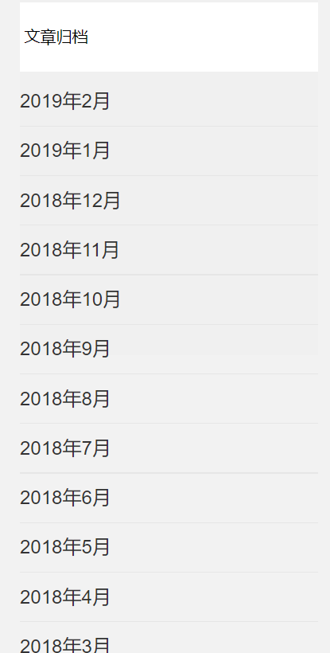
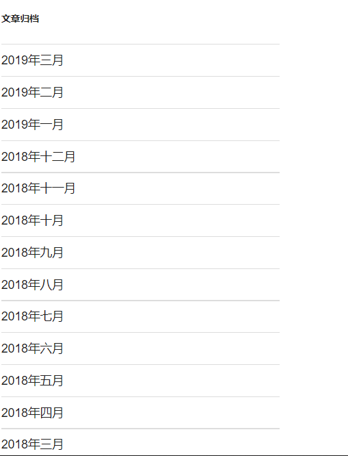

我的效果图如下(这个是我实现的):


wordpress的效果图如下:

sql代码:
```
SELECT DISTINCT YEAR(post.post_modified)AS `year`,MONTH(post.post_modified) AS `month` FROM wp_posts AS post

```
<!--more-->
xml代码:
```
<?xml version="1.0" encoding="UTF-8"?>
<!DOCTYPE mapper PUBLIC "-//mybatis.org//DTD Mapper 3.0//EN" "http://mybatis.org/dtd/mybatis-3-mapper.dtd">
<mapper namespace="com.blog.springboot.dao.PostsDao">

	<!-- 通用查询映射结果 -->
	<resultMap id="BaseResultMap" type="com.blog.springboot.entity.Posts">
		<id column="ID" property="id" />
		<result column="post_author" property="postAuthor" />
		<result column="post_date" property="postDate" />
		<result column="post_date_gmt" property="postDateGmt" />
		<result column="post_content" property="postContent" />
		<result column="post_title" property="postTitle" />
		<result column="post_excerpt" property="postExcerpt" />
		<result column="post_status" property="postStatus" />
		<result column="comment_status" property="commentStatus" />
		<result column="ping_status" property="pingStatus" />
		<result column="post_password" property="postPassword" />
		<result column="post_name" property="postName" />
		<result column="to_ping" property="toPing" />
		<result column="pinged" property="pinged" />
		<result column="post_modified" property="postModified" />
		<result column="post_modified_gmt" property="postModifiedGmt" />
		<result column="post_content_filtered" property="postContentFiltered" />
		<result column="post_parent" property="postParent" />
		<result column="guid" property="guid" />
		<result column="menu_order" property="menuOrder" />
		<result column="post_type" property="postType" />
		<result column="post_mime_type" property="postMimeType" />
		<result column="comment_count" property="commentCount" />
		<result column="year" property="year"/>
        <result column="month" property="month"/>
	</resultMap>

	<!-- 通用查询结果列 -->
	<sql id="Base_Column_List" >
		ID AS id, post_author AS postAuthor, post_date AS postDate,
		post_date_gmt AS postDateGmt, post_content AS postContent, post_title
		AS postTitle, post_excerpt AS postExcerpt, post_status AS postStatus,
		comment_status AS commentStatus, ping_status AS pingStatus,
		post_password AS postPassword, post_name AS postName, to_ping AS
		toPing, pinged, post_modified AS postModified, post_modified_gmt AS
		postModifiedGmt, post_content_filtered AS postContentFiltered,
		post_parent AS postParent, guid, menu_order AS menuOrder, post_type AS
		postType, post_mime_type AS postMimeType, comment_count AS
		commentCount
	</sql>


    <!-- 文章归档 -->
    <select id="articleArchive" resultMap="BaseResultMap">
    SELECT DISTINCT YEAR(post.post_modified)AS `year`,MONTH(post.post_modified) AS `month` FROM wp_posts AS post
    </select>


</mapper>

```

实体:
```
package com.blog.springboot.entity;

import java.io.Serializable;
import java.util.List;

import com.baomidou.mybatisplus.activerecord.Model;
import com.baomidou.mybatisplus.annotations.TableField;
import com.baomidou.mybatisplus.annotations.TableId;
import com.baomidou.mybatisplus.annotations.TableName;
import com.baomidou.mybatisplus.enums.IdType;


@TableName("wp_posts")
public class Posts extends Model<Posts> {

    private static final long serialVersionUID = 1L;

    @TableId(value = "ID", type = IdType.AUTO)
    private Integer id;
    @TableField("post_author")
    private Long postAuthor;
    @TableField("post_date")
    private String postDate;
    @TableField("post_date_gmt")
    private String postDateGmt;
    @TableField("post_content")
    private String postContent;
    @TableField("post_title")
    private String postTitle;
    @TableField("post_excerpt")
    private String postExcerpt;
    @TableField("post_status")
    private String postStatus;
    @TableField("comment_status")
    private String commentStatus;
    @TableField("ping_status")
    private String pingStatus;
    @TableField("post_password")
    private String postPassword;
    @TableField("post_name")
    private String postName;
    @TableField("to_ping")
    private String toPing;
    private String pinged;
    @TableField("post_modified")
    private String postModified;
    @TableField("post_modified_gmt")
    private String postModifiedGmt;
    @TableField("post_content_filtered")
    private String postContentFiltered;
    @TableField("post_parent")
    private Long postParent;
    private String guid;
    @TableField("menu_order")
    private Integer menuOrder;
    @TableField("post_type")
    private String postType;
    @TableField("post_mime_type")
    private String postMimeType;
    @TableField("comment_count")
    private Integer commentCount;
    
    @TableField(exist=false)
    private List<TermTaxonomy> termTaxonomy;
    
    @TableField(exist=false)
    private List<Terms> terms;
    
    @TableField(exist=false)
    private List<Users> users;
    
    @TableField("year")
    private String year;
    
    @TableField("month")
    private String month;
    
    
   
    
    public String getMonth() {
		return month;
	}

	public void setMonth(String month) {
		this.month = month;
	}

	public String getYear() {
		return year;
	}

	public void setYear(String year) {
		this.year = year;
	}


	public List<Users> getUsers() {
		return users;
	}

	public void setUsers(List<Users> users) {
		this.users = users;
	}

	public List<TermTaxonomy> getTermTaxonomy() {
		return termTaxonomy;
	}

	public void setTermTaxonomy(List<TermTaxonomy> termTaxonomy) {
		this.termTaxonomy = termTaxonomy;
	}

	public List<Terms> getTerms() {
		return terms;
	}

	public void setTerms(List<Terms> terms) {
		this.terms = terms;
	}

	public Integer getId() {
        return id;
    }

    public void setId(Integer id) {
        this.id = id;
    }

    public Long getPostAuthor() {
        return postAuthor;
    }

    public void setPostAuthor(Long postAuthor) {
        this.postAuthor = postAuthor;
    }

    public String getPostDate() {
        return postDate;
    }

    public void setPostDate(String postDate) {
        this.postDate = postDate;
    }

    public String getPostDateGmt() {
        return postDateGmt;
    }

    public void setPostDateGmt(String postDateGmt) {
        this.postDateGmt = postDateGmt;
    }

    public String getPostContent() {
        return postContent;
    }

    public void setPostContent(String postContent) {
        this.postContent = postContent;
    }

    public String getPostTitle() {
        return postTitle;
    }

    public void setPostTitle(String postTitle) {
        this.postTitle = postTitle;
    }

    public String getPostExcerpt() {
        return postExcerpt;
    }

    public void setPostExcerpt(String postExcerpt) {
        this.postExcerpt = postExcerpt;
    }

    public String getPostStatus() {
        return postStatus;
    }

    public void setPostStatus(String postStatus) {
        this.postStatus = postStatus;
    }

    public String getCommentStatus() {
        return commentStatus;
    }

    public void setCommentStatus(String commentStatus) {
        this.commentStatus = commentStatus;
    }

    public String getPingStatus() {
        return pingStatus;
    }

    public void setPingStatus(String pingStatus) {
        this.pingStatus = pingStatus;
    }

    public String getPostPassword() {
        return postPassword;
    }

    public void setPostPassword(String postPassword) {
        this.postPassword = postPassword;
    }

    public String getPostName() {
        return postName;
    }

    public void setPostName(String postName) {
        this.postName = postName;
    }

    public String getToPing() {
        return toPing;
    }

    public void setToPing(String toPing) {
        this.toPing = toPing;
    }

    public String getPinged() {
        return pinged;
    }

    public void setPinged(String pinged) {
        this.pinged = pinged;
    }

    public String getPostModified() {
        return postModified;
    }

    public void setPostModified(String postModified) {
        this.postModified = postModified;
    }

    public String getPostModifiedGmt() {
        return postModifiedGmt;
    }

    public void setPostModifiedGmt(String postModifiedGmt) {
        this.postModifiedGmt = postModifiedGmt;
    }

    public String getPostContentFiltered() {
        return postContentFiltered;
    }

    public void setPostContentFiltered(String postContentFiltered) {
        this.postContentFiltered = postContentFiltered;
    }

    public Long getPostParent() {
        return postParent;
    }

    public void setPostParent(Long postParent) {
        this.postParent = postParent;
    }

    public String getGuid() {
        return guid;
    }

    public void setGuid(String guid) {
        this.guid = guid;
    }

    public Integer getMenuOrder() {
        return menuOrder;
    }

    public void setMenuOrder(Integer menuOrder) {
        this.menuOrder = menuOrder;
    }

    public String getPostType() {
        return postType;
    }

    public void setPostType(String postType) {
        this.postType = postType;
    }

    public String getPostMimeType() {
        return postMimeType;
    }

    public void setPostMimeType(String postMimeType) {
        this.postMimeType = postMimeType;
    }

    public Integer getCommentCount() {
        return commentCount;
    }

    public void setCommentCount(Integer commentCount) {
        this.commentCount = commentCount;
    }

    @Override
    protected Serializable pkVal() {
        return this.id;
    }

    @Override
    public String toString() {
        return "Posts{" +
        ", id=" + id +
        ", postAuthor=" + postAuthor +
        ", postDate=" + postDate +
        ", postDateGmt=" + postDateGmt +
        ", postContent=" + postContent +
        ", postTitle=" + postTitle +
        ", postExcerpt=" + postExcerpt +
        ", postStatus=" + postStatus +
        ", commentStatus=" + commentStatus +
        ", pingStatus=" + pingStatus +
        ", postPassword=" + postPassword +
        ", postName=" + postName +
        ", toPing=" + toPing +
        ", pinged=" + pinged +
        ", postModified=" + postModified +
        ", postModifiedGmt=" + postModifiedGmt +
        ", postContentFiltered=" + postContentFiltered +
        ", postParent=" + postParent +
        ", guid=" + guid +
        ", menuOrder=" + menuOrder +
        ", postType=" + postType +
        ", postMimeType=" + postMimeType +
        ", commentCount=" + commentCount +
        "}";
    }
}


```

dao代码:
```
package com.blog.springboot.dao;

import java.util.List;
import java.util.Map;

import com.baomidou.mybatisplus.mapper.BaseMapper;
import com.blog.springboot.entity.Posts;


public interface PostsDao extends BaseMapper<Posts> {
    //文章归档
	public List<Posts> articleArchive();


}


```


service代码:
```
public interface PostsService extends IService<Posts> {
	//文章归档
	public List<Posts> articleArchive();
}

```

实现类:
```
package com.blog.springboot.service.impl;

import java.util.List;
import java.util.Map;

import org.springframework.beans.factory.annotation.Autowired;
import org.springframework.stereotype.Service;

import com.baomidou.mybatisplus.mapper.EntityWrapper;
import com.baomidou.mybatisplus.plugins.Page;
import com.baomidou.mybatisplus.service.impl.ServiceImpl;
import com.blog.springboot.dao.PostsDao;
import com.blog.springboot.entity.Posts;
import com.blog.springboot.service.PostsService;


@Service
public class PostsServiceImpl extends ServiceImpl<PostsDao, Posts> implements PostsService {
	
	@Autowired
	private PostsDao postDao;

	
	@Override
	public List<Posts> articleArchive() {

		return postDao.articleArchive();
	}

	

}


```

后台Controller:
```
/**
	 * 文章归档
	 * @return
	 */
	@GetMapping(value="/articleArchive")
	public JSONObject writePost() {
		
		List<Posts> post = postService.articleArchive();
		
		if(!post.isEmpty()) {
			
			json.put("code", "000000");
			json.put("msg", "获取文章归档");
			json.put("post", post);
		}else {
			
			json.put("code", "222222");
			json.put("msg", "暂无文章归档");
		}
		return json;
	}

```

前端js实现:
```
//文章归档
function articleArchive(){

				$.ajax({
		url: Blog.url.api.articleArchive,
		type: "GET",
		dataType: 'json',
		success: function(data) {
			
            var rows = "";
			$.each(data.post, function(index, post) {
				 var year = post.year+"年";
				 var month = post.month+"月";
				 var date = year + month;
				 rows= rows +"";
                 rows= rows +"<li><a href='#'>"+date+"</a></li>";
                 rows= rows +"<hr/>";
			});
			
			$("#articleArchive").html(rows);
			
		},
		error: function(XMLHttpRequest, textStatus, errorThrown) {

			console.log(XMLHttpRequest.status);

			console.log(XMLHttpRequest.readyState);

			console.log(textStatus);
		}
	});
}

```