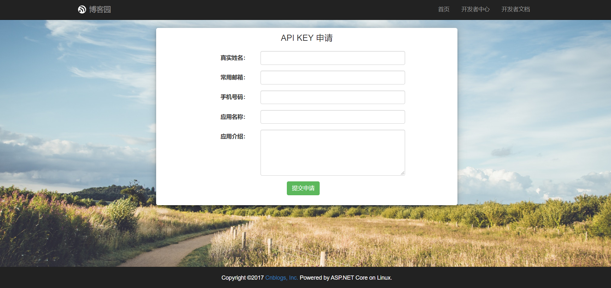
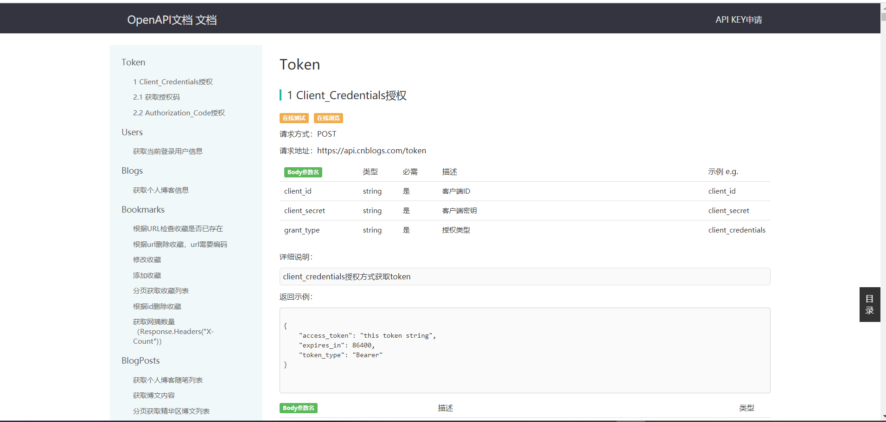
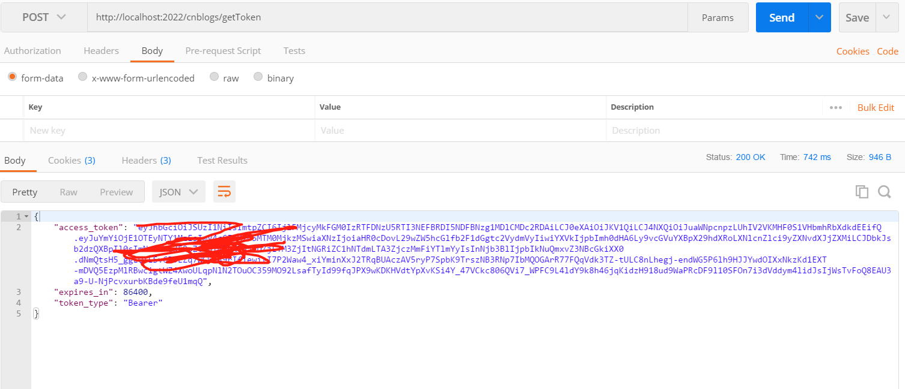

业务背景:
我通过weblogic这个Java爬虫框架是能够爬取得到博客园的大多数数据，但后来得知博客园有自己的开放API，通过这个开放API可以做一些事情，比方说实现一个关于博客园文章的小程序阅读、或者想学习go、node.js、flutter或uniapp用其实现一个CMS应用。
<!--more-->

## 一、API KEY 申请
申请地址:
https://oauth.cnblogs.com/

## 二、申请成功后，会发一个邮件给你，里面有ClientId和ClientSecret

## 三、访问博客园OpenAPI文档
地址为:
https://api.cnblogs.com/Help

## 四、验证请求一下

如上图是我做了一层封装。

主要封装了请求体中的clien_id、client_secret、grant_type等。

基本上拿到了token，将其放到请求头中，接下来博客园开放接口都能使用(注意，是开放接口，没有开放的接口，换言之就是接口文档上没有了，就不能使用)