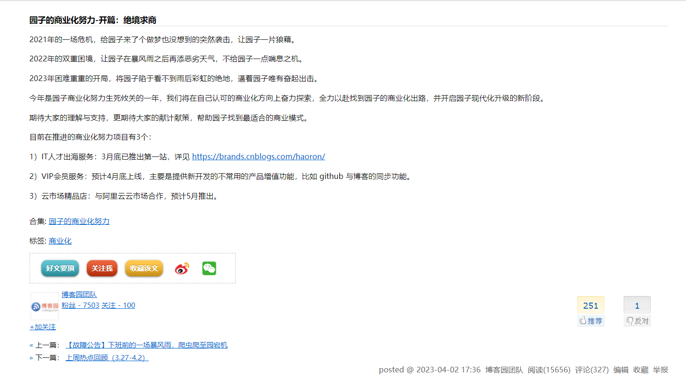
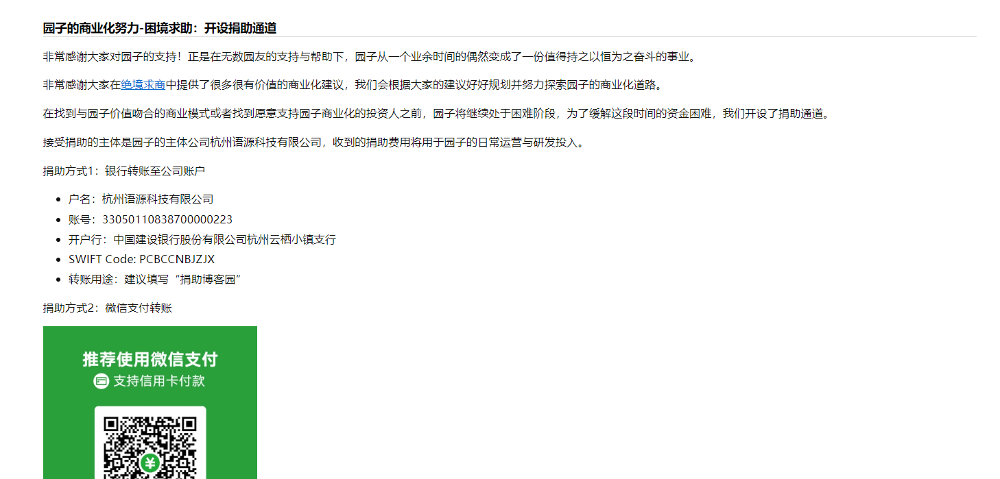
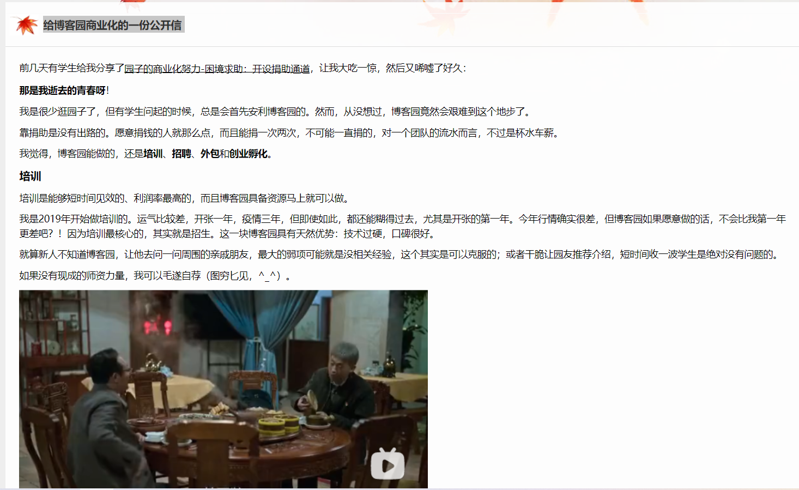
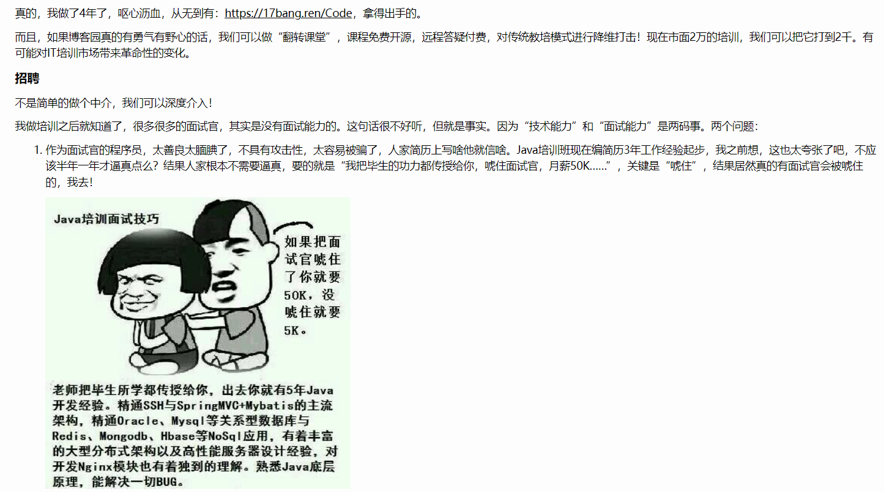
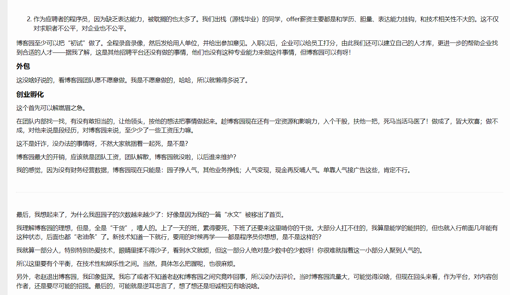
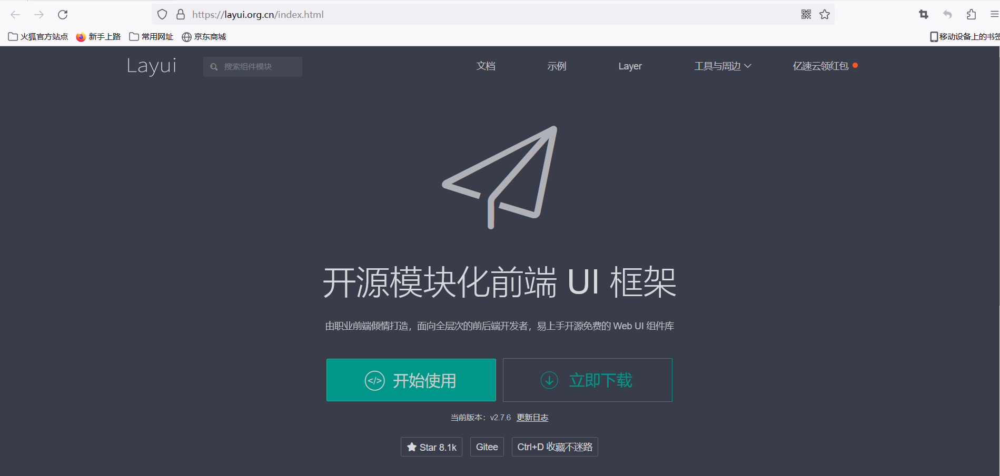
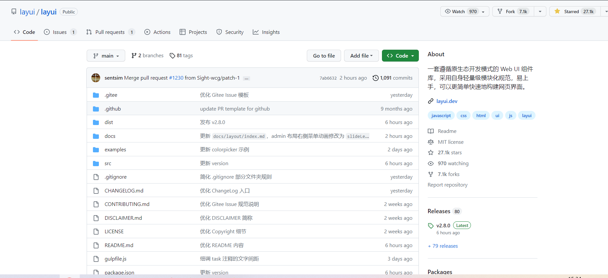

博客园，一个时代的产物，它于2004年1月创建，迄今为止，已存活19年。从2023年4月份开始，博客园似乎快要撑不下去了。博客园官方博客接二连三发出如下相关信息:
<!--more-->

2021年的一场危机，不仅仅是博客园受到的波及，凡是稍微有规模的内容网站平台均受到了影响，我也在那一年写下了这篇文章[博客园整改之思考](https://youcongtech.com/2021/04/06/%E5%8D%9A%E5%AE%A2%E5%9B%AD%E6%95%B4%E6%94%B9%E4%B9%8B%E6%80%9D%E8%80%83/)。

2022年博客园遇到了双重困难，其实不仅仅是博客园，很多公司也一样，不少公司好不容易撑过了2020年以及2021年，正当一切变得貌似好转起来了，突然一个2022年直接就将其打倒了，这已经不是个例了，大环境如此，岂非个体所能阻挡的了？

2023年的开端，很多公司要么直接倒了，要么直接发不起工资，要么全员降薪，要么搞变相裁员。这一切预示着一切不那么好。每个人都需要做好心理准备。

我在博客园写作算起来五年多的时间，中间有一段时间，可谓是每天产出，但后面随着经验的不断增长，岗位不一样，所要解决的问题也越来越需要我专注以及越来越复杂，业余时间上也就少了很多。

博客园能否破局？不少人对此非常关注，甚至献言献策。有一个博客园老粉专门对此写了文章，文章为[给博客园商业化的一份公开信](https://www.cnblogs.com/freeflying/p/17347287.html)

**主要内容截图摘要如下:**

记得在2020年的时候，也曾吐槽过博客园，认为它一个这么大的内容平台，这个UI做的不那么好，而后不久之后，博客园也开始慢慢改进。
同样我也专门写了相关文章，对比了它与CSDN、思否等网站，感兴趣的朋友可以阅读这篇文章[谈谈博客园](https://mp.weixin.qq.com/s?__biz=MzUxODk0ODQ3Ng==&mid=2247484412&idx=1&sn=8b2c1cadac3fdd9ef24e495950cbbc24&chksm=f98050efcef7d9f921e3ea4c1bd36a79ce3324a57cb0198a12d061f4a1410cfafb6ca8dc537a&token=1368160516&lang=zh_CN#rd)。

说到这，我还是蛮有感慨的，以前总鄙视CSDN，认为它太恶心了，看个完整的文章还得注册登录，看个文章还要付费，看个文章还要会员，广告满天飞，不如博客园纯粹，但现在再来看，只能说明过去的自己太天真。**任何一家企业至关重要的目标就是存活下去并找到自己的商业模式(个人也是如此)。没有存活这个作为前提条件，什么都是扯淡，这也是一些人常说的，先生存再发展。**

写到这，也让我想起Layui,Layui在2021年的时候官网下线，对此我写下了[谈谈Layui](https://mp.weixin.qq.com/s?__biz=MzUxODk0ODQ3Ng==&mid=2247485990&idx=1&sn=681791244bce6d67e5f7192084f0fc69&chksm=f9805935cef7d023dc242338af3deb61bc685c0e3c62dc7c04441dec1eb93322c054c40bfe84&scene=21#wechat_redirect)这篇文章，既有感慨开源的不易，也有一种特别的危机感。幸运的是贤心一切都好起来了，layui的官网回来了，layui至今仍在维护。**如下所示:**

无论是博客园，还是Layui，它们的共同点都是一个时代的产物(内容网站时代与jQuery时代)。Layui的破局之道一定是愿意有企业用户为此付费(开源走到最后，不盈利很难持续走下去,Github或Gitee中不少好的开源项目断了就是前车之鉴)，博客园的破局之道是人才出海服务、VIP会员服务、云市场精品店等能够稳定持续的推进并最终有用户为此付费买单(已知官方博客所提到的)。