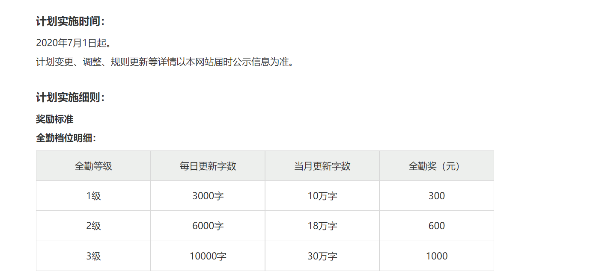
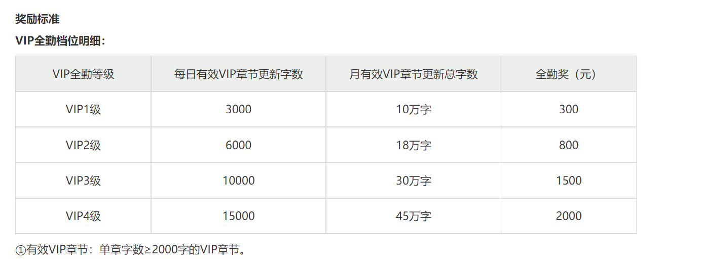

2020年4月底我辞去了一份互联网高薪工作，主要原因是身体状况太糟糕，再不辞职，恐怕我可能永远会停留在那一刻。当然了，这并不表示那家公司不好，相反，那家公司把我从创业公司养成的许多不好的习惯统统纠正过来，同样也让我们明白上千家企业用的Saas系统应当是怎样的。
<!--more-->
5月份的时候，我去做了一次体检，等待体验结果出来以后，没想到的是身体状况这么糟糕，之前只是感觉，由于长期的加班加点经常通宵，睡觉的时候，心脏隐隐约约有点痛，加上那个时候看到的一些新闻，觉得这不是一个好的兆头，犹豫了很久，便决定果断裸辞。2020年的5月份，我整整休息了一个月，在这一个月我没有找工作，好在所处城市疫情没那么严重，到处走走散散心。正当6月份的到来，我觉得不能再休息了，我需要保障我的现金流，但对于我而言，保障现金流只有一种方式，那就是工作，只有工作才能获取源源不断的现金流。但我此时并不想找工作，然后萌发出一个想法，那就是我想自己尝试单干。毕竟当时的我前端、后端、微信小程序均会写，于是通过搜索引擎了解了一些接私活平台，我基本上全部注册了一遍，并更新了自己的信息。于是每天隔三岔五登录平台看那些所谓的客户发布需求，我只选我能做的，没想到的是却是几百人抢一个需求，竞争太激烈了，以至于半个月我一单都接不到。当然了，那半个月我并不是每天都守着接私活网站，而是每天会抽两到三个小时的时间学习，同样也会拿出两到三个小时的时间写小说。写小说其实有两个想法，第一个想法是我曾经有一个作家的梦想，第二个想法是想借此机会赚点钱。

我选择在纵横网上写小说：

而上述仅仅只适应签约，初次作品要想签约必需满足三万字，我用了两天时间写了三万字，没想到没通过，当我继续奋力冲刺写到了10万字，但最终还是被拒签，而这个时候已经快7月份了，中间接私活仍然很不顺利。在7月初的时候，一位公众号粉丝找到我，说遇到一个问题，想付费请我帮助，该问题是有关分布式相关的，刚好这段时间我结合在教育Saas公司的实践系统地复习了一遍相关的分布式微服务相关知识以及也研究了一些开源项目，面对他的这个问题，我当天并给出了解决方案，他支付宝给我转了500元。

大概是7月中旬的时候，我逐渐意识到还是应该找一份工作，至于写小说这样的，可在不影响工作的前提下利用业余时间写。这次疫情下的自由职业探索也让我意识到自己的一些不足，也让我清理了头脑中的虚无自由职业梦，自由职业挺难的，一切没有想象的那么简单。当然了，这并不表示我会放弃。只是眼下的时机不一样，所以，最终我决定还是去找一份工作。于是在7月底的时候成功通过了M2公司的面试，8月的时候来到公司上班，没想到的是M2公司其实还是属于一种创业型的公司，没想到我和创业是那么的有缘分。好在在M2公司一年多的努力，项目中标且与客户签订了合同，这是我人生中第二次从0到1设计的架构，第一次在创业公司，但我失败了，第二次就是在M2公司，我却成功了，人生第一次价值千万的架构成功了，我非常高兴，但我也明白，这并不是我一个人的功劳，而是我们团队共同的合力，因为很多团队小伙伴直接或间接的问题帮我完善了整体的架构。于是我见证了团队从屈指可数到几十个人。那个时候是2021年，2020年+2021年我终于把身体给养好了，加上项目的成功，可谓是双喜临门。

**也许有人会问我，从2020年5月初到2020年7月底(未进入M2公司之前)这段自由职业探索失败的时间是否浪费了时间？**
对于当时的我而言，可能会觉得浪费了时间。
但是对于现在的我而言，我觉得一点也不浪费时间，**因为人生中的任何一项有意义的经历都是有价值的，这种价值是不能用金钱这样单一的指标来衡量的。**

