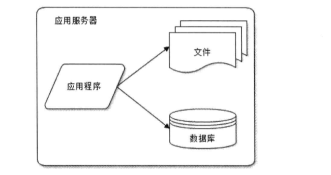
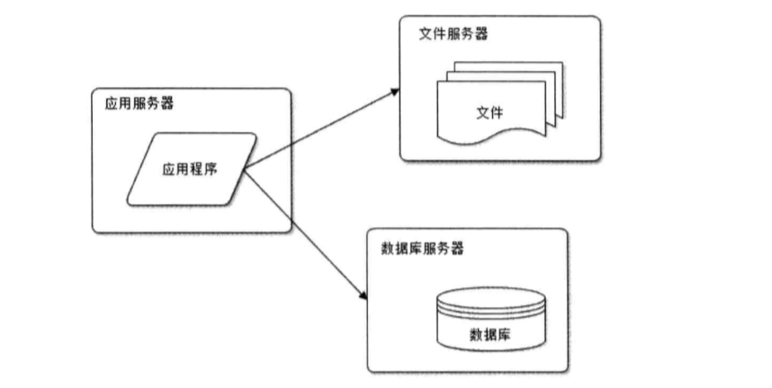
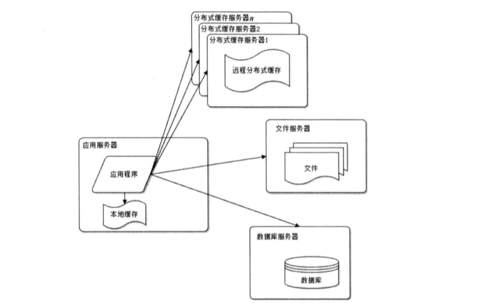
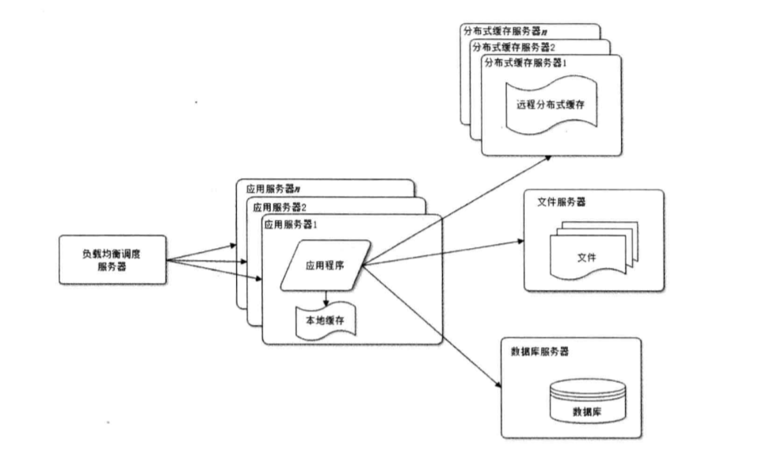
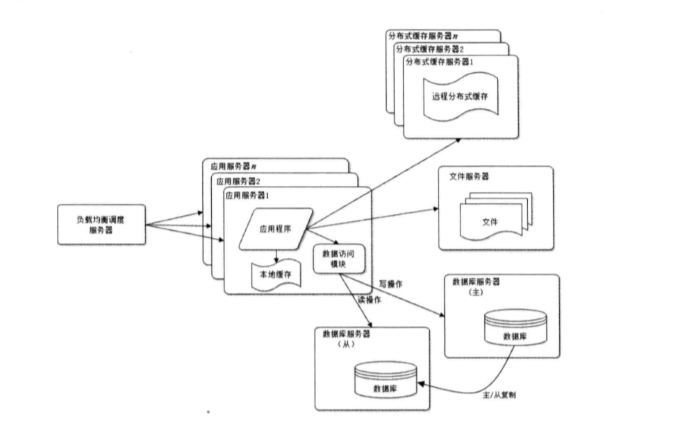
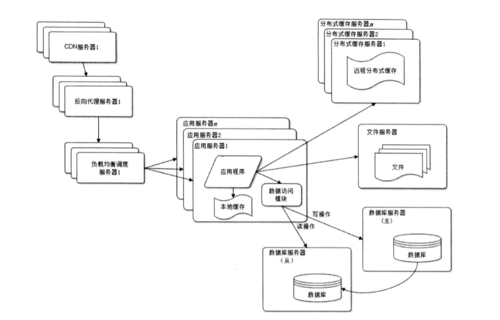
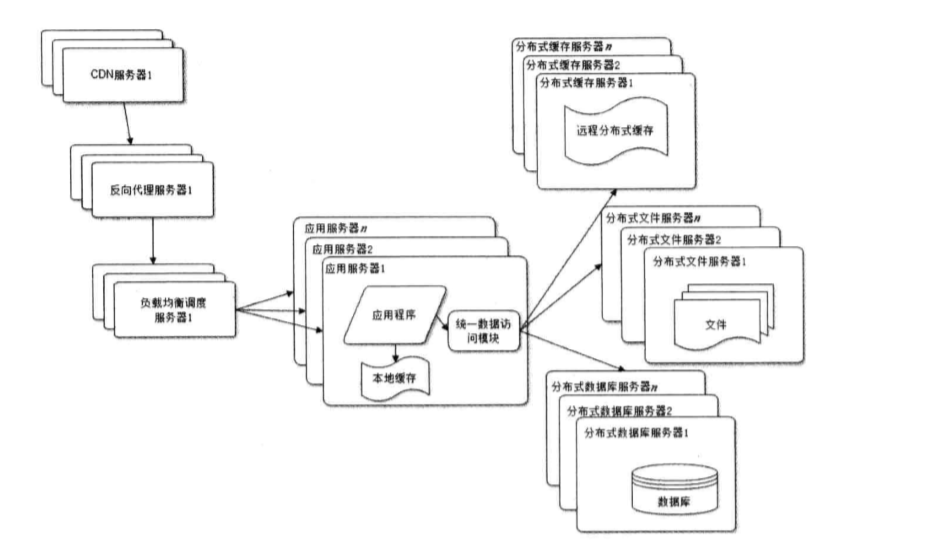
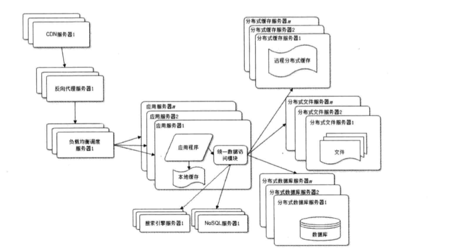

---

title: 大型网站技术架构演化

date: 2019-03-08 13:54:14

tags: "架构"

---

## 一、大型网站软件系统的特点

#### 1.高并发、大流量

##### a.什么是高并发?

高并发是互联网分布式系统架构设计中必须考虑的因素之一，它通常是指，通过设计保证系统能够同时并行处理多个请求。

<!--more-->
##### b.高并发的衡量指标有哪些?

(1)响应时间:系统对请求做出响应。例如系统处理一个HTTP请求需要200ms,这个200ms就是系统的响应时间。

(2)吞吐量:单位时间内处理的请求数量。

(3)QPS：每秒响应请求数。在互联网领域，这个指标和吞吐量区分的不那么明显。

(4)并发用户数:同时承载正常使用系统功能的用户数量。例如一个通讯系统，在线量一定程度上代表系统的并发用户数，比如腾讯QQ。

##### c.什么是大流量

大流量这个词，顾名思义表示很多流量，这个很多可以用一千万，一亿或者百亿等来衡量。

以流量来说，这个词有比较多的含义，如:

(1)它可以表示手机无线网数据;

(2)网店或网站的访问量;

(3)流体通过量，如水流量等;

在这里主要指网站的流量(包含网站访问量)。

##### d.那么网站流量指标有哪些呢

主要指标包括:

(1)独立访问者数量;

(2)重复访问者数量;

(3)页面浏览数;

(4)每个访问者的页面浏览数;

(5)用户在网站的停留时间;

(6)用户来源网站(又叫"引导网站");

(7)用户所使用的搜索引擎及其关键字;

#### 2.高可用:系统需要不间断提供服务

##### a.什么是高可用

高可用是分布式系统架构设计中必须考虑的因素之一，它通常是指，通过设计减少系统不能提供正常服务的时间。

假设系统一直能够提供服务，我们说系统的可用性是100%。

如果系统每运行100个时间单位，会有1个时间单位无法提供服务，系统的年停机时间为8.76个小时。

##### b.如何保障系统的高可用

我们都知道，单点是系统高可用的大敌，应该尽量在系统设计的过程中避免单点。方法论上，高可用保证的原则是“集群化”，或者叫“冗余”:只有一个单点挂了服务会受影响，如果有冗余备份，挂了还有其它backup能够顶上。

那么什么是单点呢？

你可以理解为所有的服务都在一个服务器上。

为什么要避免单点？

假定所有的服务在一个服务器上，如果该服务器因为某种原因挂掉了，那么所有的服务都会收到影响，从而会增长系统不能提供正常服务的时间。

#### 3.海量数据(又称“大数据”)

什么是是海量数据？海量数据又称大数据。对于大数据，研究机构给出了这样的定义:大数据是需要新处理模式才能具有更强的决策力、洞察力和流程化能力的海量、高增长率和多样化的信息资产。

从技术上看，大数据与云计算的关系就像一昧硬币的正反面。大数据必然无法用单台计算机进行处理，必须采用分布式架构。其特色在于可对海量数据进行分布式数据挖掘，但必须依托云计算的分布式处理、分布式数据库以及云存储、虚拟化技术。

##### 大数据的特点

(1)数据体量大，从TB级跃升到PB级别。

(2)数据类型繁多，比如网络日志、视频、图片、地理位置等。

(3)处理速度快。

(4)数据价值大。

#### 4.用户分布广泛，网络情况复杂
许多大型互联网都是为全球用户提供服务的，用户分布范围广，各地网络情况千差万别。在国内，还有各个运营商网络互通难的问题。
以在我老家的时候，联通的网络不好，移动的网络好，导致使用联通的用户使用软件受制于网络信号差而无法使用。

#### 5.安全环境恶劣
由于互联网的开放性，使得互联网站更容易受到攻击，大型网站几乎每天都会被黑客攻击。以GitHub为例，无时无刻不在遭受到攻击。

#### 6.需求快速变更，发布频繁
和传统软件的版本发布频率不一样，互联网产品为了快速适应市场，满足用户需求，其产品发布频率是极高的。

#### 7.渐进式发展:几乎所有的大网站都是从一个小网站开始的

以最早期的淘宝来说，也是从单体应用来的。据说早期的架构是Linux+Apache+MySQL+PHP(LAMP)。
FaceBook是伯克扎克同学在哈佛大学的宿舍里开发的；Google的第一台服务器部署在斯坦福大学的实验室;阿里巴巴则是在马云家的客厅里诞生。
好的互联网产品都是慢慢运营出来的，不是一开始就开发好的，这也正好与网站架构的发展演化过程对应。

## 二、大型网站架构演化发展历程

#### 1.初始阶段的网络架构:应用程序、数据库、文件等所有资源都在一台服务器上(单体应用)

#### 2.应用服务和数据库分离:网站使用三台服务器:应用服务器、文件服务器、数据库服务器

一般情况下有这么几种形式？

(1)nginx+tomcat+ftp+mysql/oracle;

(2)nginx+tomcat+vsftp+mysql/oracle;

(3)apache+tomcat+ftp+mysql/oracle;

(4)nginx+tomcat;

(5)docker容器实践思路(又称容器化);

当然了，上述列出的仅仅是冰山一角，有部分公司拥有自己研发的DB或者应用服务器。

#### 3.使用缓存改善网站性能:使用缓存后数据库访问压力得到有效缓解

##### a.那么在什么样的情况应该使用缓存?

(1)经常变化的数据，但是不需要立刻进行持久化的;

(2)经常被大量读取，很少进行更新操作;

(3)大量的数据库IO操作;

(4)通用的页面，如JS、CSS、图片等;

(5) 统计和计算需要暂存的信息，需要加快计算的;

##### b.Java常用的缓存框架有哪些呢？

一般情况下，用Redis或者Memcache，当然了，有的时候也会用ehcache，关于Java常用的缓存框架代码示例和介绍可参考该篇文章:https://www.cnblogs.com/chinway/p/5534636.html

#### 4.使用服务器集群改善网站的并发处理能力:通过负载均衡调度器将请求分配到集群中的服务器上

这种方式又可以称作“中心化”，所有的请求全部经过Nginx，由Nginx分发请求到不同的应用服务器上面(根据权重进行分配)。

#### 5.数据库读写分离:应用服务器在写数据的时候访问主数据库，主数据通过主从复制机制将数据更新同步到从数据库，这样当服务器读数据的时候就可以通过从数据库了

#### 6.使用反向代理和CDN加速网络响应

关于CDN可以参考我的这篇文章:[谈谈CDN](https://www.cnblogs.com/youcong/p/9607448.html)

不过觉得还是要贴一下图，这样会有一个感性的认识。

##### 什么是反向代理呢？

反向代理是指以代理服务器来接收internet上的连接请求，然后将请求转发给内部网络上的服务器，并将从服务器上得到的结果返回给internet上请求连接的客户端，此时代理服务器对外就表现为一个反向代理服务器。

#### 7.使用分布式文件系统和分布式数据库系统

##### 分布式文件系统有哪些？

主要有MFS、Ceph、GlusterFS、Lustre等

关于它们的区别可参考:

[分布式文件系统MFS、Ceph、GlusterFS、Lustre的对比](https://www.cnblogs.com/zhiguo/p/3334993.html)

#### 8.使用NoSQL和搜索引擎

应用比较多的NoSQL,比如Memcache、Redis、MongoDB等。

搜索引擎，以solr和elasticsearch比较多。

#### 9.业务拆分

关于业务拆分可参考我的这篇博文[业务拆分的思考](https://www.cnblogs.com/youcong/p/9688300.html)

#### 10.分布式服务

可以去看看分布式服务架构这本书或是去看看国外相关专业人士的论文或文章。

分布式服务架构:原理、设计与实战电子书下载地址为:https://pan.baidu.com/s/1hK3vlIHX0SgbD4NNKx_zTg

## 三、大型网站演化的价值观

(1)大型网站架构核心价值是随网站所需灵活应付;

(2)驱动网站技术发展的主要力量是网站发展业务;

大型网站的核心价值不是从无到有二搭建一个大型网站，而是能够伴随小型网站业务逐步发展，慢慢演化成一个大型网站，网站的架构选择尽量满足网站用户增加需求。

## 四、网站架构设计误区

误区如下所示:

(1)一昧追随大公司方案;

(2)为了技术而技术;

(3)企图用技术解决所有问题;

参考资料如下:

什么是高并发:https://blog.csdn.net/DreamWeaver_zhou/article/details/78587580

什么是高可用:http://www.cnblogs.com/shizhiyi/p/7750530.html

什么是海量数据？它具有哪些特征？:http://www.znjj.tv/news/3322.html

在什么情况使用Java缓存:https://flychao88.iteye.com/blog/1532335

8张图读懂大型网站技术架构:https://github.com/Snailclimb/JavaGuide/blob/master/%E6%9E%B6%E6%9E%84/8%20%E5%BC%A0%E5%9B%BE%E8%AF%BB%E6%87%82%E5%A4%A7%E5%9E%8B%E7%BD%91%E7%AB%99%E6%8A%80%E6%9C%AF%E6%9E%B6%E6%9E%84.md

《大型网站技术架构:核心原理与案例分析》第一章概述第一节大型网站架构演化

