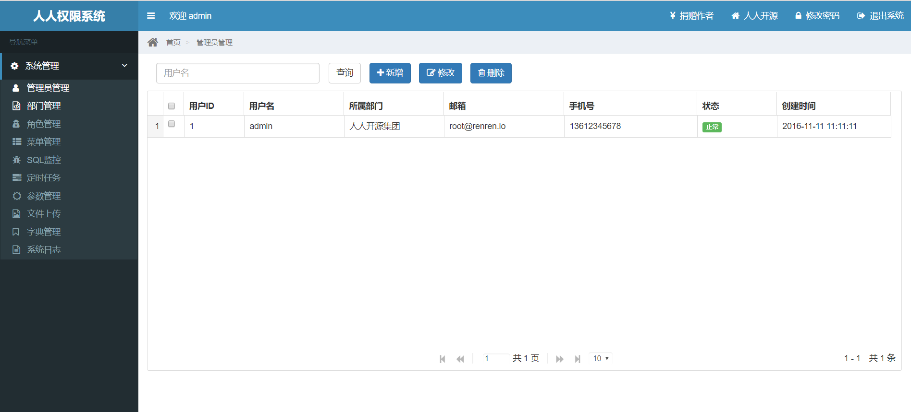
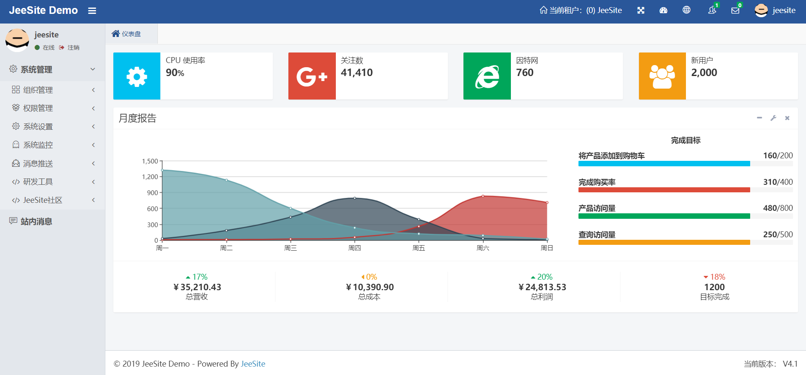

关于什么是模式,这个来自建筑师的词汇是这样定义的:"每一个模式描述了一个在我们周围不断重复发生的问题及该问题解决方案的核心。这样，你就能一次又一次地使用该方案而不必做重复的工作"。

模式的关键在于模式的可重复性，问题与场景的可重复性带来的解决方案的可重复使用。

**联系实际开发**:
每个做前后台开发的小伙伴们都会发现一点，一个正儿八经的后台系统，80%是重复的，20%是特别的(可以称作个性化定制)。

举个例子:
人人开源的后台系统:

Jeesite4的后台系统:

从这两者进行比对就可以明显的发现公共的部分非常相似(只不过展现的形式不一样，renren-security中的角色管理是直接在菜单中显示，而jeesite4则放在权限管理中，只需点击即可看到对应的角色管理)
<!--more-->
在这里我就不详细说它们的内部架构了，感兴趣的可以参考我的这篇博客[开源项目之架构分享](https://www.cnblogs.com/youcong/p/9800717.html)

在软件开发中，可复用模式非常重要，因为这会直接影响到敏捷开发的效率高低。

## 网站架构模式

### 1.分层
分层是企业应用系统中最常见的一种架构模式，将系统在横向维度上切分成几个部分，每个部分负责一部分相对比较单一的职责，然后通过上层对下层的依赖和调用组成一个完整的系统。

应用层:负责具体业务和视图展示，如网站首页及搜索输入和结果展示。
服务层:为应用层提供服务支持，如用户管理服务，购物车服务等。
数据层:提供数据存储访问服务，如数据库、缓存、文件、搜索引擎等。

这种分层模式，很多开发者们并不陌生，特别是Java开发的朋友们，最常用的就是三层架构(业务逻辑层、数据访问层、UI层等)，在分层模式中就是一个比较好的诠释。

通过分层，可以更好地将一个庞大的软件系统切分成不同的部分，便于分工合作开发和维护；各层之间具有一定的独立性，只要维持调用接口不变，各层可以根据具体问题独立演化发展而不需要其他层必须做出相应的调整。

任何事情有利也有弊，分层并不是万能的，比如禁止跨层次调用(应用层不能直接调用数据层)及逆向调用(数据层调用服务层、或服务层调用应用层等)。

不过总的来说，正是因为有了分层，软件开发效率才会越来越高，再没有分层的时代，数据层、业务逻辑层、表现层全部耦合在一起，真的是牵其一而动全身。在此我不得不佩服早期开发人员的勇气(这里以早期Java开发为例，记得在校的时候我曾经见过一个JSP+Servlet囊括数据层、业务逻辑层、表现层内容，当时我看到这个项目就冒冷汗，太TMD的变态了)

### 2.分割

如果说分层是将软件在横向方面进行切分，那么分割就是在纵向方面对软件进行切分。
网站越大，功能越复杂，服务和数据处理的种类也越多，将这些不同的功能和服务分割开来，包装成高内聚低耦合的模块单元，一方面有助于软件的开发和维护；另一方面，便于不同模块的分布式部署，提高网站的并发处理能力和功能扩展能力。

**那么什么是内聚？什么是耦合？**
内聚是从功能角度来度量模块内的联系，一个好的内聚模块应当恰好做一件事。它描述的是模块内的功能联系(比如一个函数只办一件事)。
耦合是软件结构中各模块之间相互连接的一种度量，耦合强弱取决于模块间接口的复杂度、进入或访问一个模块的点以及通过接口的数据(耦合这个很好理解，耦合性越低代码的可扩展性可维护性越好，相反耦合性越高，开发者们就有种想上吊自杀的冲动，耦合性越高的例子就不多说了，特别是维护老项目的开发者们感触最深了)

### 3.分布式
对于大型网站，分层和分割的一个主要目的是为了切分后的模块便于分布式部署，即将不同模块部署在不同的服务器上，通过远程调用协同工作。分布式意味着可以使用更多的计算机完成同样的功能，计算机越多，CPU、内存、存储资源也就越多，能够处理的并发访问和数据量就越大，进而能够为更多的用户提供服务。

**分布式也就其弊端**:
(1)服务的调用必须通过网络，可能对性能造成比较严重的影响;
(2)服务器越多，服务器宕机的概率也就越大，宕机会造成服务不可用，直接导致网站可用性降低;
(3)数据一致性问题;
(4)开发管理维护困难;

**常用的分布式方案**：
(1)分布式应用和服务:将分层和分割后的应用和服务模块分布式部署，除了可以改善网站性能和并发性、加快开发和发布速度、减少数据库连接资源消耗外；还可以使不同应用复用共同的服务，便于业务功能扩展;
(2)分布式静态资源:网站的静态资源如JS、CSS、图片等资源独立分布式部署，并采用独立的域名,即人们常说的动静分离。
(3)分布式数据和存储:大型网站处理以P为单位的海量数据(P这个单位也许有人对此不熟悉，本人普及一下，1024K=1M 1024M=1G 1024G=1T 1024T=1P)，通常分布式存储以NoSQL居多。
(4)分布式计算，首推Hadoop。

### 4.集群
记得当初我对集群和分布式之间的区别不太理解，认为它们差不多。
其实它们之间的区别大了去了，在此我用一句话概括(非常理解，保你不忘):
集群就是不同的机器提供相同的服务;
分布式是不同的机器提供不同的服务;

服务器集群有更多的服务器提供相同的服务，因此可以提供更好的并发特性，当有更多用户访问的时候，只需要向集群中加入新的机器即可。同时因为一个应用由多台服务器提供，当某台服务器发生故障时，负载均衡设备或者系统的失效转移机制会将请求转发到集群中的其他服务器上，使服务器故障不影响用户使用。所以在网站应用中，即使是访问量很小的分布式应用和服务，也至少要部署两台服务器构成一个小的集群，目的就是提高系统的可用性。

### 5.缓存
缓存就是将数据存放在举例计算最近的位置以加快处理速度。缓存是改善软件性能的第一手段，现代CPU越来越快的一个重要因素就是使用更多的缓存，在复杂的软件设计中，缓存几乎无处不在。

(1)CDN:即内容分发网络，部署在距离终端用户最近的网络服务商，用户的网站请求总是先到达他的网络服务商那里，在这里缓存网站的一些静态资源(较少变化的数据)，可以就近以最快速度返回给用户，如视频网站和门户网站会将用户访问量大的热点内容缓存在CDN。

(2)反向代理:反向代理属于网站前端架构的一部分，部署在网站的前端，当用户请求到达网站的数据中心时，最先访问到的就是反向代理服务器，这里缓存网站的静态资源，无需将请求继续转发给应用服务器就能返回给用户。

(3)本地缓存:在应用服务器本地缓存着热点数据，应用程序可以在本机内存中直接访问数据，而无需访问数据库;

(4)分布式缓存:大型网站的数据量非常庞大，即使只缓存一小部分，需要的内存空间也不是单机能承受的，所以处了本地缓存，还需要分布式缓存，将数据缓存在一个专门的分布式缓存集群中，应用程序通过网络通信访问缓存数据;

注意:
使用缓存的两个前提条件:
a.数据访问热点不均衡,某些数据会更频繁的访问;
b.数据在某个时间段内有效，不会很快过期,否则缓存的数据就会因已经失效而产生脏读，影响结果的正确性。

**什么是脏读？**
通俗的讲，当一个事务正在访问数据，并且对数据进行了修改，而这种修改还没有提交到数据库中，这时，另外一个事务也访问这个数据，然后使用了这个数据。因为这个数据是还没有提交的数据，那么另外一个事务读到的这个数据是脏数据，依据脏数据所做的操作可能是不正确的

网站应用中，缓存除了可以加快数据访问数据，还可以减轻后端应用和数据存储的负载压力，这一点对网站数据库架构至关重要，网站数据库几乎都是按照有缓存的前提进行负载能力设计的。

### 6.异步
计算机软件发展的一个重要目标和驱动力就是降低软件耦合性。事物之间直接关系越少，就越少被彼此影响，越可以独立发展。
系统解耦合的手段除了前面提到的分层、分割、分布式等，还有一个重要手段就是异步，业务之间的消息传递不是同步调用，而是将一个业务操作分成多个阶段，每个阶段之间通过共享数据的方式异步执行协作。

异步架构是典型的生产者消费者模式，两者不存在直接调用，只要保持数据结构不变，彼此功能实现可以随意变换而不互相影响，这对网站扩展新功能非常便利。除此外，使用异步消息队列还有如下特性:
(1)提高系统可用性。消费者服务器发生故障，数据会在消息队列服务器中存储堆积，生产者服务器可以继续处理业务请求，系统整体表现无故障。消费者服务器恢复正常后，继续处理消息队列中的数据。

(2)加快网站响应速度。处在业务处理前端的生产者服务器在处理完业务请求后，将数据写入消息队列，不需要等待消费者服务器处理就可以返回，响应延迟减少;

(3)消除并发访问高峰。用户访问网站是随机的，存在访问高峰和低谷，即使网站按照一般访问高峰进行规划和部署，也依然会出现突发事件，比如购物网站的促销活动，微博上的热点事件(比如之前赵丽颖官宣导致微博宕机)。

### 7.冗余
网站需要7x24小时连续运行，但是服务器随时可能出现故障，特别是服务器规模比较大时，出现某台服务器宕机是必然事件。要想保证在服务器宕机的情况网站依然可以继续服务，不丢失数据，就需要一定程度的服务器冗余运行，数据冗余备份，这样当某台服务器宕机时，可以将其上的服务和数据访问转移到其他机器上。

访问和负载很小的服务也必须部署至少两台服务器构成一个集群，其目的就是通过冗余实现服务高可用。数据库除了定期备份(可通过shell脚本实现)，存档保存外，为了保证在线业务高可用，还需要对数据进行主从分离，实时同步实现热备份。

为了抵御地震等不可抗因素导致的网站完全瘫痪，某些大型网站会对整个数据中心进行备份，全球范围内部署灾备数据中心。网站程序和数据实时同步到多个灾备数据中心。

### 8.自动化
自动化，如自动化监控报警(zabbix、nagios等)、自动化部署(jenkins)、自动化测试等。
通常分布式项目一般自动化程度比较高。
后续我会针对这些写一个专题实践。

### 9.安全
互联网的开放特性使得其从诞生起就面对巨大的安全挑战，网站在安全将方面也积累很多模式，如对于常见的网站XSS攻击、SQL注入、进行编码转换等相应处理、对于垃圾敏感信息进行过滤等。

本文主要参考《大型网站技术架构：核心原理与案例分析》，上述内容作为本人记录的读书笔记。

