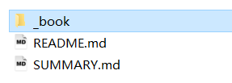

本文主要参考资料为该网址:https://github.com/GitbookIO/gitbook/blob/master/docs/setup.md

如何想使用现成的gitbook，网络上虽说可以搜索的到，但是要使用，可能会受到限制，需要翻墙。

但是通过这种方式，就不必翻墙，可以作为公司内部文档或者是自己的开源项目介绍等。

<!--more-->

步骤如下(以生成一个blog文档为例):

## 全局安装gitbook-cli
```
npm install gitbook-cli -g

```

## 初始化
```
gitbook init ./blog

```

也可以不写 ./blog，./blog相当于指定目录，实践中最好这样操作。

## 启动服务
```
gitbook serve

```
访问地址:http://localhost:4000

效果图如下:


当然，测试的时候可以通过gitbook server这样，但是当文档完成后，部署到线上，最好还是通过`gitbook build`生成静态文件，效果如图:




另外还有一个叫docsify，与gitbook差不多，用作技术文档或者业务文档、项目介绍等，都是很不错的。
感兴趣的朋友可以通过下面官方文档地址，玩玩docsify。
docsify文档地址为:https://docsify.js.org/#/

对应的生成文档效果图，就跟官方文档一样，如图所示:


很萌吧
