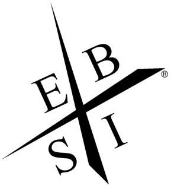

最近阅读一本书《富爸爸财务自由之路》，看序言和其中一部分内容比较有感触

一、你在哪个象限？这个象限适合你吗?
在书中开篇贴了一张图，如下所示:

<!--more-->
这四个英文字母分别代表的意思是 E，对应的单词是Employee，即雇员; B,对应的单词是Business owner,即企业所有者(老板); S,对应的单词Self-employed，即自由职业者; I,对应的单词Investor,即投资人;

我现在所处的象限和大多数人那样，均为E。

要说这个象限是否适合我，就目前而言还是比较适合我的。

不过人还是要心存理想，我还是希望日后我能成为一名Business owner或者投资人。

二、长大后想做什么?
长大后想做什么？ 相信90后的朋友们，每个人从小都会有这样一个梦想，想成为一名科学家或者是老师、大老板、救世的大英雄。 这些梦想的来源为身边的人(包括父母、朋友、亲戚、同学、阅读的书籍等等)。 从中可以看出耳濡目染的影响。 所处的环境决定你会成为什么样的人，这就好比为什么很多家长为什么想让自己的孩子进入重点中学，并不仅仅是重点中学师资资源多么好(当然了，这个也很重要)，还有一个重要因素就是环境，有句话叫做，近朱者赤近墨者黑。

三、水的故事，两个人竞争
水的故事，个人感触极深，以软件开发为例，我在想为什么程序员被称作码农，是因为我们一直在做重复劳动，将脑力劳动硬是变成了体力。 比如一段代码出现五到六次以上，为什么就不能将其抽象成一个函数调用？再比如明知动手直接开干会出问题，为什么就不能事先好好思考，用笔画一个流程图梳理一下(尽管可能有点丑，但这并不是最重要的，最重要的是把业务逻辑想清楚)。 书中水的故事，两个人竞争，一个人累死累活起早贪黑去很远的地方用桶装水，另一个则在这段时间写了一个商业规划书，拉了几笔投资，用作通水的不锈钢管道。 最后的结果是，起早贪黑的人面临失业，而另外一个人，无时无刻不再赚钱，而且非常轻松。 这让我想到一个词，“规矩”，在软件开发中也有规矩，比如代码规范(每个人编码的方式存在差异，但是如果将其统一化，团队主义多一点，个人英雄主义少一点，那么我想加班的频率也就不那么多了)。