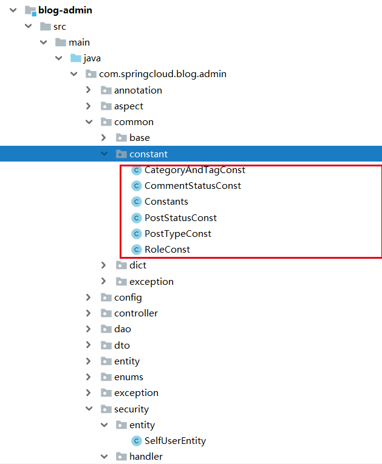
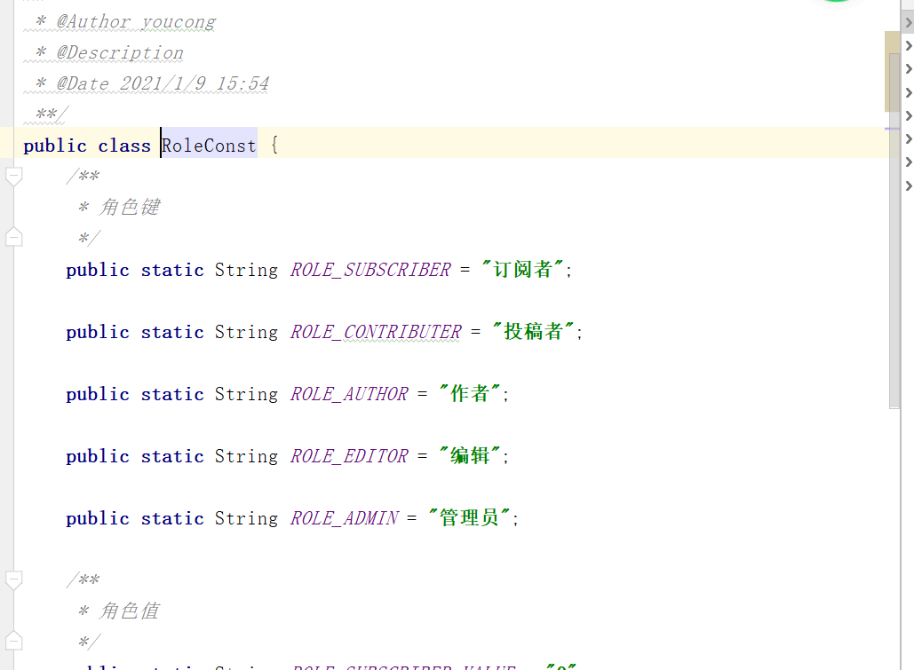

常量，可以理解为一种特殊的变量，通常用static final来修饰，它的值一旦设定，在程序运行过程中不允许改变。
常量在实际开发中使用非常多，这里以我博客为例，我的博客系统主要以WordPress作为模仿对象，我的常量类如下：
<!--more-->


其中的RoleConst.java内容如下:


### 一.我为什么使用常量来定义这些？
最主要的一个原因是它能解决魔法值问题。特别是代码中有switch、if和其它重复多次的变量值，通常这些值都可以定义为常量。魔法值太多不利于代码的维护。
魔法值代码例子如下:
```
String key = "Id#taobao_" + tradeId;
cache.put(key, value);

```
### 二、常量与配置文件的区别？
常量通常是一个或多个Java类，这些类的包前缀通常为constant。
而配置文件大多是xx.properties文件或xml文件、yaml文件，一般来说，目前properties文件和yaml文件是用的比较多的(分布式微服务项目，如spring+springmvc+mybatis、springboot+mybatis、springboot+springcloud等)，xml文件偏向于比较老的项目了(spring+struts/struts2+hibernate或ssm(sprint+struts/struts2+mybatis等)。

### 三、什么时候应该使用常量？什么时候应该使用配置文件？
对于魔法值通常建议使用常量进行管理，而像mysql、memcache、elasticesearch、tomcat、redis、mongodb、对象存储服务器(类似文件管理这样的)等通常使用配置文件进行管理。

### 四、常量的规范有哪些？
这里参考阿里巴巴Java开发手册:
- 1.【强制】不允许任何魔法值（即未经定义的常量）直接出现在代码中。

- 2.【强制】long 或者 Long 初始赋值时，使用大写的 L，不能是小写的 l，小写容易跟数字 1 混
淆，造成误解。

- 3.【推荐】不要使用一个常量类维护所有常量，按常量功能进行归类，分开维护。
说明：大而全的常量类，非得使用查找功能才能定位到修改的常量，不利于理解和维护。

- 4.【推荐】常量的复用层次有五层：跨应用共享常量、应用内共享常量、子工程内共享常量、包
内共享常量、类内共享常量。
1） 跨应用共享常量：放置在二方库中，通常是 client.jar 中的 constant 目录下。
2） 应用内共享常量：放置在一方库中，通常是 modules 中的 constant 目录下。
3） 子工程内部共享常量：即在当前子工程的 constant 目录下。
4） 包内共享常量：即在当前包下单独的 constant 目录下。
5） 类内共享常量：直接在类内部 private static final 定义。

- 5.【推荐】如果变量值仅在一个范围内变化，且带有名称之外的延伸属性，定义为枚举类。下面
正例中的数字就是延伸信息，表示星期几。

### 五、配置文件有哪些规范？
- (1)首先要遵循该配置文件类型的规范，否则会报错或失效(yaml、properties、xml或txt、ini等)；
- (2)按功能类型区分，用户配置文件、系统配置文件、业务配置文件、第三方配置文件等(对于springboot项目而言通常配置文件会放在resources目录下，通过目录进行区分)；
- (3)注释说明(像txt的可能没办法加注释，但最后有一个专门的配置文档说明书，利于以后的扩展和维护)。

### 六、总结
常量和配置文件本质上是让我们的代码变得更稳定、更好维护、更易扩展等，最后带来的好处是团队研发效率的提高，项目开发顺利，不用加班。
