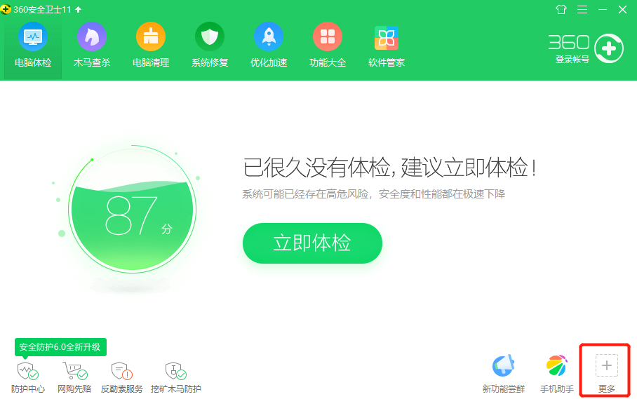
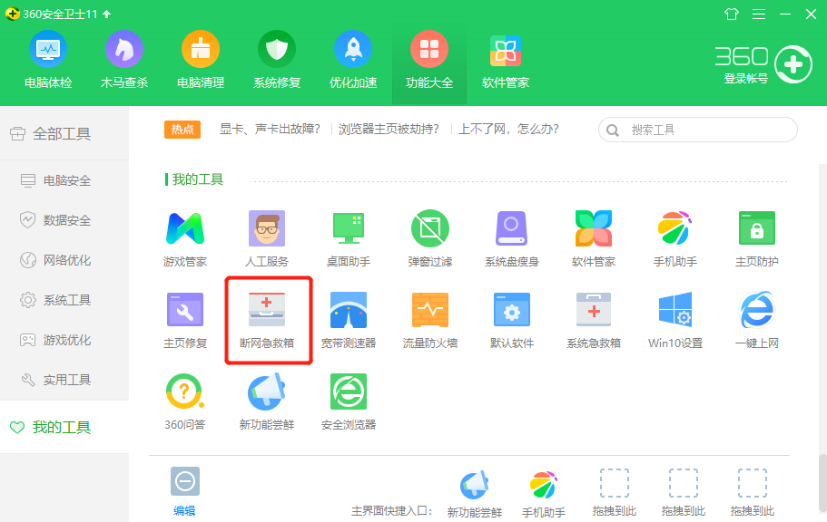
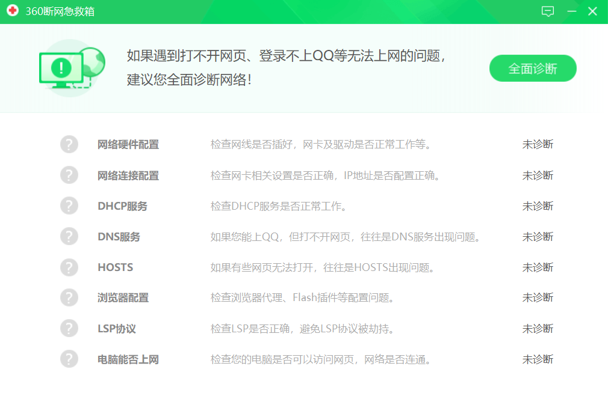
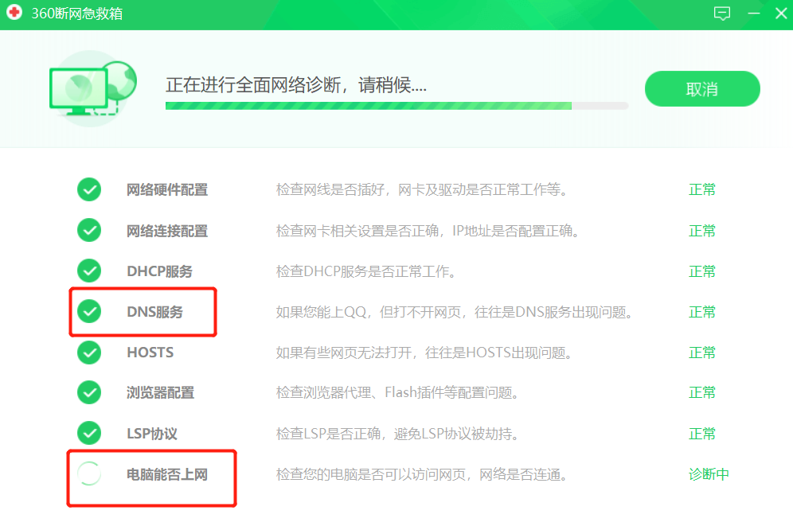

### 问题描述:微信、qq可以上网，但是浏览器却不能上网怎么办?
<!--more-->
**解决办法**(步骤如下):
(1)打开360安全卫士,点击更多

(2)进入到更多中，点击断网急救箱

(3)进入到断网急救箱，点击全面诊断

(4)一般都是如图红色标记处，最后点击修复即可

问题的原因是什么呢?
通常是DNS解析问题，如果要说为什么浏览器不能上网，qq和微信可以，是因为它们的DNS解析不同。

在没有用360这个办法时，我尝试过使用命令行解决，如下:
输入命令： netsh winsock reset catalog ——>重启电脑
但是没有效果。
