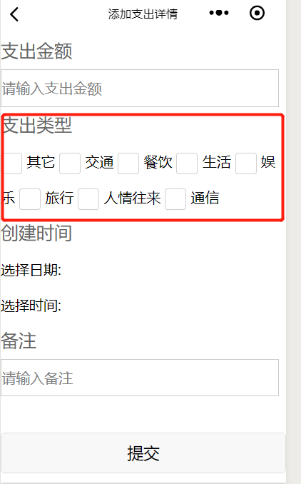

效果图如下:

<!--more-->
实例代码如下:
type_add.js
```
// pages/detail_add/detail_add.js
Page({

  /**
   * 页面的初始数据
   */
  data: {
    selectData: "", //下拉列表的数据
    height: 20,
    focus: false
  },
  checkboxChange: function(e) {
    console.log('checkbox发生change事件，携带value值为：', e.detail.value)
    console.log("长度:" + e.detail.value.length);
    this.setData({
      typeId: e.detail.value,
      length: e.detail.value.length
    })


  },
  formSubmit: function(e) {
    console.log('form发生了submit事件，携带数据为：' + e.detail.value.amount + ", " + e.detail.value.typeId + ", " + this.data.remark + ", " + this.data.date + ", " + this.data.time);

    var amount = e.detail.value.amount;
    var typeId = this.data.typeId;

    var date = this.data.date;
    var time = this.data.time;
    var remark = e.detail.value.remark;
    var createDate = date + " " + time;
    var length = this.data.length;
    console.log("length:" + length);
    console.log("date:" + date);
    console.log("time:" + time);
    console.log("createDate:" + createDate)

    if (amount == null || amount == "") {
      wx.showToast({
        title: "支出金额不能为空",
        icon: 'none',
        duration: 1500
      })
    } else if (typeId == null || typeId == "") {
      wx.showToast({
        title: "支出类型不能为空",
        icon: 'none',
        duration: 1500
      })

    } else if (length >= 2) {
      wx.showToast({
        title: "支出类型只能选择一种",
        icon: 'none',
        duration: 1500
      })
    } else if (date == null || date == "") {
      wx.showToast({
        title: "日期不能为空",
        icon: 'none',
        duration: 1500
      })
    } else if (time == null || time == "") {
      wx.showToast({
        title: "时间不能为空",
        icon: 'none',
        duration: 1500
      })
    } else if (remark == null || remark == "") {
      wx.showToast({
        title: "备注不能为空",
        icon: 'none',
        duration: 1500
      })
    } else {


      wx.request({

        url: getApp().globalData.urlPath + "spendingDetail/add",
        method: "POST",
        data: {
          amount: amount,
          typeId: typeId,
          createDate: createDate,
          remark: remark
        },
        header: {
          "Content-Type": "application/x-www-form-urlencoded"
        },
        success: function(res) {
          console.log(res.data.code);
          if (res.statusCode == 200) {

            //访问正常
            if (res.data.code == "000000") {
              wx.showToast({
                title: "添加支出详情成功",
                icon: 'success',
                duration: 3000,
                success: function() {

                  wx.navigateTo({
                    url: '../detail/detail'
                  })
                }
              })

            }
          } else {

            wx.showLoading({
              title: '系统异常',
              fail
            })

            setTimeout(function() {
              wx.hideLoading()
            }, 2000)
          }

        }
      })
    }


  },
  formReset: function() {
    console.log('form发生了reset事件')
  },
  bindDateChange: function(e) {
    console.log('picker发送选择改变，携带值为', e.detail.value)
    this.setData({
      date: e.detail.value
    })
  },
  bindTimeChange: function(e) {
    console.log('picker发送选择改变，携带值为', e.detail.value)
    this.setData({
      time: e.detail.value
    })
  },
  /**
   * 生命周期函数--监听页面加载
   */
  onLoad: function(options) {
    wx.setNavigationBarTitle({

      title: "添加支出详情"

    })


    var userCode = wx.getStorageSync('userId').toString();
    var self = this;
    wx.request({
      url: getApp().globalData.urlPath + "spendingType/types", //json数据地址 
      data: {
        userCode: userCode
      },
      headers: {
        "Content-Type": "application/x-www-form-urlencoded"
      },
      success: function(res) {
        console.log("res.data.data.typeName:" + res.data.data)

        self.setData({

          selectData: res.data.data

        })


      }
    })
  },

  /**
   * 生命周期函数--监听页面初次渲染完成
   */
  onReady: function() {

  },

  /**
   * 生命周期函数--监听页面显示
   */
  onShow: function() {

  },

  /**
   * 生命周期函数--监听页面隐藏
   */
  onHide: function() {

  },

  /**
   * 生命周期函数--监听页面卸载
   */
  onUnload: function() {

  },

  /**
   * 页面相关事件处理函数--监听用户下拉动作
   */
  onPullDownRefresh: function() {

  },

  /**
   * 页面上拉触底事件的处理函数
   */
  onReachBottom: function() {

  },

  /**
   * 用户点击右上角分享
   */
  onShareAppMessage: function() {

  }
})
```

type_add.wxml:
```
<form bindsubmit="formSubmit" bindreset="formReset">
  <view class="section">
    <text>支出金额</text>
    <input name="input" name="amount" placeholder="请输入支出金额" />
  </view>

  <view class="section">
    <text>支出类型</text>
    <checkbox-group bindchange="checkboxChange">
      <label class="checkbox" wx:for="{{selectData}}">
        <checkbox value="{{item.typeId}}" checked="{{item.checked}}" />{{item.typeName}}
      </label>
    </checkbox-group>

  </view>

  <view>
    <text>创建时间</text>
    <view class="section">
      <picker mode="date" value="{{date}}" start="2018-09-01" end="2030-09-01" bindchange="bindDateChange">
        <view class="picker">
          选择日期: {{date}}
        </view>
      </picker>
    </view>
    <view class="section">
      <picker mode="time" value="{{time}}" start="00:00=" end="23:59" bindchange="bindTimeChange">
        <view class="picker">
          选择时间: {{time}}
        </view>
      </picker>
    </view>
  </view>
  <view class="section">
    <text>备注</text>
    <input name="input" name="remark" placeholder="请输入备注" />
  </view>
  <view>
    <text>\n</text>
  </view>
  <view class="btn-area">
    <button form-type="submit">提交</button>
    <view>
      <text>\n</text>
    </view>
    <button form-type="reset">重置</button>
  </view>
</form>

```
bindchange="checkboxChange" 相当于js中的onchange事件。
上述中的form表单基本就是参考官方文档改的。
有一段代码还是要提一下:
```
      self.setData({

          selectData: res.data.data

        })

```

self其实相当于this，意为当前。每次触发事件，对应的值都会进行存储，用于与后台通信进行数组传递，

type_add.wxss:
```
/* pages/login/login.wxss */
form{
  width: 310px;
  height: 240px;
  line-height: 40px;
  /* border: 1px solid red;  */
}
input{
  border: 1px solid #ccc;
  width: 310px;
  height: 40px;
}
.button{
  margin-top: 20px;
}
.header text{
  font-size: 25px;
  color: #666;
}
form text{
  font-size: 20px;
  color: #666;
}
```