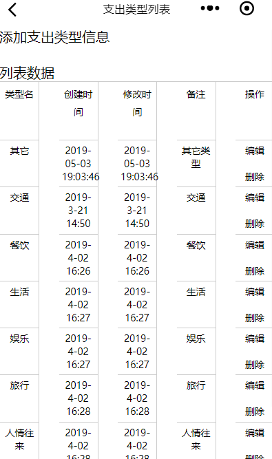

效果图如下:

<!--more-->
实现代码如下:
type.js:
```
// pages/type/type.js
Page({

  /**
   * 页面的初始数据
   */
  data: {
    types: ""
  },
  editType: function (e) {
     var typeId =  e.currentTarget.dataset['id'];
     console.log("edit:"+typeId);


    wx.navigateTo({
      url: '../type_edit/type_edit?typeId=' + typeId
    })
  },
  delType:function(e){

    var typeId = e.currentTarget.dataset['id'];

    console.log("delete:"+typeId)


    wx.showModal({
      title: '提示',
      content: '确认要删除该支出类型?',
      success: function (res) {
        if (res.confirm) {
          console.log('用户点击确定')

          wx.request({

            url: getApp().globalData.urlPath + "spendingType/delete",
            method: "POST",
            data: {
              typeId: typeId
            },
            header: {
              "Content-Type": "application/x-www-form-urlencoded"
            },
            success: function (res) {
              console.log(res.data.code);
              if (res.statusCode == 200) {

                //访问正常
                if (res.data.code == "000000") {
                  wx.showToast({
                    title: "删除成功，返回支出类型列表",
                    icon: 'success',
                    duration: 3000,
                    success: function () {

                      wx.navigateTo({
                        url: '../type/type'
                      })
                    }
                  })

                }
              } else {

                wx.showLoading({
                  title: '系统异常',
                  fail
                })

                setTimeout(function () {
                  wx.hideLoading()
                }, 2000)
              }

            }
          })


        } else if (res.cancel) {
          console.log('用户点击取消')
        }
      }
    })

  },
  /**
   * 生命周期函数--监听页面加载
   */
  onLoad: function (options) {
    wx.setNavigationBarTitle({

      title: "支出类型列表"

    })
    var userCode = wx.getStorageSync('userId');
    var self = this
    wx.request({
      url: getApp().globalData.urlPath + "spendingType/types",//json数据地址 
      data: {
        userCode: userCode
      },
      headers: {
        "Content-Type": "application/x-www-form-urlencoded"
      },
      success: function (res) {
        self.setData({

          types: res.data.data

        });//等同于

      }
    })
  },

  /**
   * 生命周期函数--监听页面初次渲染完成
   */
  onReady: function () {

  },

  /**
   * 生命周期函数--监听页面显示
   */
  onShow: function () {

  },

  /**
   * 生命周期函数--监听页面隐藏
   */
  onHide: function () {

  },

  /**
   * 生命周期函数--监听页面卸载
   */
  onUnload: function () {

  },

  /**
   * 页面相关事件处理函数--监听用户下拉动作
   */
  onPullDownRefresh: function () {

  },

  /**
   * 页面上拉触底事件的处理函数
   */
  onReachBottom: function () {

  },

  /**
   * 用户点击右上角分享
   */
  onShareAppMessage: function () {

  }
})

```

type.js没什么好说的，如果要说，只能说这个onLoad这里的onLoad就相当于js中的onload方法，当进入该视图时，默认全局加载一次。


type.wxml:
```
<view>
  <view>
    <navigator url="/pages/type_add/type_add" hover-class="navigator-hover">添加支出类型信息</navigator>
  </view>
  <view>
    <text>\n</text>
  </view>
  <view>
    <view>
      <text>列表数据</text>
      <text>\n</text>
    </view>
<view class="table">
        <view class="tr thead">
          <view class="td">类型名</view>
          <view class="td">创建时间</view>
          <view class="td ">修改时间</view>
          <view class="td">备注</view>
          <view class="td ">操作</view>
        </view>
        <block>
          <view class="tr" wx:for="{{types}}" wx:for-item="item">
            <view class="td">{{item.typeName}}</view>
            <view class="td">{{item.createDate}}</view>
            <view class="td">{{item.modifyDate}}</view>
            <view class="td">{{item.remark}}</view>
            <view class="td">
              <text bindtap='editType' data-id="{{item.typeId}}">编辑</text>
              <text>\n</text>
              <text>\n</text>
              <text bindtap='delType' data-id="{{item.typeId}}">删除</text>
            </view>
          </view>
        </block>
      </view>

 

  </view>
</view>

```

遍历循环主要使用的是wx:for。如果要类比的话，我觉得jstl跟这个神似。先来看看jstl,代码如下:
```
   <c:forEach var="u" items="${user}">
			<tr>
					<td>${u.cid}</td>
					<td>${u.cname}</td>
					<td>${u.age }</td>
			</tr>
	</c:forEach>


```

var相当于我可以任意定义一个简要字母来调用item(item相当于type.js中的data或`self.setData`存储的数据)。

如果你还不明白的话，可以联系到$.each,代码如下:
```
		$.each(classroom_list, function(i, c) {

							rows = rows + "<tr>";
							rows = rows + "<td>" + c.id + "</td>";
							rows = rows + "<td>" + c.nickname + "</td>";
							rows = rows + "<td><a href='student_submit_info.html?userId="+c.id+"'>查看详情</a></td>";
							rows = rows + "</tr>"
		});


```


type.wxss:
```
.table {
  border: 1px solid #ccc;
  font-size: 28rpx;
  background: #fff;
  border-right: none;
}
 
.tr{
  display: flex;
  justify-content: space-between;
}
 
.td {
  text-align: center;
  border: 1px solid #ccc;
  display: inline-block;
  border-left: none;
  border-bottom: none;
  padding: 10rpx 1%;
  width: 12%;
}
 
.thead .td{
  border-top: none;
  height: 140rpx;
  line-height: 50rpx;
}


```

参考资料:
[微信小程序之列表渲染](https://developers.weixin.qq.com/miniprogram/dev/reference/wxml/list.html)