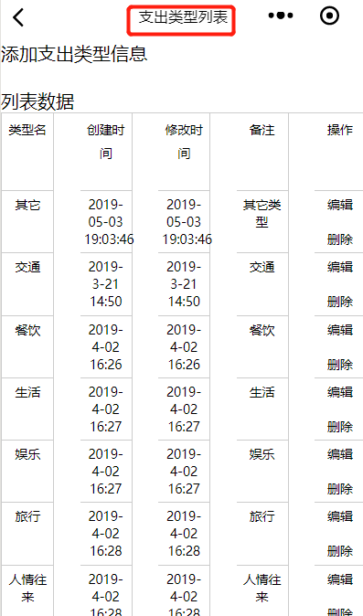

效果图:

<!--more-->
这个标题是在哪里定义的呢？
type.js核心代码如下(通常这段代码放在onLoad函数体内):
```
   wx.setNavigationBarTitle({

      title: "支出类型列表"

    })

```

除了上面的在js中定义，还有在对应的json文件中定义(type.json)，代码如下:
```
{

    "navigationBarTitleText": "支出类型"
  
}

```

两者效果是一样的。