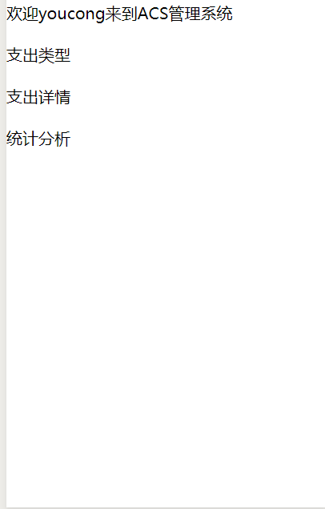
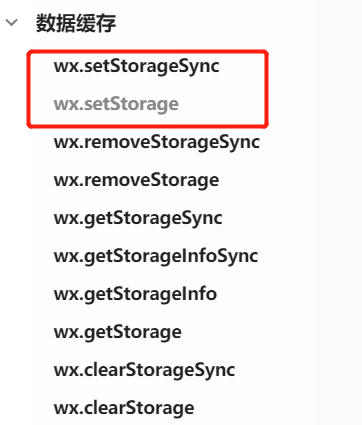

关于缓存，举个示例，假定我不是通过微信授权登录的方式，小程序又是如何识别我登录后的身份呢？？？
效果图:


这个功能我是通过缓存实现的。
<!--more-->
关键核心代码如下:
```
      wx.setStorage({
        key: 'userName',
        data: res.data.user.userName
     })

```

微信小程序提供的主要缓存如图:


那么两个缓存之间的区别又是什么？

wx.setStorage(Object object)

将数据存储在本地缓存中指定的 key 中。会覆盖掉原来该 key 对应的内容。除非用户主动删除或因存储空间原因被系统清理，否则数据都一直可用。单个 key 允许存储的最大数据长度为 1MB，所有数据存储上限为 10MB。


wx.setStorageSync(string key, any data)
wx.setStorage 的同步版本


如果要说它们之间区别，那就是同步和异步之间的区别，异步不必等待当前任务执行结束，就可以直接执行下一步任务，而同步则必须等待当前任务执行完毕，才能执行下一步任务。


那么既然我缓存了之后，请问如何获取呢？
核心代码如下:
manage.js
```

  /**
   * 页面的初始数据
   */
  data: {
    userName: wx.getStorageSync('userName'),
    userInfo: {}
  }

```

另外大家有没有联想到redis或者memcached的键值获取呢，与其是不是很相似。


参考资料如下:
[微信小程序之数据缓存](https://developers.weixin.qq.com/miniprogram/dev/api/storage/wx.setStorageSync.html)
