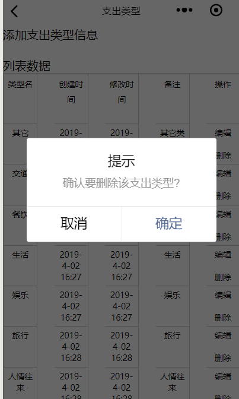

效果图如下:

<!--more-->
核心代码如下:
```
  delType:function(e){

    var typeId = e.currentTarget.dataset['id'];

    console.log("delete:"+typeId)


    wx.showModal({
      title: '提示',
      content: '确认要删除该支出类型?',
      success: function (res) {
        if (res.confirm) {
          console.log('用户点击确定')

          wx.request({

            url: getApp().globalData.urlPath + "spendingType/delete",
            method: "POST",
            data: {
              typeId: typeId
            },
            header: {
              "Content-Type": "application/x-www-form-urlencoded"
            },
            success: function (res) {
              console.log(res.data.code);
              if (res.statusCode == 200) {

                //访问正常
                if (res.data.code == "000000") {
                  wx.showToast({
                    title: "删除成功，返回支出类型列表",
                    icon: 'success',
                    duration: 3000,
                    success: function () {

                      wx.navigateTo({
                        url: '../type/type'
                      })
                    }
                  })

                }
              } else {

                wx.showLoading({
                  title: '系统异常',
                  fail
                })

                setTimeout(function () {
                  wx.hideLoading()
                }, 2000)
              }

            }
          })


        } else if (res.cancel) {
          console.log('用户点击取消')
        }
      }
    })

  }

```

wxml代码如下:
```
 <text bindtap='delType' data-id="{{item.typeId}}">删除</text>

```
data-id相当于绑定对应的值，比方说你是根据id来删除对应的数据。
bindtap，即绑定事件。