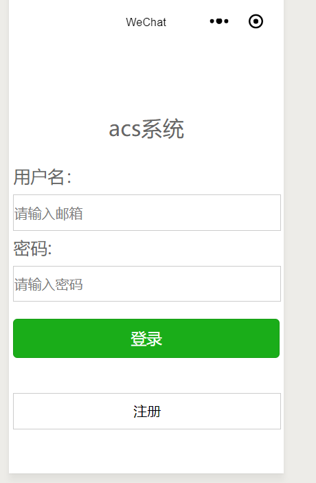
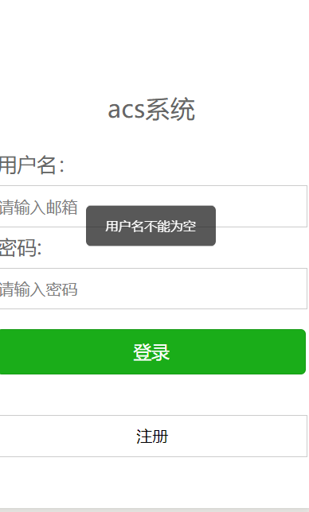
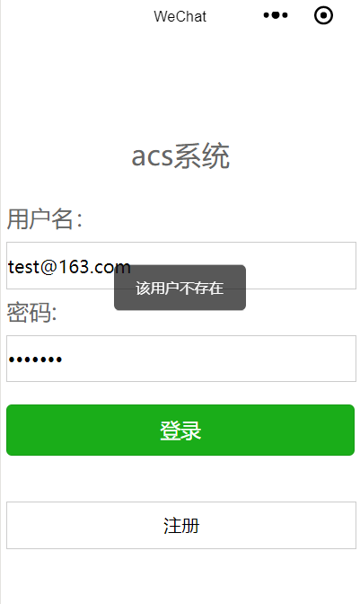

关于网络通信，这里我使用的是wx.request,官方代码示例如下:
```
wx.request({
  url: 'test.php', //仅为示例，并非真实的接口地址
  data: {
    x: '',
    y: ''
  },
  header: {
    'content-type': 'application/json' // 默认值
  },
  success (res) {
    console.log(res.data)
  }
})

```
对于初学者而言，官方示例可能会看不怎么懂，所以我就以我自己当初项目驱动学习的方式(开发个人的记账小程序)来作为学习实例。
<!--more-->
以登录来说，效果图如下:


此次示例包含表单校验和网络请求，代码如下:
login.js
```
// pages/login/login.js
Page({

  /**
   * 页面的初始数据
   */
  data: {
    username: "",
    password: ""

  },
   register:function(e){
    wx.navigateTo({
      url: '../register/register'
    })

  },
  formSubmit: function(e) {
    console.log(e.detail.value.email);
    console.log(e.detail.value.pwd)
    var username = e.detail.value.email;
    var password = e.detail.value.pwd;
    var emailReg = /^[A-Za-z\d]+([-_.][A-Za-z\d]+)*@([A-Za-z\d]+[-.])+[A-Za-z\d]{2,4}$/;
    if (username == null || username == "") {
      wx.showToast({
        title: "用户名不能为空",
        icon: 'none',
        duration: 1500
      })
    } else if (!emailReg.test(username)) {

      wx.showToast({
        title: "邮箱有误",
        icon: 'none',
        duration: 1500
      })

    } else if (password == null || password == "") {
      wx.showToast({
        title: "密码不能为空",
        icon: 'none',
        duration: 1500
      })
    } else {
      wx.request({

        url: getApp().globalData.urlPath + "sysUser/login",
        method: "POST",
        data: {
          username: username,
          password: password
        },
        header: {
          "Content-Type": "application/x-www-form-urlencoded"
        },
        success: function(res) {
          console.log(res.data);
          if (res.statusCode == 200) {

            //访问正常
            if (res.data.code == "000000") {
              wx.showToast({
                title: "登陆成功",
                icon: 'success',
                duration: 2000,
                success: function() {
                  wx.navigateTo({
                    url: '../manage/manage'
                  })

                  wx.setStorage({
                    key: 'userId',
                    data: res.data.user.userCode
                  })

                  wx.setStorage({
                    key: 'userName',
                    data: res.data.user.userName
                  })
                  console.log("test:" + wx.getStorageSync('userName'));
                }
              })

            } else if (res.data.code == "111111") {
              wx.showToast({
                title: "密码错误",
                icon: 'none',
                duration: 1500
              })
            } else {
              wx.showToast({
                title: "该用户不存在",
                icon: 'none',
                duration: 1500
              })
            }
          } else {

            wx.showLoading({
              title: '系统异常',
              fail
            })

            setTimeout(function() {
              wx.hideLoading()
            }, 2000)
          }

        }
      })
    }

  }
})

```

关于login.js，主要是写通信逻辑的，与咱们平时写js差异并不大，唯一不同的就是api长得不样罢了。

关于其中的getApp().globalData.urlPath，相当于全局变量，不用我每次都写一大串https之类的。

表单校验的效果如图:






代码说明:

显示消息提示框(相当于js的alert提示):
```
      wx.showToast({
        title: "邮箱有误",
        icon: 'none',
        duration: 1500
      })

```
获取input属性为name的值(相当于js中form.email.value,前提是这个表单name要为form，且form中的input要存在一个name="email")
```
e.detail.value.email;

```


跳转代码(相当于window.location.href):
```
  wx.navigateTo({
   url: '../manage/manage'
  })


```

至于wx.request，我想只要是写过ajax的，都很好理解。

login.json:
```
{
  "usingComponents": {}
}

```
关于这个login.json有什么用，我唯一想到的是页面的title(其实相当于html中的title)

lgoin.wxml:
```

<view class='container'>
  <view class='header'>
    <text>acs系统</text>
  </view>
    <view>
    <text>\n</text>
  </view>
  <view class='header'>
  </view>
  <form bindsubmit="formSubmit">
    <view class='section'>
      <text>用户名：</text>
      <input type='text' name="email" placeholder='请输入邮箱' />
    </view>
    <view class='section'>
      <text>密码:</text>
      <input password='password' name="pwd" placeholder='请输入密码' />
    </view>
    <view class='button'>
      <button type='primary' form-type='submit'>登录</button>
      <text>\n</text>
       <view bindtap='register' class="register">注册</view>
    </view>
  </form>

</view>

```
wxml相当于视图(如html或者模板语言(jsp、volocity、freemarker、beetl等))
视图除了可以写一些标签之类的，还可以写一些逻辑判断。后面会讲到的。

login.wxss:
```
/* pages/login/login.wxss */
form{
  width: 310px;
  height: 240px;
  line-height: 40px;
  /* border: 1px solid red;  */
}
input{
  border: 1px solid #ccc;
  width: 310px;
  height: 40px;
}
.button{
  margin-top: 20px;
}
.header text{
  font-size: 25px;
  color: #666;
}
form text{
  font-size: 20px;
  color: #666;
}
.register{
color:black;
display: block;
width: 310px;
height: 40px;
border: 1px solid #ccc;
text-align: center;
}

```
这个wxss就相当于css，定义视图的样式，决定视图长什么样(好看不好看)

关于微信小程序网络通信，更多信息可以参考官方文档:
[wx.request](https://developers.weixin.qq.com/miniprogram/dev/api/network/request/wx.request.html)