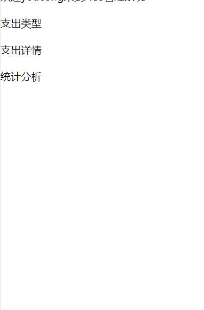

效果图:


页面有点丑，作为初次学习，页面可以要求不那么美观，先学会再说。毕竟后面可以优化的很漂亮。
<!--more-->
代码实例如下:

```
<view class="section btn-area">
  <view class="section__title">欢迎{{userName}}来到ACS管理系统</view>
  <view>
    <text>\n</text>
  </view>
  <view class="flex-wrp" style="flex-direction:row;">
    <view class="flex-item bc_green">
      <navigator url="/pages/type/type" hover-class="navigator-hover">支出类型</navigator>
    </view>

    <view>
      <text>\n</text>
    </view>

    <view class="flex-item bc_red">
      <navigator url="/pages/detail/detail" hover-class="other-navigator-hover">支出详情</navigator>
    </view>
    <view>
      <text>\n</text>
    </view>
    <view class="flex-item bc_blue">
      <navigator url="/pages/index/index" hover-class="navigator-hover" hover-class="other-navigator-hover">统计分析</navigator>
    </view>

  </view>
</view>

```


参考资料:
[微信小程序之导航](https://developers.weixin.qq.com/miniprogram/dev/component/navigator.html)