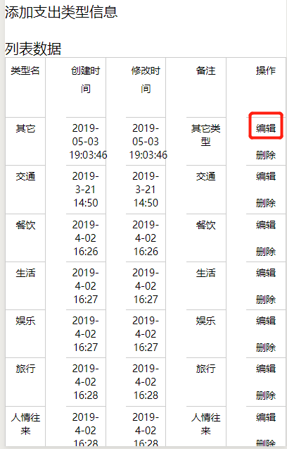
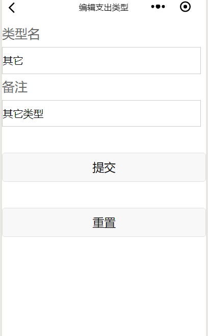

效果图:

<!--more-->


点击编辑值传过去了，那么编辑支出类型这个界面又是如何获取到值呢？

传值代码:
type.js
```
  editType: function (e) {
     var typeId =  e.currentTarget.dataset['id'];
     console.log("edit:"+typeId);


    wx.navigateTo({
      url: '../type_edit/type_edit?typeId=' + typeId
    })
  }

```

type.wxml:
```
<text bindtap='editType' data-id="{{item.typeId}}">编辑</text>

```


接收值核心代码如下(这段代码通常放在onLoad函数体内):
```
 var that = this;
    that.setData({ //this.setData的方法用于把传递过来的id转化成小程序模板语言
      typeId: options.typeId
    })

  console.log("typeId:" + that.data.typeId);

```

