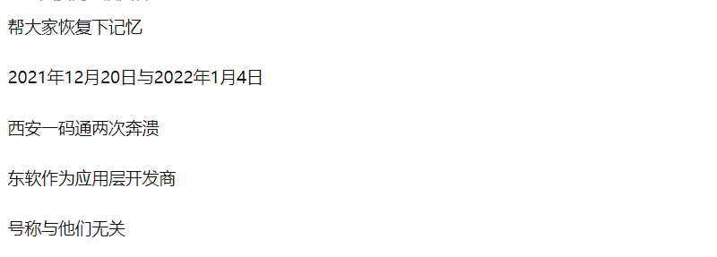
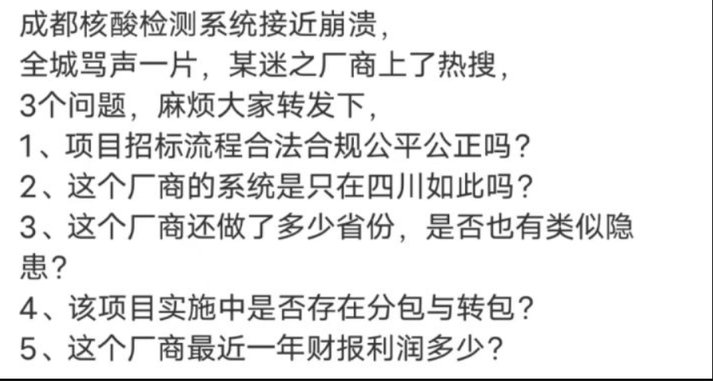
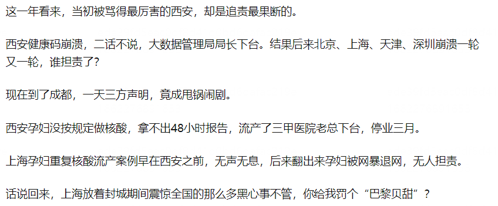
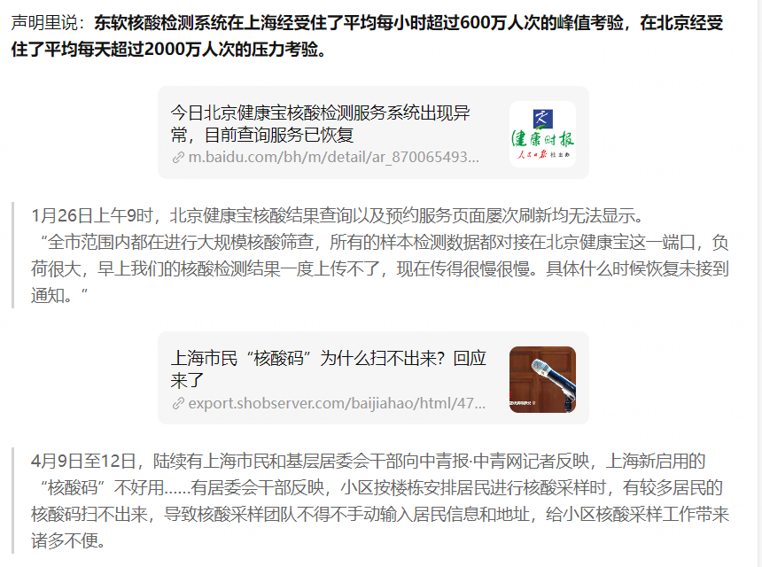
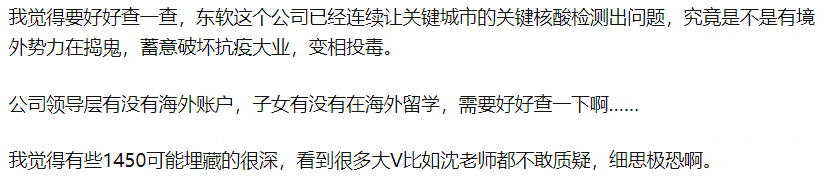
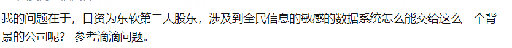

**新闻这样说:**
> 2日晚间，东软、成都核酸系统崩了登上微博热搜。
据网友反映，9月2日晚间，成都的核酸系统又崩了，在现场核酸采集的医护人员以为是信号不好，通过将手机高高举过头顶的方式来获得信号，然而并不是信号问题，而是成都的核酸系统出了问题。有网友发现，成都的核酸系统正是由东软集团开发。
<!--more-->

## 一、核酸系统为什么会崩溃呢？
**东软集团是这样说的:**

由此可知，东软集团认为系统之所以出现故障，非软件自身原因，是由于网络故障导致的。

**由此一些朋友疑惑东软是一家怎样的公司？**

**从东软集团的官网上是这样介绍这家公司的:**
> 东软集团（SH.600718）是行业领先①的全球化信息技术、产品和解决方案公司，是产业创新变革的推动者和数字化转型的赋能者。东软成立于1991年，是中国第一家上市的软件公司②。东软始终洞察时代发展趋势，探索软件技术的创新与应用，赋能全球数万家大中型客户实现信息化、数字化、智能化发展，在智慧城市、医疗健康、智能汽车互联、企业数字化转型、国际软件服务等众多领域处于领先①地位。

**东方网新闻媒介这样看:**
> 公开资料显示，东软集团成立于1991年，1996年6月在上海证券交易所上市，目前拥有2万余名员工。其前身是东北大学下属的两家公司，即沈阳东大开放软件系统股份有限公司和沈阳东大阿尔派软件有限公司，目前合并财务报表的子公司有75家。

> 2021年9月，东软集团官网文章显示，东软集团与中国电信(3.790, 0.03, 0.80%)签署产业数字化战略合作协议，而在此次合作协议之前，东软集团与中国电信共同打造出“翼填报”“一码通”“全运通”等应用，为疫情上报、疫苗预约、核酸检测、联防联控等场景提供技术支撑。

> 2022年上半年，东软集团实现营收33.83亿元，同比增长5.35%；净利润8046.08万元，同比增长205.84%。截至报告期末公司净资产为97.65亿元，与去年同期相比增长1.09%，资产负债率为49.64%。
与此同时，将东软集团与中国软件(39.270, 0.62, 1.60%)、科大讯飞(37.390, 0.22, 0.59%)相比，同样作为软件公司，东软的研发费用却明显偏低。

> 2022年半年度报告显示，东软集团研发费用3.38亿元，占销售额的比重接近10%；中国软件研发费用9.72亿元，占销售额比重高达27%；科大讯飞研发费用14.39亿元，占营业额比重17.9%。

> 虽然，东软称自己的核心竞争力体现在“大健康”“大汽车”“智慧城市”“企数转型”等领域的技术积累、行业经验、知名度和市场影响力等诸多方面，但较低的研发占比或会成为其发展的最大障碍。

**对此，一些网友朋友对此发表了一些看法:**

**A网友:**

**B网友:**

**C网友:**

**D网友:**

**E网友:**

**F网友:**

**G网友:**

**H网友:**

**我的看法是:**
> 第一次故障没有预料到，可以理解，但接二连三出现这样的问题，先是西安(健康码崩溃，东软参与了核心系统的建设)，然后紧接着是上海(健康云崩溃，万达信息主导)等。第一次是自己参与的，第二次是他人的案例，如果吸取自己加他人的教训，就不会出现成都核酸检测系统崩溃的这种情况了。

## 二、我对成都核酸检测系统崩溃有哪些思考？
之前写过一篇文章，大家可以读一读（相关的内容，我不再赘述）：
[全国性系统之架构设计与思考](https://youcongtech.com/2022/04/30/%E5%85%A8%E5%9B%BD%E6%80%A7%E7%B3%BB%E7%BB%9F%E4%B9%8B%E6%9E%B6%E6%9E%84%E8%AE%BE%E8%AE%A1%E4%B8%8E%E6%80%9D%E8%80%83/)

要建立一套全国性的核酸检测系统，部署全国各地（意思是在全国各地都有节点，就近原则），具备分布式集群、弹性伸缩、容灾备份等特点，一旦出现问题，立即启动新的节点，在短暂的时间内恢复正常，某一个地方节点不够用（可能出现疫情或其它情况导致核酸检测需求增加），会自动扩展多个节点来达到高可用的目的。同样这一套系统有专门的人来维护，相关的监控一定是自动化的，一旦发现CPU高或内存不够用的情况，除通知相关人员之外，另立即自动增加几个节点进行备用（横向扩展）。基本上按照这种思路来做，问题故障的概率不大（概率不大，并不表示不会出现问题），而是即便发生故障，也在可控范围，甚至无需人工干预，系统自动宏观调控即可。

在[全国性系统之架构设计与思考](https://youcongtech.com/2022/04/30/%E5%85%A8%E5%9B%BD%E6%80%A7%E7%B3%BB%E7%BB%9F%E4%B9%8B%E6%9E%B6%E6%9E%84%E8%AE%BE%E8%AE%A1%E4%B8%8E%E6%80%9D%E8%80%83/)一文中我提到过一点:
> 全国性系统的使用频率并不是每时每刻都处于高频状态，自动化监控体系可监控频率，频率高则通过弹性伸缩进行自动化扩容，确保服务的可用性与稳定性，当频率处于一个平稳状态或低频，进行资源释放，这样一来既能充分利用资源，又能避免资源的浪费。也许最开始没有具体的统计数据，不好判断低频、中频、高频这样的，为了保障服务的可用性与稳定性，可以通过大规模扩容，当有了数据之后，就能做到自动化控制。

今年以来加上这次，已经出现了三次教训，三次教训如不吸取，接下来可能会有第四次、第五次乃至第N次。

**阿房宫赋有一句话说的很好:**
> 秦人不暇自哀，而后人哀之。后人哀之而不鉴之，亦使后人而复哀后人也。

希望这样的事件不要再发生了，同时也希望广大的IT朋友们借鉴这次事件的教训，从中吸取他人的教训，在做架构设计层面，要充分考虑一些突发的情况该怎样应对。
