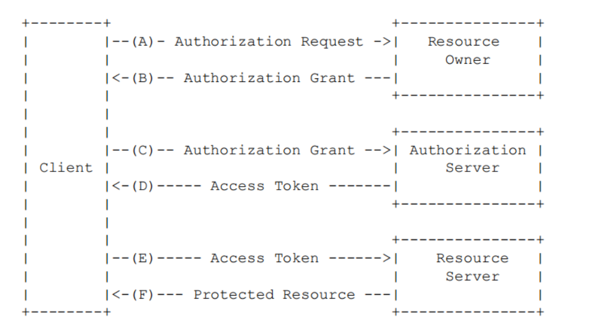
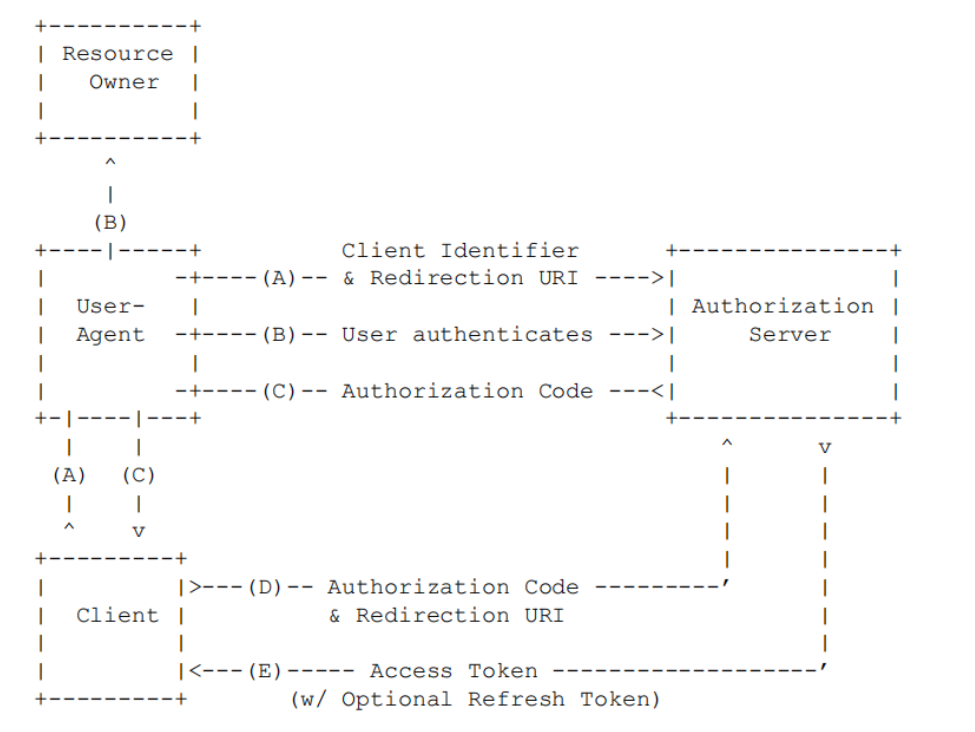
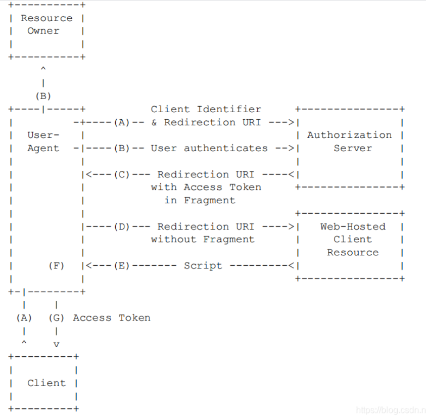
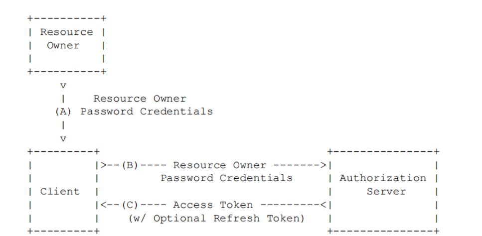
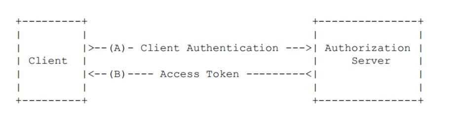

## 一、安全认证的主要框架有哪些？
- [Apache Shiro](https://shiro.apache.org/)；
- [Spring Security](https://spring.io/projects/spring-security)；
- [Sa-Token](https://sa-token.dev33.cn/)。

而我们主要基于SpringSecurity+OAuth2。
<!--more-->

## 二、OAuth2.0流程

**描述:**

（A）客户端（Client）向资源拥有者（Resource Owner）申请授权，资源拥有者（Resource Owner）可以直接授权，但最好是通过Autherization进行授权；
（B）客户端（Client）获得授权的允许凭据(Authorization Grant)，在OAuth2.0中该凭据的获取有四种类型，授权码、隐藏式、用户密码和客户端凭证；
（C）客户端（Client）使用授权凭据向授权服务器（Authorization Server）申请访问凭证(Access Token)；
（D）认证服务器（Authorization Server）验证申请凭据（Authorization Grant），验证通过后颁发访问凭证(Access Token)；
（E）客户端（Client）使用访问凭证(Access Token)访问资源服务器（Resource Server）；
（F）资源服务器（Resource Server）验证访问凭证(Access Token)，验证通过后对客户端（Client）请求进行处理并返回结果。

## 三、客户端授权类型
我们主要采取的是用户密码的方式向授权服务器获取对应的访问token(即Access Token)。

### 1.授权码模式流程

（A）客户端（Client）使浏览器（User-Agent）跳转至认证服务器（Authorization Server）的认证接口,请求信息包含客户端标识、请求范围、跳转URI（跳转至客户端，用来提取授权码）
（B）认证服务器（Authorization Server）验证资源所有者（Resource Owner），通常就是用户填写用户名密码并确认是否授权
（C）认证服务器（Authorization Server)如果验证通过，则会返回给浏览器（User-Agent)步骤(A)中发送的跳转URI，跳转至客户端（Client），跳转URI中同时会携带授权码（Authorization Code）
（D）客户端（Client）使用授权码（Authorization Server)向认证服务器（Authorization Server)请求访问凭证（Access Token），同时还会携带跳转URI用于客户端提取访问凭证（Access Token）
（E）认证服务器（Authorization Server)验证授权码（Authorization Server)，验证通过后颁发访问凭证（Access Token）

### 2.隐藏模式流程

（A）客户端（Client）通过浏览器（User-Agent）跳转至认证服务器（Authorization），请求中包含客户端标识和跳转URI
（B）用户（Resource Owner）填写用户密码，认证服务器（Authorization）对其进行认证
（C）认证服务器（Authorization）认证通过后，返回之前传入的跳转URI至浏览器，跳转URI中以锚点(#)的方式包含访问凭证（Access Token）
（D）浏览器（User-Agent）跳转至URI指向的客户端的Web服务器，浏览器（User-Agent）保留锚点之后的信息
（E）客户端Web服务器返回一个web页面（其中包含嵌入的脚本），web页面能够提取锚点中的信息，并发送完整的URI至客户端
（F）浏览器（User-Agent）执行Web页面中的脚本
（G）浏览器（User-Agent）发送访问凭证（Access Token）至客户端（Client）

### 3.用户密码模式

（A）资源所有者（Resource Owner）提供给客户端（Client）用户名和密码
（B）客户端（Client）使用用户名/密码，向认证服务器（Authorization Server)请求访问凭证（Access Token）
（C）认证服务器（Authorization Server)验证用户名/密码，验证通过后颁发访问凭证（Access Token）

### 4.客户端凭证模式

（A）客户端（Client）向认证服务器（Authorization Server)请求访问凭证(Access Token）
（B）认证服务器（Authorization Server)验证客户端（Client），如果验证通过则颁发访问凭证(Access Token）

## 三、OAuth2.0主要应用场景有哪些
- 第三方登录(QQ、微信、微博、支付宝、GitHub等)；
- 第三方接口服务(自建数据接口服务、某XX网数据接口服务等)。

## 四、OAuth2相关资料
[官方文档-英文](https://oauth.net/2/)
[理解OAuth2.0](https://www.ruanyifeng.com/blog/2014/05/oauth_2_0.html)
[OAuth2.0详解](https://zhuanlan.zhihu.com/p/89020647)
[W3CSchool之OAuth2.0](https://www.w3cschool.cn/oauth2/)
